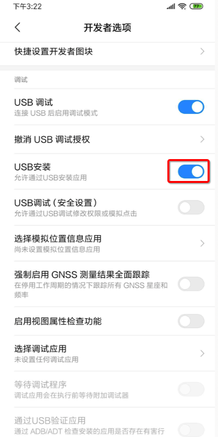
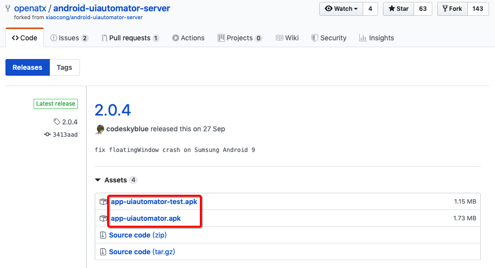
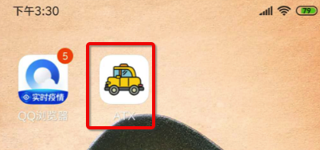
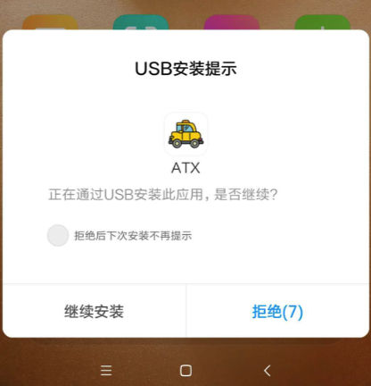
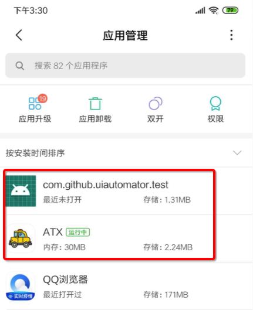
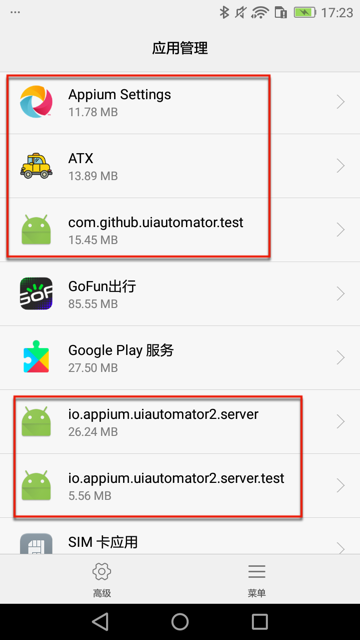
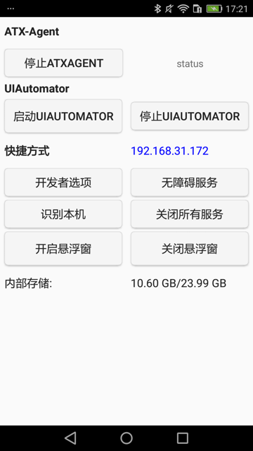
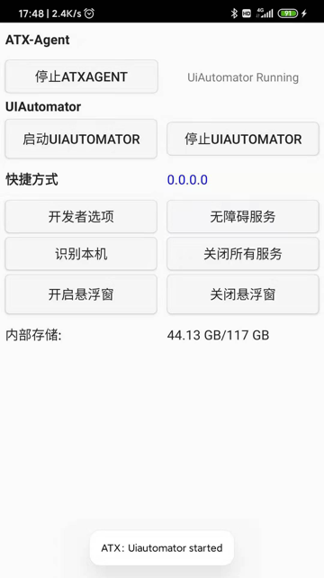

# 环境搭建

下面介绍如何搭建uiautomator2的开发环境，去测试安卓设备。

## 准备工作：安卓手机

### 确保手机中开启了USB安装

安卓手机中开启 `开发者选项`->`USB调试`->`USB安装`



否则后续无法正常安装uiautomator2相关的ATX等软件和服务。

## 安装

```bash
pip3 install -U uiautomator2
```

* 如果包管理器是`pipenv`，则用：
  * `pipenv install uiautomator2`

再去安装相关依赖的东西：

```bash
python3 -m uiautomator2 init
```

## 测试连接

再去测试连接：

```python
import uiautomator2 as u2
d = u2.connect() # connect to device
print(d.info)
```

其中：

u2.connect()可以换成wifi或usb：

* wifi
    * `d = u2.connect('10.0.0.1')`
* usb
    * `d = u2.connect('8c8a4d4d')`
        * 其中`8c8a4d4d`是`adb devices`列出的当前（用USB数据线连接到Mac中的）安卓设备的ID
            ```bash
            ➜  ~ adb devices
            List of devices attached
            8c8a4d4d    device
            ```

输出举例：

```bash
➜  autoTestAndroidGameHappyBigBattle python
Python 3.7.3 (default, May 22 2019, 10:55:14)
[Clang 10.0.1 (clang-1001.0.46.4)] on darwin
Type "help", "copyright", "credits" or "license" for more information.
>>> import uiautomator2 as u2
>>> d = u2.connect('8c8a4d4d')
conn=<urllib3.connection.HTTPConnection object at 0x1077f4da0>,method=GET,url=/version,timeout_obj=Timeout(connect=2, read=2, total=None),body=None,headers={'User-Agent': 'python-requests/2.22.0', 'Accept-Encoding': 'gzip, deflate', 'Accept': '*/*', 'Connection': 'keep-alive'},chunked=False
```

和：红米Note10X打开了微信的输出：

```bash
{'currentPackageName': 'com.tencent.mm', 'displayHeight': 2201, 'displayRotation': 0, 'displaySizeDpX': 393, 'displaySizeDpY': 873, 'displayWidth': 1080, 'productName': 'atom', 'screenOn': True, 'sdkInt': 29, 'naturalOrientation': True}
```

## 说明：安装细节

#### 安装内容

上述命令会安装相关工具到你安卓手机中：

* uiautomator-server
    * 作用：包含httprpc服务的apk
        * 2个apk
            * 图解
                * 
            * 框架要求2个apk，缺一不可
                * app-uiautomator-test.apk：测试程序
                    * uiautomator这个框架允许我们测试第三方应用
                    * 包名：com.github.uiautomator.test
                * app-uiautomator.apk：被测应用
                    * 基本就是个傀儡
                        * 只要别轻易的死掉，就算是一个合格的应用了
                    * 包名：com.github.uiautomator
    * 地址：https://github.com/openatx/android-uiautomator-server/releases
* atx-agent
    * 地址：https://github.com/openatx/atx-agent
* openstf/minicap
    * 地址：https://github.com/openstf/minicap
* openstf/minitouch
    * 地址：https://github.com/openstf/minitouch

#### 安装log日志

期间如果开启了uiautomator2的debug后，可以看到更详细的信息。

比如安装路径（小米9中安装期间显示安装的东西有）：

* minicap、minitouch
  * https://tool.appetizer.io/openatx/stf-binaries/raw/master/node_modules/minitouch-prebuilt/prebuilt/arm64-v8a/bin/minitouch
* com.github.uiautomator, com.github.uiautomator.test 2.0.3
  * https://tool.appetizer.io/openatx/android-uiautomator-jsonrpcserver/releases/download/v0.1.6/bundle.jar
  * https://tool.appetizer.io/openatx/android-uiautomator-jsonrpcserver/releases/download/v0.1.6/uiautomator-stub.jar
  * https://tool.appetizer.io/openatx/android-uiautomator-server/releases/download/2.0.3/app-uiautomator.apk
  * https://tool.appetizer.io/openatx/android-uiautomator-server/releases/download/2.0.3/app-uiautomator-test.apk

安卓6的`华为畅享6S`，重新初始化的log是：

```bash
[200218 13:55:44][DevicesMethods.py 11 ] start init driver
[I 200218 13:55:45 init:132] uiautomator2 version: 2.5.3
[I 200218 13:55:45 init:317] Install minicap, minitouch
[I 200218 13:55:45 init:330] Install com.github.uiautomator, com.github.uiautomator.test 2.1.1
[I 200218 13:56:02 init:300] - app-uiautomator.apk installed
[I 200218 13:56:14 init:300] - app-uiautomator-test.apk installed
[I 200218 13:56:14 init:308] Install atx-agent 0.8.2
[I 200218 13:56:19 init:342] Check atx-agent version
Successfully init AdbDevice(serial=DWH9X17124W03779)
```

安卓9的`红米Note8Pro`的初始化log是：

```bash
[200217 14:45:33][DevicesMethods.py 11 ] start init driver
[I 200217 14:45:37 init:132] uiautomator2 version: 2.5.3
[I 200217 14:45:37 init:317] Install minicap, minitouch
minicap.so |⣿⣿⣿⣿⣿⣿⣿⣿⣿⣿| 67.1K/67.1K
[I 200217 14:45:37 init:330] Install com.github.uiautomator, com.github.uiautomator.test 2.1.1
[I 200217 14:45:38 init:300] - app-uiautomator.apk installed
[I 200217 14:45:38 init:300] - app-uiautomator-test.apk installed
[I 200217 14:45:38 init:308] Install atx-agent 0.8.2
[I 200217 14:45:39 init:342] Check atx-agent version
Successfully init AdbDevice(serial=hmucaei75ptk7szs)
```

分别对应着去安装：

* minicap和minitouch
* com.github.uiautomator和com.github.uiautomator.test
  * 对应着：app-uiautomator.apk和app-uiautomator-test.apk
* atx-agent

#### 安装后的app

不过，实际上（安卓10的小米9，安卓9的小米Note8Pro）只安装了，最核心的2个：

* ATX
    * 桌面图标
        * 
    * 安装期间需要手动点击 继续安装
        * 
* com.github.uiautomator.test
    * 桌面图片：无
    * 安装期间，需要手动点击：继续安装
        * 

安装后，可以在应用管理中找到，刚才安装的2个应用：

* 红米Note8Pro 安卓9
    * 
* 华为畅享6S 安卓6
    * 

##### ATX

关于ATX，启动后的主界面：



点击`启动UIAUTOMATOR`后，会显示：`ATX：Uiautomator started`


