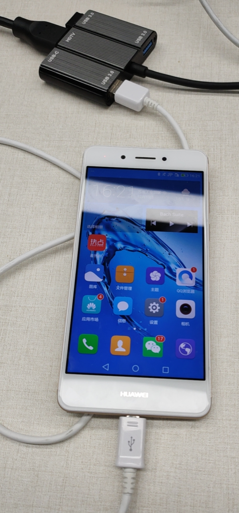
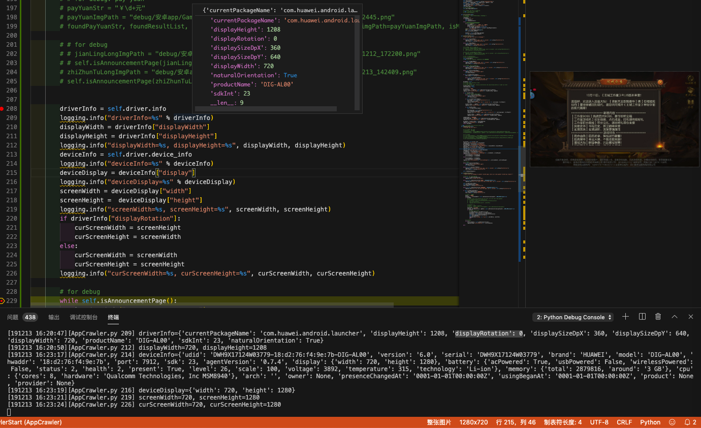

# 设备相关

此处整理出，和安卓设备相关的一些通用功能的函数和调用举例。

## 获取安卓设备信息

```python
def getDeviceInfo(self):
    return self.driver.device_info
```

调用：

```python
deviceInfo = self.getDeviceInfo()
```
## 获取安卓版本

```python
def getAndroidVersion(self):
    """返回安卓版本号，float值： 6.0，9.0 """
    deviceInfo = self.getDeviceInfo()
    logging.debug("deviceInfo=%s" % deviceInfo)
    androidVersionStr = deviceInfo["version"] # '6.0'
    androidVersionFloat = float(androidVersionStr)
    return androidVersionFloat
```

调用：

```python
    curAndroidVersionFloat = self.getAndroidVersion()
    ANDROID_VERSION_NEED_RESTART_U2 = 7.0
    if curAndroidVersionFloat <= ANDROID_VERSION_NEED_RESTART_U2:
        isNeedRestartU2 = True
```

## 获取安卓屏幕分辨率

```python
def getCurScreenResolution(self):
    """Get current screen resolution"""
    driverInfo = self.driver.info
    logging.debug("driverInfo=%s" % driverInfo)
    # displayWidth = driverInfo["displayWidth"]
    # displayHeight = driverInfo["displayHeight"]
    # logging.info("displayWidth=%s, displayHeight=%s", displayWidth, displayHeight)
    # deviceInfo = self.driver.device_info
    deviceInfo = self.getDeviceInfo()
    logging.debug("deviceInfo=%s" % deviceInfo)
    deviceDisplay = deviceInfo["display"]
    logging.debug("deviceDisplay=%s" % deviceDisplay)
    screenWidth = deviceDisplay["width"]
    screenHeight =  deviceDisplay["height"]
    logging.debug("screenWidth=%s, screenHeight=%s", screenWidth, screenHeight)
    if driverInfo["displayRotation"]:
        curScreenWidth = screenHeight
        curScreenHeight = screenWidth
    else:
        curScreenWidth = screenWidth
        curScreenHeight = screenHeight
    logging.debug("curScreenWidth=%s, curScreenHeight=%s", curScreenWidth, curScreenHeight)

    return (curScreenWidth, curScreenHeight)
```

调用：

```python
screenWidth, screenHeight = self.getCurScreenResolution()
```

输出：

```bash
[191213 16:16:13][AppCrawler.py 209] driverInfo={'currentPackageName': 'com.zztl.dragon.cs', 'displayHeight': 720, 'displayRotation': 1, 'displaySizeDpX': 640, 'displaySizeDpY': 360, 'displayWidth': 1196, 'productName': 'DIG-AL00', 'sdkInt': 23, 'naturalOrientation': False}
[191213 16:16:13][AppCrawler.py 212] displayWidth=1196, displayHeight=720
[191213 16:16:13][AppCrawler.py 214] deviceInfo={'udid': 'DWH9X17124W03779-18:d2:76:f4:9e:7b-DIG-AL00', 'version': '6.0', 'serial': 'DWH9X17124W03779', 'brand': 'HUAWEI', 'model': 'DIG-AL00', 'hwaddr': '18:d2:76:f4:9e:7b', 'port': 7912, 'sdk': 23, 'agentVersion': '0.7.4', 'display': {'width': 720, 'height': 1280}, 'battery': {'acPowered': True, 'usbPowered': False, 'wirelessPowered': False, 'status': 2, 'health': 2, 'present': True, 'level': 26, 'scale': 100, 'voltage': 3892, 'temperature': 315, 'technology': 'Li-ion'}, 'memory': {'total': 2879816, 'around': '3 GB'}, 'cpu': {'cores': 8, 'hardware': 'Qualcomm Technologies, Inc MSM8940'}, 'arch': '', 'owner': None, 'presenceChangedAt': '0001-01-01T00:00:00Z', 'usingBeganAt': '0001-01-01T00:00:00Z', 'product': None, 'provider': None}
[191213 16:16:13][AppCrawler.py 216] deviceDisplay={'width': 720, 'height': 1280}
[191213 16:16:13][AppCrawler.py 219] screenWidth=720, screenHeight=1280
[191213 16:16:13][AppCrawler.py 226] curScreenWidth=1280, curScreenHeight=720
```

得到了我们要的：屏幕的宽度和高度

且知道了是当前屏幕是否已旋转（从安卓手机的默认的竖屏，旋转成游戏的横屏）了

另外，当屏幕故意不去旋转，回到默认竖屏后：



此时
* 旋转为`False`
    * `displayRotation`: `0`
    * `naturalOrientation`: `True`
* 但`displayHeight`值有变化：是`1208`
  * 却不是`1280`

如图：



详细log：

```bash
[191213 16:20:47][AppCrawler.py 209] driverInfo={'currentPackageName': 'com.huawei.android.launcher', 'displayHeight': 1208, 'displayRotation': 0, 'displaySizeDpX': 360, 'displaySizeDpY': 640, 'displayWidth': 720, 'productName': 'DIG-AL00', 'sdkInt': 23, 'naturalOrientation': True}
[191213 16:20:50][AppCrawler.py 212] displayWidth=720, displayHeight=1208
[191213 16:23:17][AppCrawler.py 214] deviceInfo={'udid': 'DWH9X17124W03779-18:d2:76:f4:9e:7b-DIG-AL00', 'version': '6.0', 'serial': 'DWH9X17124W03779', 'brand': 'HUAWEI', 'model': 'DIG-AL00', 'hwaddr': '18:d2:76:f4:9e:7b', 'port': 7912, 'sdk': 23, 'agentVersion': '0.7.4', 'display': {'width': 720, 'height': 1280}, 'battery': {'acPowered': True, 'usbPowered': False, 'wirelessPowered': False, 'status': 2, 'health': 2, 'present': True, 'level': 26, 'scale': 100, 'voltage': 3892, 'temperature': 315, 'technology': 'Li-ion'}, 'memory': {'total': 2879816, 'around': '3 GB'}, 'cpu': {'cores': 8, 'hardware': 'Qualcomm Technologies, Inc MSM8940'}, 'arch': '', 'owner': None, 'presenceChangedAt': '0001-01-01T00:00:00Z', 'usingBeganAt': '0001-01-01T00:00:00Z', 'product': None, 'provider': None}
[191213 16:23:19][AppCrawler.py 216] deviceDisplay={'width': 720, 'height': 1280}
[191213 16:23:21][AppCrawler.py 219] screenWidth=720, screenHeight=1280
[191213 16:23:24][AppCrawler.py 226] curScreenWidth=720, curScreenHeight=1280
```

详见：

【已解决】uiautomator2获取当前屏幕的宽和高即屏幕大小分辨率信息

