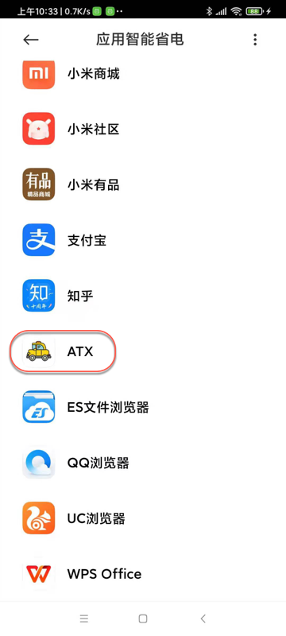
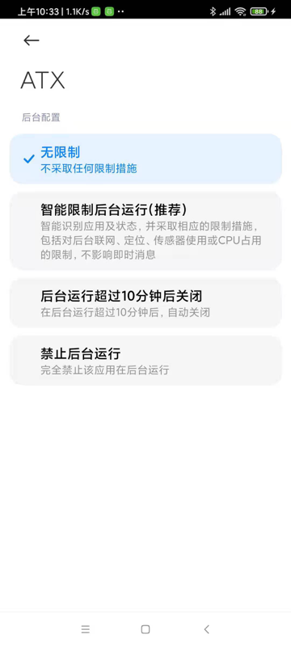
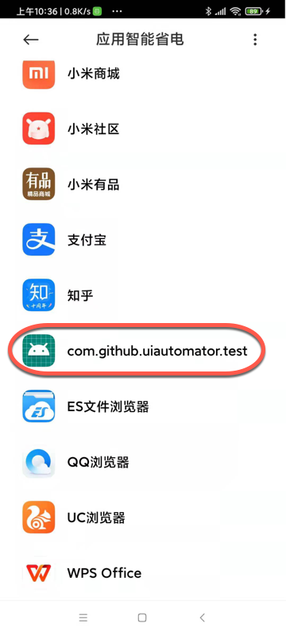
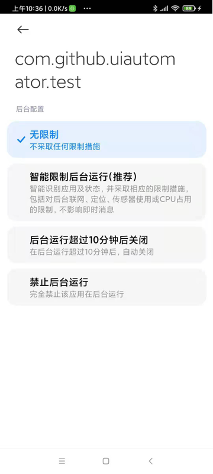
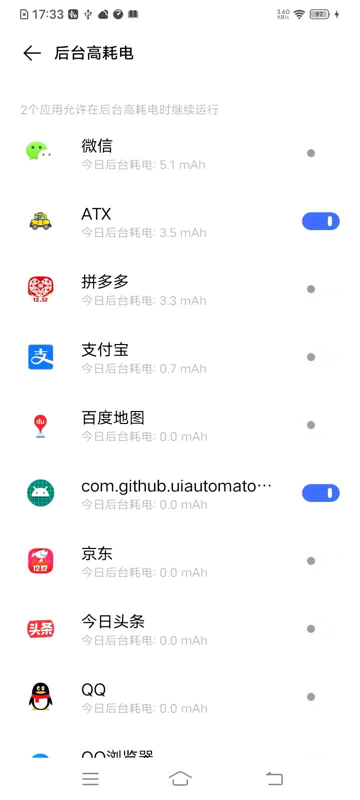
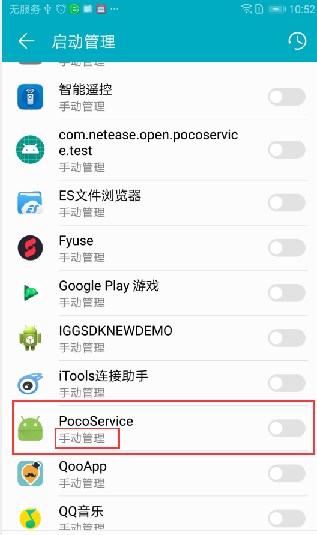

# 后台服务已被杀掉

如果uiautomator2过段时间 偶尔 不定期 被杀掉 导致服务需要重启，则很可能是 后台服务被杀掉了，需要设置 允许后台运行 

即把：`ATX`、`com.github.uiautomator.test`的 应用智能省电，改为：无限制

* ATX
  * 
  * 
* com.github.uiautomator.test
  * 
  * 

其他还有类似的：

在设置中的`后台高耗电`中：

* 允许后台运行：ATX和com.github.uiautomator.test
  * 

另外内部用了`uiautomator2`的网易的`AirTest`，也是类似逻辑：

> 5.如果华为手机出现poco在启动后十几秒内自动断开的话，可以检查一下手机管家的版本号是否大于8.0，如果是的话，就在手机管家->启动管理里面，找到pocoservice，勾选允许自启动和允许后台活动
> 
> 

