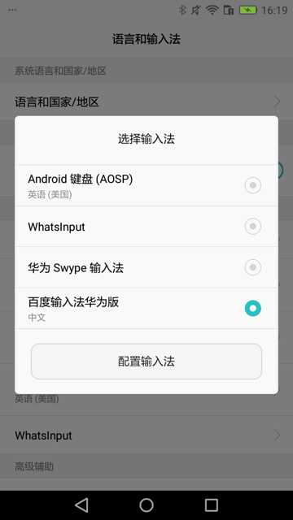
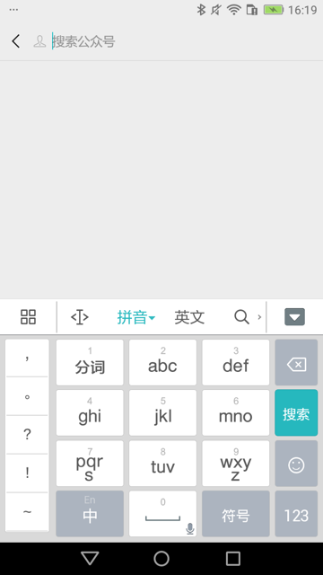
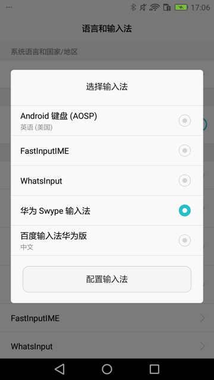
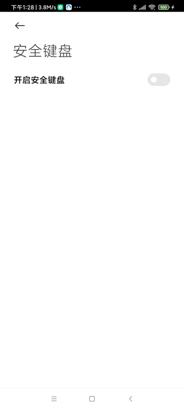

# 输入文字

## 输入文字的两种方式

对于输入文字，发现之前的可以工作的代码：

```python
self.driver(text=locator["text"]).set_text(text,timeout=WaitFind)
```

会出现：无法完整输入内容

具体现象：中文输入法中，输入了字母，但是丢失了数字 的效果：


且输入法此时已经也被换了（换成了 FastInputIME 或 系统自带（华为Swype） 输入法了）

注：

```python
self.driver(text=locator["text"]).set_text(text,timeout=WaitFind)
```

内部是调用的uiautomator2的session的set_text：

文件：`/Users/limao/.pyenv/versions/3.8.0/lib/python3.8/site-packages/uiautomator2/session.py`

```python
    def set_text(self, text, timeout=None):
        self.must_wait(timeout=timeout)
        if not text:
            return self.jsonrpc.clearTextField(self.selector)
        else:
            return self.jsonrpc.setText(self.selector, text)
```

（除了额外支持timeout参数外）

而换用另外的：

### `xpath`的`set_text`

```python
searchElementSelector = self.driver.xpath(searchKeyText)
searchElementSelector.set_text(text)
```

内部调用的：

文件：`/Users/limao/.pyenv/versions/3.8.0/lib/python3.8/site-packages/uiautomator2/xpath.py`

```python
    def set_text(self, text: str = ""):
        el = self.get()
        self._parent.send_text()  # switch ime
        el.click()  # focus input-area
        self._parent.send_text(text)
```

### `send_keys`

```python
self.driver.send_keys(text)
self.driver.set_fastinput_ime(False) # 关掉FastInputIME输入法，切换回系统默认输入法（此处华为手机默认输入法是华为Swype输入法）
```

其中，是否加上 打开FastInputIME

```python
self.driver.set_fastinput_ime(True) # # 切换成FastInputIME输入法
self.driver.send_keys(text)
self.driver.set_fastinput_ime(False) # 关掉FastInputIME输入法，切换回系统默认输入法（此处华为手机默认输入法是华为Swype输入法）
```

经测试，感觉没区别。

结果都是：

* 可以成功输入文字
    * 此处的：gh_cfcfcee032cc
* 但是输入法会被切换掉
    * 我之前设置的是：百度的输入法
            * 
        * 对应着，输入文字之前，应该是
            * 
    * 会被换成：当前系统默认自带输入法
        * 当前系统是：华为的畅享6S手机 DIG-AL00
            * 自带输入法是：华为Swype输入法
                * 
    * 效果是：
        * 

结论：

* 基本上实现了自己的：要输入文字的目的
* 但是：却把之前设置的（百度）输入法切换成系统的（华为）输入法了。
    * 问题不大，但是很不爽
        * 但是没办法改变和保留原有输入法

## set_text导致输入法切换，需要恢复

最终整理出函数：

```python
def selectorSetText(u2Dev, curXpathSelector, inputText):
    selectorSetTextResp = curXpathSelector.set_text(inputText)
    logging.info("selectorSetTextResp=%s", selectorSetTextResp) # selectorSetTextResp=None
    # 在set_text后，输入法会变成FastInputIME输入法
    # 用下面代码可以实现：关掉FastInputIME输入法，切换回系统默认输入法
    u2Dev.set_fastinput_ime(False)
```

## 用set_text输入字符串：小米安全键盘 影响输入，可以考虑禁止掉

代码本身：

```python
passwordStr = "请输入密码"
passwordXpath = """//android.widget.EditText[@text="%s" and @index="2" and @clickable="true"]""" % passwordStr
passwordSelector = u2Dev.xpath(passwordXpath)
if passwordSelector.exists:
    logging.info("Found %s", passwordStr)
    # pwdClickResp = passwordSelector.click()
    # logging.debug("pwdClickResp=%s", pwdClickResp)
    # doScreenshot(u2Dev)
    selectorSetText(u2Dev, passwordSelector, Vivo_Password)

def selectorSetText(u2Dev, curXpathSelector, inputText):
    selectorSetTextResp = curXpathSelector.set_text(inputText)
    logging.info("selectorSetTextResp=%s", selectorSetTextResp) # selectorSetTextResp=None
    doScreenshot(u2Dev)
    # 在set_text后，输入法会变成FastInputIME输入法
    # 用下面代码可以实现：关掉FastInputIME输入法，切换回系统默认输入法
    u2Dev.set_fastinput_ime(False)
```

是可以输入密码=字符串的

但是
* 之前开启了：小米安全键盘
  * 导致：输入不顺利
    * 小米安全键盘 会弹出显示 消失掉，多次之后
    * （等待1，2秒后）触发异常：
      * `/Users/limao/dev/xxx/crawler/appAutoCrawler/AppCrawler/venv/lib/python3.8/site-packages/uiautomator2/__init__.py:1646: Warning: set FastInputIME failed. use "d(focused=True).set_text instead"`
      * `warnings.warn(`
    * 最终才能输入密码
* 解决办法：关闭 小米安全键盘
  * 步骤：
    * 系统设置-》更多设置-》语言与输入法-》安全键盘-》取消勾选：开启安全键盘
      * 

