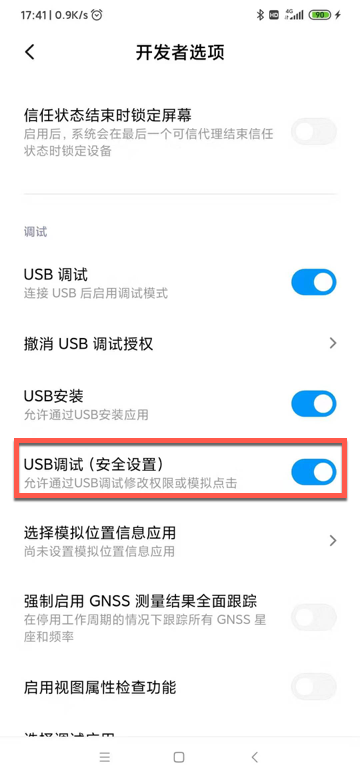

# long_click不工作

权限问题导致long_click不工作

之前小米9中用long_click

```python
self.driver(text=locator["text"]).click(timeout=WaitFind)
```

报错：

```bash
uiautomator2.exceptions.JsonRpcError: 0 Unknown error: <Injecting to another application requires INJECT_EVENTS permission> data: {'exceptionTypeName': 'java.lang.SecurityException', 'message': 'Injecting to another application requires INJECT_EVENTS permission'}, method: click
```

即：`INJECT_EVENTS`问题=权限问题

解决办法：去开启权限 `USB调试（安全设置）` -> `允许通过USB调试修改权限或模拟点击`



注：期间会3次提醒你

* 因为这个权限很重要
    * 如果随便给了其他坏的应用
        * 可能会滥用，而导致你手机被恶意操控
            * 所以多次提醒你确认
                * 自己此处是调试手机，自动抓包，所以没问题，是打算开启此权限

