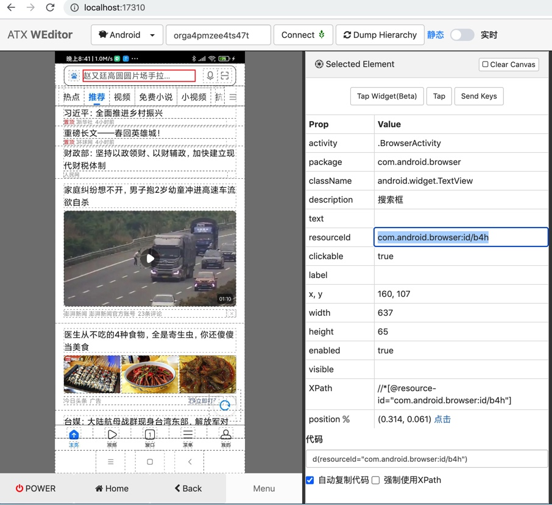

# 举例：定位小米手机中内置浏览器中的输入框和获取属性值

下面举例来介绍：


## 页面

对于安卓手机`小米Note10X`其中内置的浏览器的首页中顶部的输入框：


## 搞清楚元素属性

通过多种调试：

### 借助`weditor`调试页面，看元素属性



拷贝出全部属性：

```bash
Selected Element

Prop    Value
activity    .BrowserActivity
package    com.android.browser
className    android.widget.TextView
description    搜索框
text    
resourceId    com.android.browser:id/b4h
clickable    true
label    
x, y    160, 107
width    637
height    65
enabled    true
visible    
XPath    //*[@resource-id="com.android.browser:id/b4h"]
position     (0.532, 0.057) 点击
代码 d(resourceId="com.android.browser:id/b4h")
```

### 用代码`dump_hierarchy`输出整页的xml中找到对应元素的部分

```python
curPageXml = d.dump_hierarchy(compressed=False, pretty=False)
```

输出的页面xml源码中，有对应该元素的部分

```xml
<node index="1" text="" resource-id="com.android.browser:id/b4h" class="android.widget.TextView" package="com.android.browser" content-desc="搜索框" checkable="false" checked="false" clickable="true" enabled="true" focusable="false" focused="false" scrollable="false" long-clickable="false" password="false" selected="false" visible-to-user="true" bounds="[160,107][797,172]" />
```

都可得知对应属性是：

* `package`: `com.android.browser`
* `class`: `android.widget.TextView`
* `resource-id`: `com.android.browser:id/b4h`
* `content-desc`: `搜索框`
* ...

## 查找（定位）元素

此处去查找定位该元素的逻辑就是：

* `class="android.widget.TextView"` + `resource-id="com.android.browser:id/b4h"`
    * 注：如果确定`resource id`的值是唯一的，则也可以只用：
      * `resource-id="com.android.browser:id/b4h"`

对应代码是：

### 用`driver(propertyParameter)`去查找元素

```python
inputUiObj = d(resourceId="com.android.browser:id/b4h", className="android.widget.TextView")
```

> 或
> ```python
> inputUiObj = d(resourceId="com.android.browser:id/b4h")
> ```
> 
> ------
> 
> 注：其他属性对应的参数还有：
> * `text`, `textContains`, `textMatches`, `textStartsWith`
> * `className`, `classNameMatches`
> * `description`, `descriptionContains`, `descriptionMatches`, `descriptionStartsWith`
> * `checkable`, `checked`, `clickable`, `longClickable`
> * `scrollable`, `enabled`, `focusable`, `focused`, `selected`
> * `packageName`, `packageNameMatches`
> * `resourceId`, `resourceIdMatches`
> * `index`, `instance`

去找到元素。

> 关于返回元素的类型，可以通过
>    ```python
>    print("type(inputUiObj)=%s" % type(inputUiObj))
>    ```
> 得知是：
>    ```xml
>    <class 'uiautomator2.session.UiObject'>
>    ```

想要继续获取元素属性，则可以通过`info`

```python
inputUiObjectInfo = inputUiObj.info
```

> 关于`info`的类型，可以通过
>    ```python
>    print("type(inputUiObjectInfo)=%s" % type(inputUiObjectInfo))
>    ```
> 得知是：
>    ```xml
>    <class 'dict'>
>    ```

打印出的`info`的值是：

```xml
inputUiObjectInfo={'bounds': {'bottom': 172, 'left': 160, 'right': 797, 'top': 107}, 'childCount': 0, 'className': 'android.widget.TextView', 'contentDescription': '搜索框', 'packageName': 'com.android.browser', 'resourceName': 'com.android.browser:id/b4h', 'text': '', 'visibleBounds': {'bottom': 172, 'left': 160, 'right': 797, 'top': 107}, 'checkable': False, 'checked': False, 'clickable': True, 'enabled': True, 'focusable': False, 'focused': False, 'longClickable': False, 'scrollable': False, 'selected': False}
```

附上完整代码：

```python
# Method 1: use driver pass in parameter
inputUiObj = d(resourceId="com.android.browser:id/b4h", className="android.widget.TextView")
# inputUiObj = d(resourceId="com.android.browser:id/b4h")
print("type(inputUiObj)=%s" % type(inputUiObj)) # type(inputUiObj)=<class 'uiautomator2.session.UiObject'>
print("inputUiObj=%s" % inputUiObj) # inputUiObj=<uiautomator2.session.UiObject object at 0x10a0bea00>
inputUiObjectInfo = inputUiObj.info
print("type(inputUiObjectInfo)=%s" % type(inputUiObjectInfo)) # type(inputUiObjectInfo)=<class 'dict'>
print("inputUiObjectInfo=%s" % inputUiObjectInfo) # inputUiObjectInfo={'bounds': {'bottom': 172, 'left': 160, 'right': 797, 'top': 107}, 'childCount': 0, 'className': 'android.widget.TextView', 'contentDescription': '搜索框', 'packageName': 'com.android.browser', 'resourceName': 'com.android.browser:id/b4h', 'text': '', 'visibleBounds': {'bottom': 172, 'left': 160, 'right': 797, 'top': 107}, 'checkable': False, 'checked': False, 'clickable': True, 'enabled': True, 'focusable': False, 'focused': False, 'longClickable': False, 'scrollable': False, 'selected': False}
isFoundInput = inputUiObj.exists # True
```

### 用`driver.xpath(xpathSelector)`去查找元素

```python
inputXpathSelector = d.xpath("//android.widget.TextView[@resource-id='com.android.browser:id/b4h']")
```

> 或：
> ```python
> inputXpathSelector = d.xpath("//*[@resource-id='com.android.browser:id/b4h']")
> ```

找到元素。

> 关于`xpath`返回的类型，可以通过
>    ```python
>    print("type(inputXpathSelector)=%s" % type(inputXpathSelector))
>    ```
> 得知是：
>    ```xml
>    <class 'uiautomator2.xpath.XPathSelector'>
>    ```

想要获取属性值，此处要先去得到`XPathSelector`对应的**XML元素**

```python
inputXpathElem = inputXpathSelector.get()
```

> 关于`get()`返回的类型，可以通过
>    ```python
>    print("type(inputXpathElem)=%s" % type(inputXpathElem))
>    ```
> 得知是：
>    ```xml
>    <class 'uiautomator2.xpath.XMLElement'>
>    ```

然后才能去用`inputXpathElem.attrib`获取属性值

> 关于`attrib`的类型，可以通过
>    ```python
>    print("type(inputXpathElem.attrib)=%s" % type(inputXpathElem.attrib))
>    ```
> 得知是：
>    ```xml
>    <class 'lxml.etree._Attrib'>
>    ```

打印出的`dict`类型的`inputXpathElem.attrib`值是：

```xml
inputXpathElem.attrib={'index': '1', 'text': '', 'resource-id': 'com.android.browser:id/b4h', 'package': 'com.android.browser', 'content-desc': '搜索框', 'checkable': 'false', 'checked': 'false', 'clickable': 'true', 'enabled': 'true', 'focusable': 'false', 'focused': 'false', 'scrollable': 'false', 'long-clickable': 'false', 'password': 'false', 'selected': 'false', 'visible-to-user': 'true', 'bounds': '[160,107][797,172]'}
```

附上完整代码：

```python
# Method 2: use xpath
inputXpathSelector = d.xpath("//android.widget.TextView[@resource-id='com.android.browser:id/b4h']")
# inputXpathSelector = d.xpath("//*[@resource-id='com.android.browser:id/b4h']")
print("type(inputXpathSelector)=%s" % type(inputXpathSelector)) # type(inputXpathSelector)=<class 'uiautomator2.xpath.XPathSelector'>
inputXpathElem = inputXpathSelector.get()
print("type(inputXpathElem)=%s" % type(inputXpathElem)) # type(inputXpathElem)=<class 'uiautomator2.xpath.XMLElement'>
print("inputXpathElem=%s" % inputXpathElem) # inputXpathElem=<uiautomator2.xpath.XMLElement object at 0x108585d30>
print("type(inputXpathElem.attrib)=%s" % type(inputXpathElem.attrib)) # type(inputXpathElem.attrib)=<class 'lxml.etree._Attrib'>
print("inputXpathElem.attrib=%s" % inputXpathElem.attrib) # inputXpathElem.attrib={'index': '1', 'text': '', 'resource-id': 'com.android.browser:id/b4h', 'package': 'com.android.browser', 'content-desc': '搜索框', 'checkable': 'false', 'checked': 'false', 'clickable': 'true', 'enabled': 'true', 'focusable': 'false', 'focused': 'false', 'scrollable': 'false', 'long-clickable': 'false', 'password': 'false', 'selected': 'false', 'visible-to-user': 'true', 'bounds': '[160,107][797,172]'}
isFoundInput = inputXpathSelector.exists # True
```
