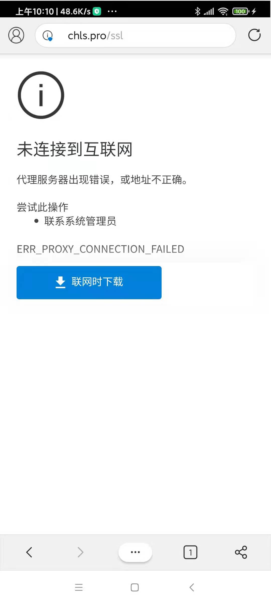
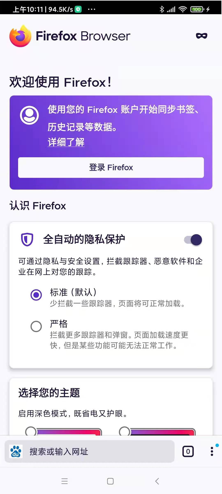

# APP

## 安装app

```python
def install_app_Android(self, item, packages=None):
  appAccount = item[0]
  appPackage = item[1]
  appMainActivity = item[2]
  apkFilePath = item[3]

  if packages is None:
    packages = self.get_packages()
  if appPackage in packages:
    logging.info("AppName {0} is alread installed".format(appAccount))
  else:
    logging.info("start to install app in {}".format(os.path.basename(self.arg_options.task)))

    # show current adb command version, makesure is latest version
    # os.system("adb --version")
    # Android Debug Bridge version 1.0.41
    # Version 30.0.5-6877874
    # Installed as /Users/limao/dev/tools/android/adb/platform-tools/adb

    # isUseShortCmd = True # use short command to try to avoid install stuck
    isUseShortCmd = False # use default long abd install command

    if isUseShortCmd:
      # sometime will stuck, reason: maybe command length too large, > 255?
      # so copy to temp folder -> to reduce command string length
      tmpFolder = tempfile.TemporaryDirectory()
      logging.info("tmpFolder=%s", tmpFolder)
      # tmpFolder=<TemporaryDirectory '/var/folders/gt/5868sbcd1jq4rxvryqhy2_1sz8n0s3/T/tmp_yk15rlz'>
      tmpFolderName = tmpFolder.name
      logging.info("tmpFolderName=%s", tmpFolderName)
      # tmpFolderName=/var/folders/gt/5868sbcd1jq4rxvryqhy2_1sz8n0s3/T/tmp_yk15rlz
      apkFileName = os.path.basename(apkFilePath)
      logging.info("apkFileName=%s", apkFileName)
      # apkFileName=20201202_fengyun_0192LeiMoChuanShuo_gameApp_Android_0.apk
      tmpApkFile = os.path.join(tmpFolderName, apkFileName)
      logging.info("tmpApkFile=%s", tmpApkFile)
      # tmpApkFile=/var/folders/gt/5868sbcd1jq4rxvryqhy2_1sz8n0s3/T/tmp_yk15rlz/20201202_fengyun_0192LeiMoChuanShuo_gameApp_Android_0.apk
      logging.info("Copy %s to tmp file %s", apkFilePath, tmpApkFile)
      # Copy /Users/limao/dev/xxx/crawler/appAutoCrawler/AppCrawler/task/20201202_fengyun_0192LeiMoChuanShuo/20201202_fengyun_0192LeiMoChuanShuo_gameApp_Android/20201202_fengyun_0192LeiMoChuanShuo_gameApp_Android_0.apk to tmp file /var/folders/gt/5868sbcd1jq4rxvryqhy2_1sz8n0s3/T/tmp_yk15rlz/20201202_fengyun_0192LeiMoChuanShuo_gameApp_Android_0.apk
      copyfile(apkFilePath, tmpApkFile)
      # copy2(apkFilePath, tmpFolderName)

      curApkFile = tmpApkFile
    else:
      curApkFile = apkFilePath
      # os.system("adb -s {0} install {1}".format(self.device, apkFilePath))

    # show file size
    fileSizeInt = os.path.getsize(curApkFile) # 259106541
    fileSizeStr = CommonUtils.formatSize(fileSizeInt) # '247.1MB'
    logging.info("file size: %s", fileSizeStr) # file size: 247.1MB

    # adbInstallCmd = "adb -s {0} install -r {1}".format(self.device, tmpApkFile)
    # adbInstallCmd = "adb -s {0} install -r {1}".format(self.device, apkFilePath)
    # installPara = " "
    # installPara = "-r"
    installPara = "-r -f"
    adbInstallCmd = "adb -s {0} install {1} {2}".format(self.device, installPara, curApkFile)
    # adbInstallCmd = "adb shell pm install -s {0} {1}".format(self.device, curApkFile)
    # adbInstallCmd = "adb shell pm install -s {0} -r {1}".format(self.device, curApkFile)
    # adbInstallCmd = "adb shell pm install -s {0} -f {1}".format(self.device, curApkFile)
    # adb -s hmucaei75ptk7szs install -r /var/folders/gt/5868sbcd1jq4rxvryqhy2_1sz8n0s3/T/tmpq3ypjfgd/20201202_fengyun_0192LeiMoChuanShuo_gameApp_Android_0.apk
    # length=243 command:
    # adb -s hmucaei75ptk7szs install -r /Users/limao/dev/xxx/crawler/appAutoCrawler/AppCrawler/task/20201202_fengyun_0192LeiMoChuanShuo/20201202_fengyun_0192LeiMoChuanShuo_gameApp_Android/20201202_fengyun_0192LeiMoChuanShuo_gameApp_Android_0.apk
    # 'adb -s hmucaei75ptk7szs install -r -f /Users/limao/dev/xxx/crawler/appAutoCrawler/AppCrawler/task/20201203_fengyun_0004TiTangMeng/20201203_fengyun_0004TiTangMeng_gameApp_Android/20201203_fengyun_0004TiTangMeng_gameApp_Android_0.apk'

    logging.info("Run length=%d, command: %s", len(adbInstallCmd), adbInstallCmd)
    # Run length=153, command: adb -s hmucaei75ptk7szs install -r /var/folders/gt/5868sbcd1jq4rxvryqhy2_1sz8n0s3/T/tmpq3ypjfgd/20201202_fengyun_0192LeiMoChuanShuo_gameApp_Android_0.apk
    os.system(adbInstallCmd)
```

调用：

```python
if self.isAndroid:
  return self.install_app_Android(item, packages)
```

## 启动app

对于app：

* 五子棋经典版
  * 包名：`com.fingertip.fivechess.mi`
  * 主页面：`.StartAct`

启动代码：

```python
appPackage = "com.fingertip.fivechess.mi"
appActivity = ".StartAct"
self.driver.app_start(appPackage, activity=appActivity, stop=True)
```

## 卸载app

```python
def uninstallApp_Android(self, item):
  # 卸载安装包
  appPackage = item[1]
  adbUninstallCmd = "adb -s %s uninstall %s" % (self.device, appPackage)
  logging.info(adbUninstallCmd)
  os.system(adbUninstallCmd)
  logging.info("Uninstalled Android app %s", appPackage)
```

调用：

```python
if self.isAndroid:
  self.uninstallApp_Android(item)
```

## 获取app信息

### 获取当前正在运行的app的包名和activity

```python
def get_PackageActivity_Android(self):
  # adb直接获取当前活跃app及activity
  package, activity = "",""
  cmds = ['dumpsys activity |grep {}'.format(item) for item in ['mFocusedActivity','mResumedActivity']]
  for cmd in cmds:
    output = self.driver.shell(cmd).output
    result = re.search("u0(.*?)/", output)
    package = result.group(1).strip() if result else ""
    result = re.search("/(.*?)\s", output)
    activity = result.group(1).strip() if result else ""
    if package and activity:
      return package, activity
  return package, activity
```

调用：

```python
package, activity = get_PackageActivity_Android()
```

### 举例：获取几个浏览器app的信息

可以用`uiautomator2`的`app_current()`

比如，代码：

```python
curApp = d.app_current()
print("curApp=%s" % curApp)
```

输出：

* 小米 内置浏览器
  * 图
    * 
  * 信息
    * `{'package': 'com.android.browser', 'activity': '.BrowserActivity', 'pid': 20194}`
* Edge
  * 图
    * 
  * 信息
    * `curApp={'package': 'com.microsoft.emmx', 'activity': 'org.chromium.chrome.browser.ChromeTabbedActivity', 'pid': 21340}`
* Firefox
  * 图
    * 
  * 信息
    * `curApp={'package': 'org.mozilla.firefox', 'activity': 'org.mozilla.fenix.HomeActivity', 'pid': 21817}`
* UC浏览器
  * 图
    * 
  * 信息
    * `curApp={'package': 'com.UCMobile', 'activity': 'com.uc.browser.InnerUCMobile', 'pid': 22173}`
* QQ浏览器
  * 图
    * 
  * 信息
    * `curApp={'package': 'com.tencent.mtt', 'activity': '.MainActivity', 'pid': 24304}`

## 相关辅助信息

### 获取当前安卓手机中已安装的app的包名等信息

可以通过几种方式：

* 手动点击和查看应用信息
* 用uiautomator2获取当前运行的app的信息
* 用weditor查看当前界面中app某元素的属性中的package值
* 用adb查看
  ```bash
  adb shell pm list packages
  ```

获得app的包名信息。

比如：

各种浏览器app的包名：

* 小米的 内置浏览器：`com.android.browser`
* Edge：`com.microsoft.emmx`
* Firefox：`org.mozilla.firefox`
* UC浏览器：`com.UCMobile`
* QQ浏览器：`com.tencent.mtt`
