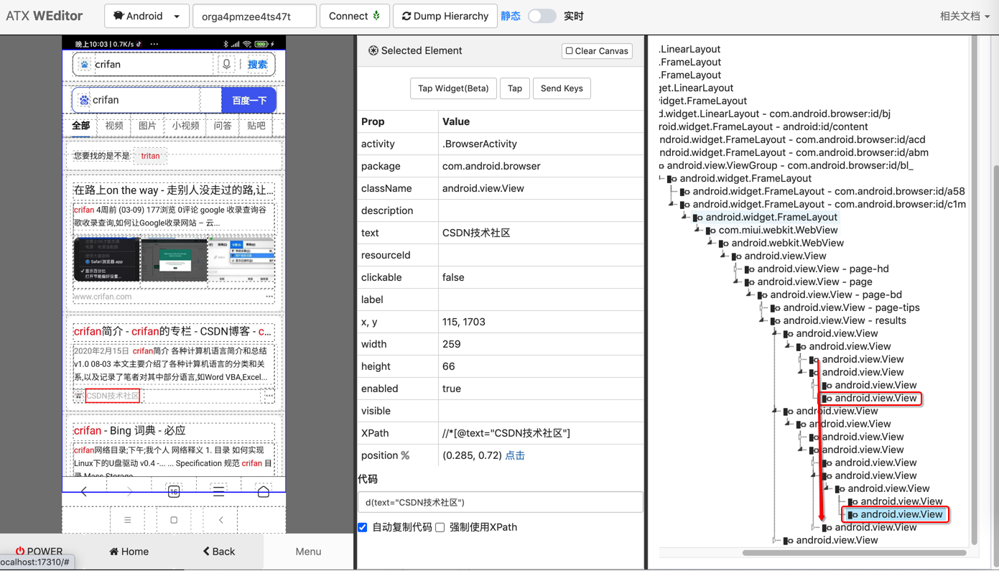
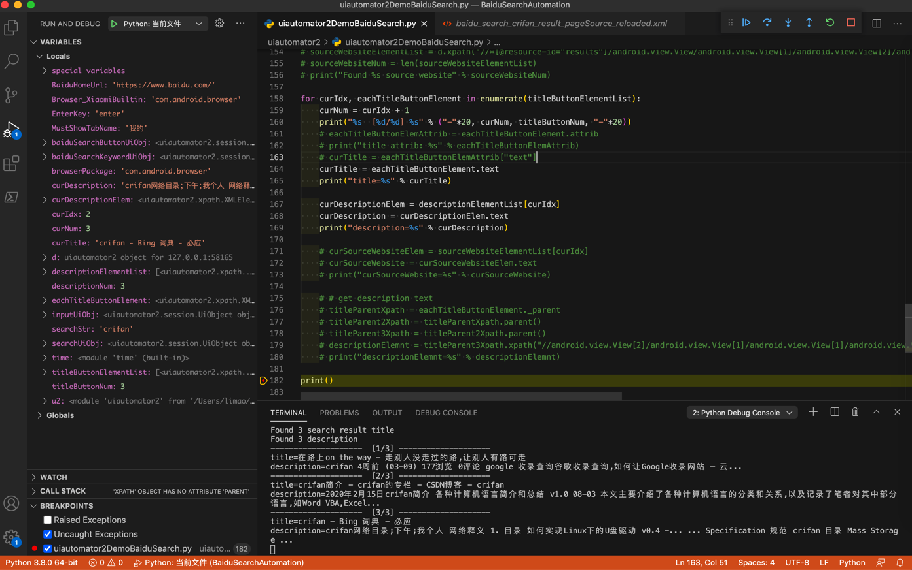

# 获取元素属性

获取元素属性，一般可以用：

* `someElement.attrib`：返回一个`dict`
* `someElement.text`：获取元素文本值

## 举例：获取百度搜索结果页面的元素列表中的元素属性

对于（调试）页面：



用代码：

```python
# Xpath chain search can find elements
titleButtonElementList = d.xpath("//*[@resource-id='results']//android.widget.Button[@clickable='true']").all()
titleButtonNum = len(titleButtonElementList)
print("Found %s search result title" % titleButtonNum)


# descriptionElementList = d.xpath("//*[@resource-id='results']/android.view.View[1]/android.view.View[1]/android.view.View[2]/android.view.View[1]/android.view.View[1]/android.view.View[1]/android.view.View[1]/android.view.View[1]").all()
descriptionElementList = d.xpath("//*[@resource-id='results']/android.view.View/android.view.View[1]/android.view.View[2]/android.view.View[1]/android.view.View[1]/android.view.View[1]/android.view.View[1]/android.view.View[1]").all()
descriptionNum = len(descriptionElementList)
print("Found %s description" % descriptionNum)


# # sourceWebsiteElementList = d.xpath('//*[@resource-id="results"]/android.view.View/android.view.View[1]/android.view.View[2]/android.view.View[1]').all()
# sourceWebsiteElementList = d.xpath('//*[@resource-id="results"]/android.view.View/android.view.View[1]/android.view.View[2]/android.view.View[2]').all()
# sourceWebsiteNum = len(sourceWebsiteElementList)
# print("Found %s source website" % sourceWebsiteNum)


for curIdx, eachTitleButtonElement in enumerate(titleButtonElementList):
    curNum = curIdx + 1
    print("%s  [%d/%d] %s" % ("-"*20, curNum, titleButtonNum, "-"*20))
    # eachTitleButtonElemAttrib = eachTitleButtonElement.attrib
    # print("title attrib: %s" % eachTitleButtonElemAttrib)
    # curTitle = eachTitleButtonElemAttrib["text"]
    curTitle = eachTitleButtonElement.text
    print("title=%s" % curTitle)


    curDescriptionElem = descriptionElementList[curIdx]
    curDescription = curDescriptionElem.text
    print("description=%s" % curDescription)


    # curSourceWebsiteElem = sourceWebsiteElementList[curIdx]
    # curSourceWebsite = curSourceWebsiteElem.text
    # print("curSourceWebsite=%s" % curSourceWebsite)
```

可以搜索到`title`外，还能输出`描述`

输出结果：

```bash
Found 3 search result title
Found 3 description
--------------------  [1/3] --------------------
title=在路上on the way - 走别人没走过的路,让别人有路可走
description=crifan 4周前 (03-09) 177浏览 0评论 google 收录查询谷歌收录查询,如何让Google收录网站 – 云...
--------------------  [2/3] --------------------
title=crifan简介 - crifan的专栏 - CSDN博客 - crifan
description=2020年2月15日crifan简介 各种计算机语言简介和总结 v1.0 08-03 本文主要介绍了各种计算机语言的分类和关系,以及记录了笔者对其中部分语言,如Word VBA,Excel...
--------------------  [3/3] --------------------
title=crifan - Bing 词典 - 必应
description=crifan网络目录;下午;我个人 网络释义 1. 目录 如何实现Linux下的U盘驱动 v0.4 -... ... Specification 规范 crifan 目录 Mass Storage ...
```

效果：



说明：

由于来源网站source website的值，不规则，不好定位，放弃获取。

此处是即使获取到，也是只有2个（页面是就显示了2个）

且还都是空（没有获取到真正要的值）。此处暂时不深究了。有机会再深究。
