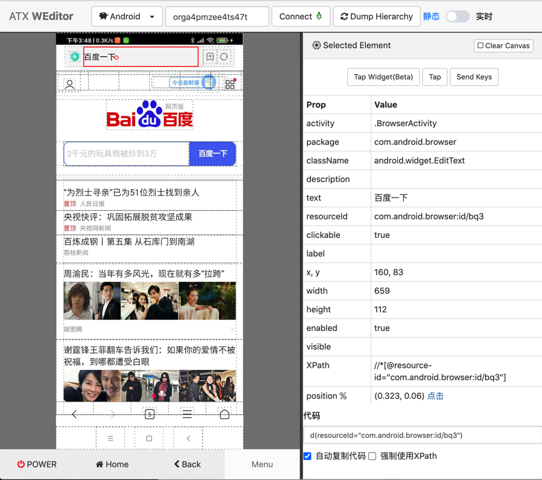

# 输入内容

找到元素后，也会遇到需要输入内容的情况。

典型用法是：

```python
# 方式1：xpath的set_text方式
searchElementSelector = self.driver.xpath(locatorText)
searchElementSelector.set_text(text)
```

即可输入文字。

后记：已整理成独立函数：

```python
def selectorSetText(self, curXpathSelector, inputText):
    # Special: add click to try workaround for 360 pwd EditText input but input to 360 account EditText
    # curXpathSelector.click()
    # curXpathSelector.clear_text()
    selectorSetTextResp = curXpathSelector.set_text(inputText)
    logging.debug("selectorSetTextResp=%s", selectorSetTextResp) # selectorSetTextResp=None
    # 在set_text后，输入法会变成FastInputIME输入法
    # 用下面代码可以实现：关掉FastInputIME输入法，切换回系统默认输入法
    self.driver.set_fastinput_ime(False)
```

调用举例：

```python
Qihoo360_Account = "yourAccount"
accountXpath = """//android.widget.EditText[@resource-id="com.qihoo.gamecenter.pluginapk:id/lp_account_input_edit" and @index="1"]"""
accountSelector = self.driver.xpath(accountXpath)
self.selectorSetText(accountSelector, Qihoo360_Account)
```

## 举例：点击和进入百度搜索页面并输入内容，再触发搜索

用代码：

```python
################################################################################
# Open baidu homepage
################################################################################

# trigger into input page

# Method 1
inputUiObj = d(resourceId="com.android.browser:id/b4h", className="android.widget.TextView")
inputUiObj.click()

# # Method 2
# inputXpathSelector = d.xpath("//android.widget.TextView[@resource-id='com.android.browser:id/b4h']")
# inputXpathSelector.click()

# input baidu homr url
BaiduHomeUrl = "https://www.baidu.com/"
searchUiObj = d(resourceId="com.android.browser:id/bq3", className="android.widget.EditText")
searchUiObj.set_text(BaiduHomeUrl)

# trigger jump to baidu home
d.press("enter")
```

实现了：

在浏览器首页中，点击顶部搜索框，进入搜索地址栏输入框页面

输入了百度首页地址后

输入回车键，触发跳转

进入了百度首页

效果：


