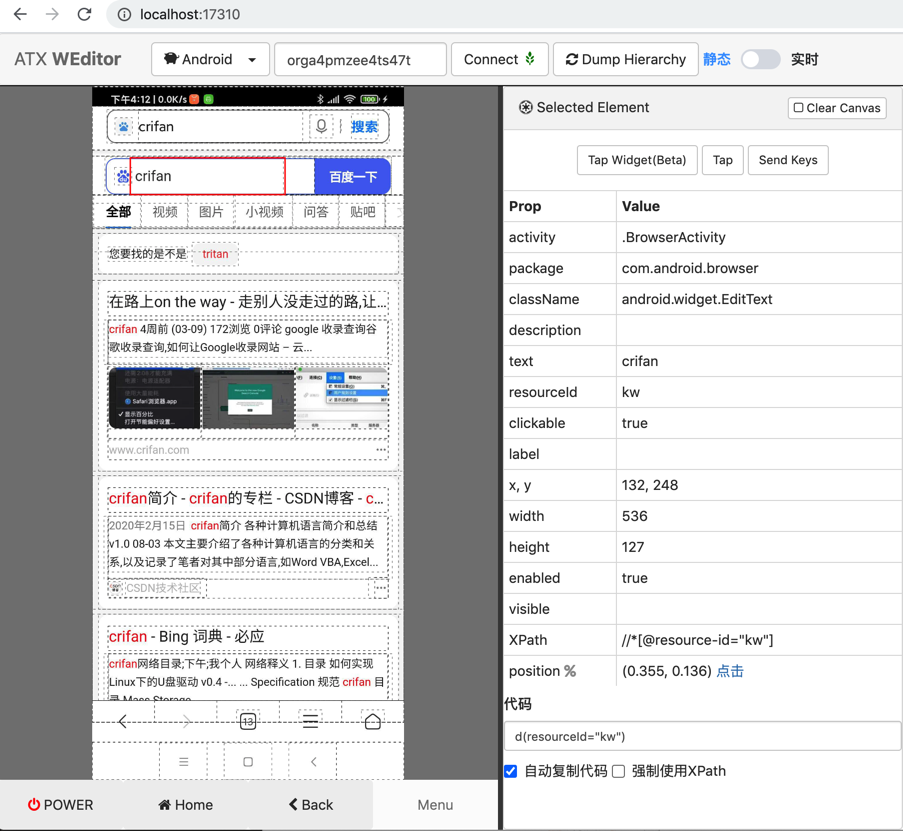

# 按键

操作安卓手机，常会遇到，模拟按键输入。

可以用`press`，比如：

```python
TriggerSearchKey = "enter" # work
d.press(TriggerSearchKey)
```

## 举例

代码：

```python
################################################################################
# Input text
################################################################################
searchStr = "crifan"

baiduSearchKeywordUiObj = d(resourceId="index-kw", className="android.widget.EditText")
baiduSearchKeywordUiObj.set_text(searchStr)
print("Inputed baidu search text %s" % searchStr)

################################################################################
# Trigger baidu search
################################################################################

# # Method 1: press key
TriggerSearchKey = "enter" # work
# # TriggerSearchKey = "search" # not work
# # TriggerSearchKey = "go" # not work
# # TriggerSearchKey = "done" # not work
d.press(TriggerSearchKey)
print("Emulated press key %s" % TriggerSearchKey)

# Method 2: find 百度一下 button then click
# baiduSearchButtonUiObj = d(resourceId="index-bn", className="android.widget.Button")
# baiduSearchButtonUiObj.click()
print("Clicked baidu search button")
```

可以实现：

给百度首页中

输入要搜索的文字

并（模拟按下回车键，或，找到百度一下按钮并点击）触发搜索

效果：


