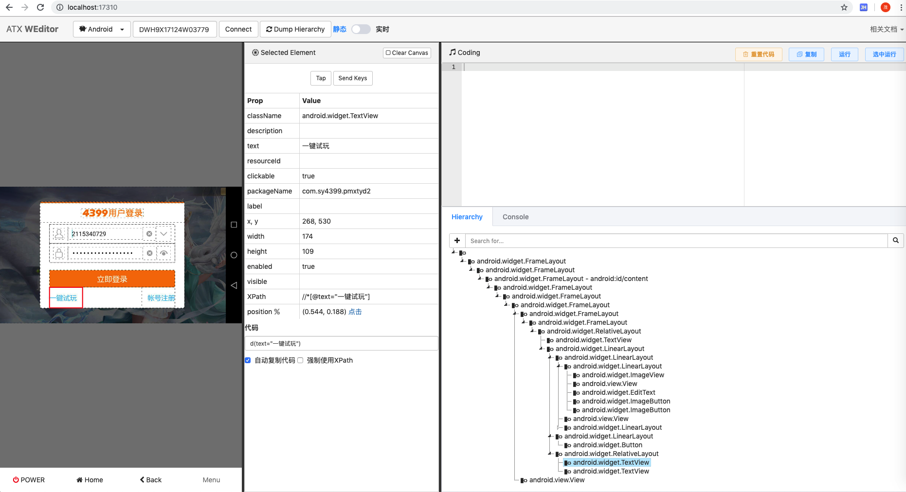

# 屏幕

此处整理和屏幕相关操作

## 点击（屏幕 坐标）

```python
self.driver.click(x, y)
```

## 长按

```python
self.driver.long_click(x,y,duration=1.5)
```

## 滑动

```python
# 等待时间
SwipDuration_Android = 0.3

SwipeDirectionBounds = [338, 333, 38, 333]
curSession.swipe(SwipeDirectionBounds[0], SwipeDirectionBounds[1], SwipeDirectionBounds[2], SwipeDirectionBounds[3], SwipDuration_Android)

self.driver.swipe(SwipeDirectionBounds[0], SwipeDirectionBounds[1], SwipeDirectionBounds[2], SwipeDirectionBounds[3], SwipDuration_Android)
```

## （从当前屏幕）返回上一页

```python
self.driver.press("back")
```

## （屏幕）坐标值

### boundsToCenterPoint：从bounds算出中间坐标值

```python
def boundsToCenterPoint(self, boundsStr):
    """
        从bounds转换出中间点位置坐标

        Example：
            bounds: '[156,1522][912,2027]'
            return: [534, 1774]
    """
    filterStr = re.sub('\[|,|\]', " ", boundsStr)
    boundStrList = filterStr.split()
    boundMap = map(int, boundStrList)
    boundIntList = list(boundMap)
    x0 = boundIntList[0]
    y0 = boundIntList[1]
    x1 = boundIntList[2]
    y1 = boundIntList[3]
    centerPoint = [(x1 + x0)//2,(y1 + y0)//2]
    return centerPoint
```

调用：

```python
centerPoint = self.boundsToCenterPoint(locatorBounds)
self.tap(centerPoint)
```


## 当前屏幕

针对于当前屏幕，最常见的几个动作是：

* 截图=截屏
* 获取(当前)页面源码(xml)

### 给当前屏幕截图

核心代码：

```python
fullImgFilePath = self.driver.screenshot(fullImgFilePath)
```

举例：

```python
fullImgFilePath = 'debug/GameScreenshot/20191209_171115.png'
fullImgFilePath = self.driver.screenshot(fullImgFilePath)
```

### getCurPageSource：获取当前屏幕画面对应的xml源码

函数：

```python
def getCurPageSource(self):
    # curPageSrcXml = self.driver.dump_hierarchy()
    curPageSrcXml = self.driver.dump_hierarchy(compressed=False, pretty=False)

    # output, exitCode = self.driver.shell(["adb", "shell", "uiautomator", "dump"])
    # output, exitCode = self.driver.shell(["uiautomator", "dump"])
    # output, exitCode = self.driver.shell("uiautomator dump")
    # output, exitCode = self.driver.shell(["shell", "uiautomator", "dump"])
    # curPageSrcXml = output

    return curPageSrcXml
```

调用：

```python
curPageSrcXml = self.getCurPageSource()
```

举例：

对于下图中左边的登录界面：



用：

```python
page_source = self.driver.dump_hierarchy(compressed=False, pretty=False)
```

导出的源码是：

```xml
<?xml version=1.0 encoding=UTF-8 standalone=yes ?>
<hierarchy rotation="1">
    <node index="0" text="" resource-id="" class="android.widget.FrameLayout" package="com.sy4399.pmxtyd2" content-desc="" checkable="false" checked="false" clickable="false" enabled="true" focusable="false" focused="false" scrollable="false" long-clickable="false" password="false" selected="false" bounds="[0,0][1196,720]">
...
                                                    <node NAF="true" index="4" text="" resource-id="" class="android.widget.ToggleButton" package="com.sy4399.pmxtyd2" content-desc="" checkable="true" checked="false" clickable="true" enabled="true" focusable="true" focused="false" scrollable="false" long-clickable="false" password="false" selected="false" bounds="[834,314][906,386]" />
                                                </node>
                                            </node>
                                            <node index="1" text="" resource-id="" class="android.widget.LinearLayout" package="com.sy4399.pmxtyd2" content-desc="" checkable="false" checked="false" clickable="false" enabled="true" focusable="false" focused="false" scrollable="false" long-clickable="false" password="false" selected="false" bounds="[268,440][928,530]">
                                                <node index="0" text="立即登录" resource-id="" class="android.widget.Button" package="com.sy4399.pmxtyd2" content-desc="" checkable="false" checked="false" clickable="true" enabled="true" focusable="true" focused="false" scrollable="false" long-clickable="true" password="false" selected="false" bounds="[268,440][928,530]" />
                                            </node>
...
                                            </node>
                                        </node>
                                    </node>
                                </node>
                            </node>
                            <node index="1" text="" resource-id="" class="android.view.View" package="com.sy4399.pmxtyd2" content-desc="" checkable="false" checked="false" clickable="false" enabled="true" focusable="false" focused="false" scrollable="false" long-clickable="false" password="false" selected="false" bounds="[218,80][978,86]" />
                        </node>
                    </node>
                </node>
            </node>
        </node>
    </node>
</hierarchy>
```

