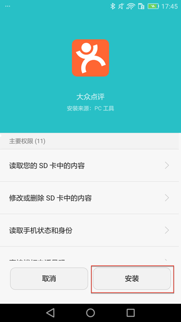
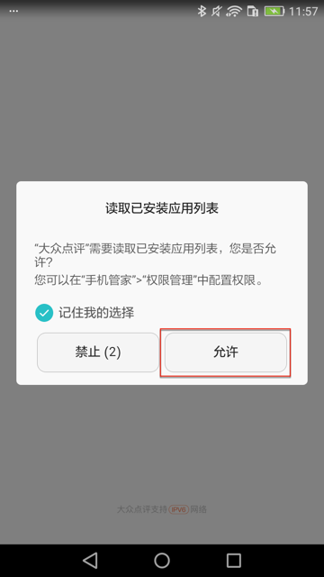

# 监听

其中一个很常用的，很好用的功能就是：**监听**

即，注册了要监听的条件，满足后，就会自动触发。

典型应用比如，希望界面中出现`好的`、`确定`等按钮，就自动点击。

比如：

* 大众点评安装期间的`安装`
  * 
* 弹框中的`允许`
  * 

则需要去注册监听器，其核心逻辑是：

* 之前用：`watcher`
* 现改用：`xpath`

详细解释：

`watcher`实现监听：

```python
# 注册单个监听器
d.watcher("安装").when(text="安装").click()
# 等价于
d.watcher("安装").when(text="安装").click(text="安装")

# （此刻）单次运行（一次）
d.watchers.run()

# 后台长期的运行
d.watchers.watched = True
```

其中的：
* `d.watchers.watched`在`uiautomator2` `>=1.0.0`版本后已废弃。
    * 推荐换用下面的`xpath`的写法：`xpath.watch_background`

`xpath`实现监听：

```python
# 注册单个监听器
d.xpath.when(text="安装").click()

# 单次运行一次
d.xpath.run_watchers()

# 后台长期的运行=开启后台监控模式
d.xpath.watch_background() # 默认每4s检查一次
# 或手动设置间隔时间
d.xpath.watch_background(2.0) # 2.0表示每2秒检查一次

# 如果需要，再去停止后台监听
d.xpath.watch_stop()
```

更多关于xpath的细节和用法，详见：

[uiautomator2/uiautomator2/ext/xpath at master · openatx/uiautomator2](https://github.com/openatx/uiautomator2/tree/master/uiautomator2/ext/xpath)

（注：不在主页的readme中，所以一般很少人能找到。我是从[raw的readme.md](https://raw.githubusercontent.com/openatx/uiautomator2/master/uiautomator2/ext/xpath/README.md)中反推才找到的）

