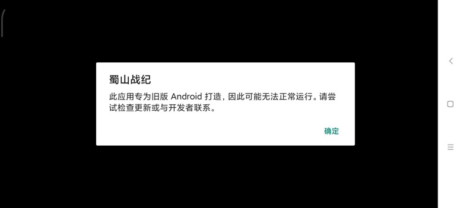

# 监听

其中一个很常用的，很好用的功能就是：**监听**

即，注册了要监听的条件，满足后，就会自动触发。

典型应用比如，希望界面中出现`好的`、`确定`等按钮，就自动点击。

比如：

* 大众点评安装期间的`安装`
  * 
* 弹框中的`允许`
  * 
* 普通安卓原生的按钮：`确定`
  * 

则需要去注册监听器，其核心逻辑是：

* 之前用：`watcher`
* 后改用：`xpath`
* 20210239 作者后来又改回：`watcher`

详细解释：

## 用`watcher`实现监听

```python
# 注册单个监听器
d.watcher("安装").when(text="安装").click()
# 等价于
d.watcher("安装").when(text="安装").click(text="安装")

# （此刻）单次运行（一次）
d.watchers.run()

# 后台长期的运行
# d.watchers.watched = True # 旧
d.driver.watcher.start() # 新
```

其中的：
* 20210329更新：版本`v2.5.3`之后，又从`xpath`换回`watcher`
  * 之前：`d.watchers.watched`在`uiautomator2` `>=1.0.0`版本后已废弃。
    * 当时：推荐换用下面的`xpath`的写法：`xpath.watch_background`

实际调用举例：

```python
def register_watcher(self):
  # Note: since uiautomator2 v2.5.3, change xpath back to wather, so use watcher now
  for key in self.config["install"]:
    logging.debug("register {}".format(key))
    # self.driver.watcher(key).when(text=key).click()
    # self.driver.watcher(key).when(text=key).click(text=key)
    # self.driver.watcher.when(key).click()
    self.driver.watcher(key).when(key).click()

  XpathConfigKeyList = [
    "Confirm_Button_Xpath_List",
    "NextStep_Button_Xpath_List",
    "PopupWindow_CloseButton_Xpath_List",
  ]
  for eachXpathConfigKey in XpathConfigKeyList:
    curXpathList = self.config[eachXpathConfigKey]
    for eachXpath in curXpathList:
      self.driver.watcher.when(eachXpath).click()
      logging.debug("Registered xpath wathcher: %s", eachXpath)

  self.driver.watcher.when(self.config["Vivo_Password_Input_Xpath"]).call(self.autoInputVivoPassword)
  self.driver.watcher.when(self.config["Vivo_Register_Vivo_Account_Xpath"]).call(self.autoDoVivoAccountLogin)
  self.driver.watcher.when(self.config["Permission_Settings_GoTo_App_Config_Xpath"]).call(self.autoGrantPermission)
  # self.driver.watcher.when(self.config["Qihoo360_Login_ReadAndAgree_Xpath"]).call(self.autoDo360AccountLogin)
  self.driver.watcher.when(self.config["Qihoo360_PasswordLogin_Xpath"]).call(self.autoDo360AccountLogin)

  self.driver.watcher.start()
```

## 用`xpath`实现监听

```python
# 注册单个监听器
d.xpath.when(text="安装").click()

# 单次运行一次
d.xpath.run_watchers()

# 后台长期的运行=开启后台监控模式
d.xpath.watch_background() # 默认每4s检查一次
# 或手动设置间隔时间
d.xpath.watch_background(2.0) # 2.0表示每2秒检查一次

# 如果需要，再去停止后台监听
d.xpath.watch_stop()
```

更多关于xpath的细节和用法，详见：

[uiautomator2/uiautomator2/ext/xpath at master · openatx/uiautomator2](https://github.com/openatx/uiautomator2/tree/master/uiautomator2/ext/xpath)

（注：不在主页的readme中，所以一般很少人能找到。我是从[raw的readme.md](https://raw.githubusercontent.com/openatx/uiautomator2/master/uiautomator2/ext/xpath/README.md)中反推才找到的）


