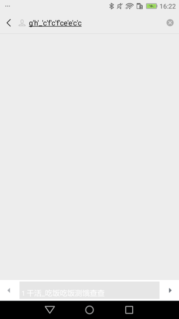
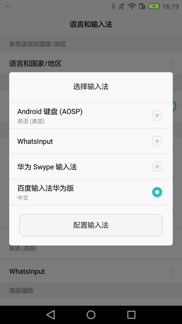
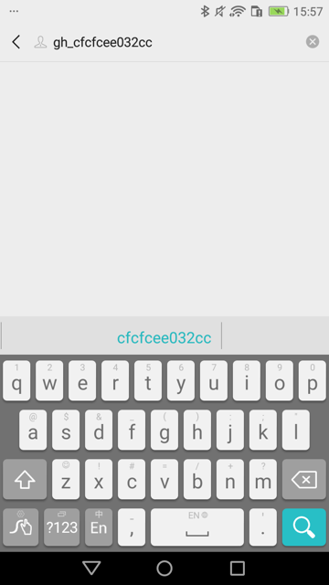

# 常见问题

此处整理出uiautomator2开发期间，遇到的一些常见问题及其解决办法。

## 输入文字

目前发现之前最早的代码：

```python
self.driver(text=locator["text"]).set_text(text,timeout=WaitFind)
```

结果会无法完整输入内容：处于，中文输入法中，输入了字母，但是丢失了数字 的效果：



且输入法此时已经也被换了（换成了 FastInputIME 或 系统自带（华为Swype） 输入法了）

注：

```python
self.driver(text=locator["text"]).set_text(text,timeout=WaitFind)
```

内部是调用的uiautomator2的session的set_text：

文件：`/Users/limao/.pyenv/versions/3.8.0/lib/python3.8/site-packages/uiautomator2/session.py`

```python
    def set_text(self, text, timeout=None):
        self.must_wait(timeout=timeout)
        if not text:
            return self.jsonrpc.clearTextField(self.selector)
        else:
            return self.jsonrpc.setText(self.selector, text)
```

（除了额外支持timeout参数外）

而换用另外的：

（1）`xpath`的`set_text`

```python
searchElementSelector = self.driver.xpath(searchKeyText)
searchElementSelector.set_text(text)
```

内部调用的：

文件：`/Users/limao/.pyenv/versions/3.8.0/lib/python3.8/site-packages/uiautomator2/xpath.py`

```python
    def set_text(self, text: str = ""):
        el = self.get()
        self._parent.send_text()  # switch ime
        el.click()  # focus input-area
        self._parent.send_text(text)
```

或

（2）`send_keys`

```python
self.driver.send_keys(text)
self.driver.set_fastinput_ime(False) # 关掉FastInputIME输入法，切换回系统默认输入法（此处华为手机默认输入法是华为Swype输入法）
```

其中，是否加上 打开FastInputIME

```python
self.driver.set_fastinput_ime(True) # # 切换成FastInputIME输入法
self.driver.send_keys(text)
self.driver.set_fastinput_ime(False) # 关掉FastInputIME输入法，切换回系统默认输入法（此处华为手机默认输入法是华为Swype输入法）
```

经测试，感觉没区别。

结果都是：


* 可以成功输入文字
    * 此处的：gh_cfcfcee032cc
* 但是输入法会被切换掉
    * 我之前设置的是：百度的输入法
            * 
        * 对应着，输入文字之前，应该是
            * 
    * 会被换成：当前系统默认自带输入法
        * 当前系统是：华为的畅享6S手机 DIG-AL00
            * 自带输入法是：华为Swype输入法
                * 
    * 效果是：
        * 

结论：

* 基本上实现了自己的：要输入文字的目的
* 但是：却把之前设置的（百度）输入法切换成系统的（华为）输入法了。
    * 问题不大，但是很不爽
        * 但是没办法改变和保留原有输入法

详见：

【部分解决】python的uiautomator2中set_text导致输入法变化无法顺利输入文字

## 权限问题导致long_click不工作

之前小米9中用long_click

```python
self.driver(text=locator["text"]).click(timeout=WaitFind)
```

报错：

```bash
uiautomator2.exceptions.JsonRpcError: 0 Unknown error: <Injecting to another application requires INJECT_EVENTS permission> data: {'exceptionTypeName': 'java.lang.SecurityException', 'message': 'Injecting to another application requires INJECT_EVENTS permission'}, method: click
```

即：`INJECT_EVENTS`问题=权限问题

解决办法：去开启权限 `USB调试（安全设置）` -> `允许通过USB调试修改权限或模拟点击`


注：期间会3次提醒你

* 因为这个权限很重要
    * 如果随便给了其他坏的应用
        * 可能会滥用，而导致你手机被恶意操控
            * 所以多次提醒你确认
                * 自己此处是调试手机，自动抓包，所以没问题，是打算开启此权限
