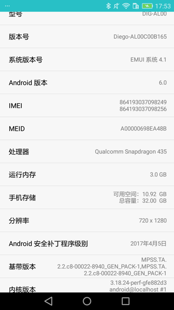
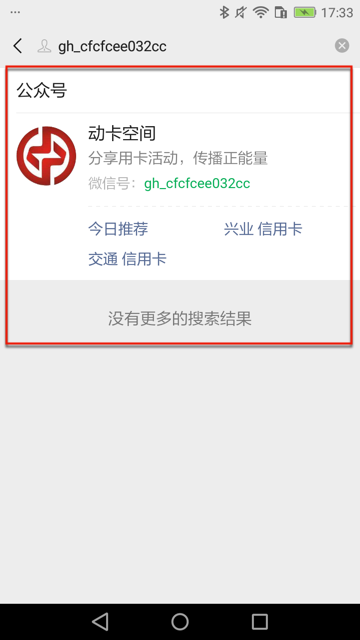
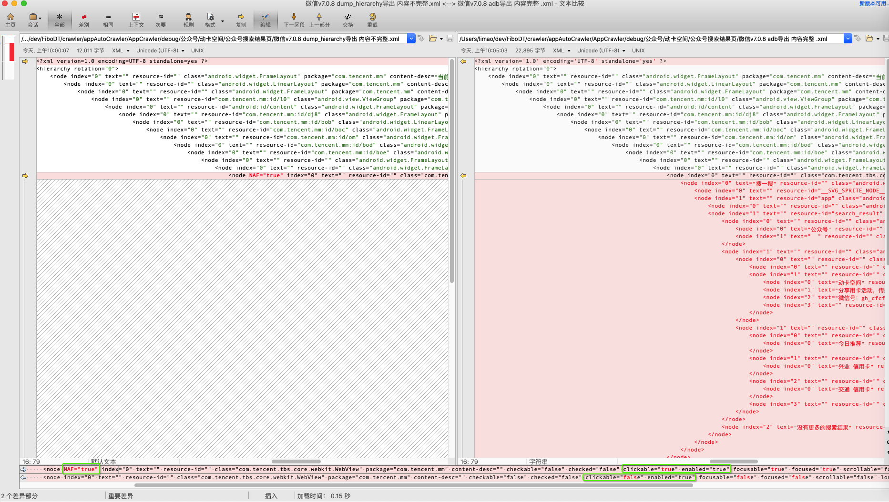
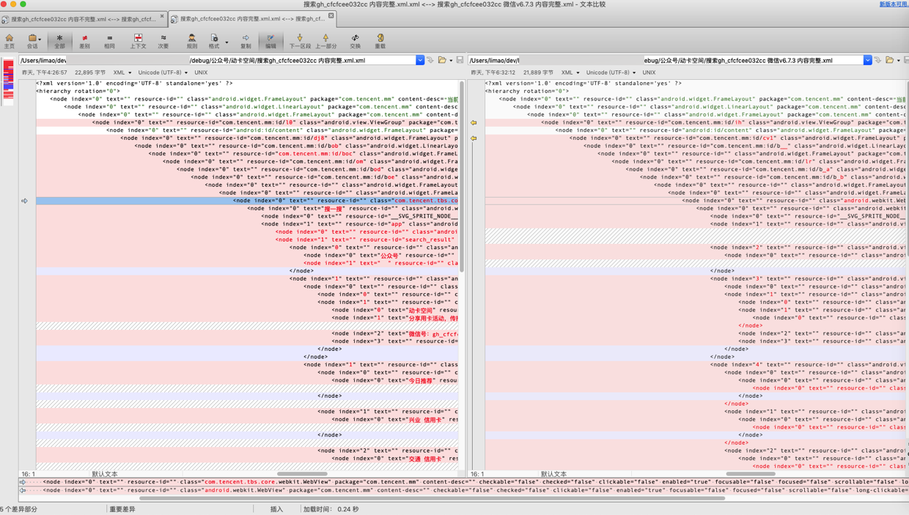

# NAF

此处所用安卓手机：`华为畅享6S DIG-AL00`



对于最新版的`v7.0.8`的微信，公众号搜索结果的页面，去导出源码，发现：
* `uiautomator2`中用代码：`self.driver.dump_hierarchy()`
    * 只能导出部分页面的源码
        * 其中红框内的源码无法导出
            * 
* Mac中终端运行adb命令：`adb shell uiautomator dump`
    * 能导出完整页面的源码

核心代码差异是：

```xml
<node NAF="true" index="0" text="" resource-id="" class="com.tencent.tbs.core.webkit.WebView" package="com.tencent.mm" content-desc="" checkable="false" checked="false" clickable="true" enabled="true" focusable="true" focused="true" scrollable="false" long-clickable="true" password="false" selected="false" bounds="[0,134][720,1208]" />
```

和

```xml
<node index="0" text="" resource-id="" class="com.tencent.tbs.core.webkit.WebView" package="com.tencent.mm" content-desc="" checkable="false" checked="false" clickable="false" enabled="true" focusable="false" focused="false" scrollable="false" long-clickable="false" password="false" selected="false" bounds="[0,134][720,1208]">

<node index="0" text="搜一搜" resource-id="" class="android.webkit.WebView" package="com.tencent.mm" content-desc="" checkable="false" checked="false" clickable="false" enabled="true" focusable="true" focused="true" scrollable="true" long-clickable="false" password="false" selected="false" bounds="[0,134][720,1208]">
...
```



另外：

之前旧版本 v6.7.3的微信，是可以正常导出的。

所以去研究：

微信版本升级前后的页面源码的变化：

* 升级前 = 微信`v6.7.3`
    * [2018微信v6.7.3老旧历史版本安装包官方免费下载_豌豆荚](https://www.wandoujia.com/apps/596157/history_v1360)
    * 页面源码：
        ```xml
        <node index="0" text="" resource-id="" class="android.webkit.WebView" package="com.tencent.mm" content-desc="" checkable="false" checked="false" clickable="false" enabled="true" focusable="false" focused="false" scrollable="false" long-clickable="false" password="false" selected="false" bounds="[0,144][720,1208]">
        <node index="0" text="" resource-id="" class="android.webkit.WebView" package="com.tencent.mm" content-desc="搜一搜" checkable="false" checked="false" clickable="false" enabled="true" focusable="true" focused="true" scrollable="true" long-clickable="false" password="false" selected="false" bounds="[0,144][720,1208]">

        <node index="0" text="" resource-id="__SVG_SPRITE_NODE__" class="android.widget.Image" package="com.tencent.mm" content-desc="" checkable="false" checked="false" clickable="false" enabled="true" focusable="false" focused="false" scrollable="false" long-clickable="false" password="false" selected="false" bounds="[0,0][0,0]" />
        ...
        ```
* 升级后 = 微信`v7.0.8`
    * [2019微信v7.0.8老旧历史版本安装包官方免费下载_豌豆荚](https://www.wandoujia.com/apps/596157/history_v1540)
    * 页面源码：
        ```xml
        <node index="0" text="" resource-id="" class="com.tencent.tbs.core.webkit.WebView" package="com.tencent.mm" content-desc="" checkable="false" checked="false" clickable="false" enabled="true" focusable="false" focused="false" scrollable="false" long-clickable="false" password="false" selected="false" bounds="[0,134][720,1208]">
        <node index="0" text="搜一搜" resource-id="" class="android.webkit.WebView" package="com.tencent.mm" content-desc="" checkable="false" checked="false" clickable="false" enabled="true" focusable="true" focused="true" scrollable="true" long-clickable="false" password="false" selected="false" bounds="[0,134][720,1208]">

        <node index="0" text="" resource-id="__SVG_SPRITE_NODE__" class="android.widget.Image" package="com.tencent.mm" content-desc="" checkable="false" checked="false" clickable="false" enabled="true" focusable="false" focused="false" scrollable="false" long-clickable="false" password="false" selected="false" bounds="[0,134][720,1208]" />
        ...
        ```

对比的区别：



主要是class的不同：
* `v6.7.3`：`class="android.webkit.WebView"`
* `v7.0.8`：`class="com.tencent.tbs.core.webkit.WebView"`

而`tbs`=`腾讯浏览器服务` = `X5浏览器` = `X5内核`

即，新版本微信的浏览器的内核，用上了新的X5内核


* 什么是NAF
    * =`Not Accessibility Friendly`
        * 直译：不可方便地访问（的节点）
            * `Accessibility`=`可访问性`=`可及性`
                * 与之相对的是：（元素节点）`Accessible` 可访问
                    * 其他普通的节点都是属于可访问的
                    * 被谁访问：被其他的工具或软件等读取和操作
                        * 其他的工具和软件：用来查看和研究android页面源码的工具
                            * 比如
                                * `android`自带的`uiautomatorviewer`
                                    * 其还支持选项`"Toggle NAF Nodes"`，打开后，可以查看到NAF的节点
                                        * 默认不能查看到NAF节点
                                    * 详见：
                                        * [UI Testing | Android Developers](https://stuff.mit.edu/afs/sipb/project/android/docs/tools/testing/testing_ui.html#overview)
                * Accessibility可访问性：主要指的是描述内容`content description`和`text`文本
                    * 只有描述内容或文本有内容
                        * 普通用户，才能从页面上才能看到该元素
                            * 否则对于普通用户就看不到该元素了，也就没太大意义了
                                * 或许可以被视为不可见元素了
            * 节点=元素=xml中的节点=某个UI控件=android程序中页面上的某个控件
                * =android的页面源码=xml代码
* 判定NAF的逻辑=如何判定一个节点是NAF
    * 根据上面的代码中的 `!nafExcludedClass(node) && !nafCheck(node)` 可以看出：
        * 先判断节点的类型
            *  `!nafExcludedClass(node)`：是属于那些可能被当做NAF节点的类型
                * 哪些节点，可能会被当做NAF节点呢？
                    * `class="xxx"`中`xxx`，即类名不在`NAF_EXCLUDED_CLASSES`范围内的
                        * 而`NAF_EXCLUDED_CLASSES`包括哪些呢？，包括如下：
                            * `android.widget.GridLayout`
                            * `android.widget.GridView`
                            * `android.widget.ListView`
                            * `android.widget.TableLayout`
                    * 可见：除了上面4种节点，其他类型的节点，（只要符合特定条件）都可能会被判定为NAF
        * 再判断节点的内容是否符合条件
            * `!nafCheck(node)`：
                * 是可点击的
                    * xml代码中：`clickable="true"`
                * 是已启用的=是有效的
                    * xml代码中：`enabled="true"`
                * 描述内容是空的
                    * xml代码中：`content-desc=""`
                * 文本是空的
                    * xml代码中：`text=""`
    * 如果上述2个条件都满足则判定是：NAF节点
        * 输出的节点中，会加上：`NAF="true"`
        * 这类节点，往往`resource-id`也是空
            * 典型的xml源码：
                * `<node NAF="true" ... text="" resource-id="" class="com.tencent.tbs.core.webkit.WebView" package="com.tencent.mm" content-desc="" ... clickable="true" enabled="true" ... />`
    * 思考：
        * 为何对于：可点击的、已启用的，但是描述内容是空的、文本是空的 节点，被当做NAF，认为不能被访问到呢？
            * 因为，这类节点，从android的界面上，往往是看不到的，但是却又能被点击，所以基本上处于不可用状态
                * 所以（代码的作者）认为这类节点，属于（从设计角度来说，就是故意）不想被普通用户看到，接触到
                    * 所以被判定为NAF，不应该被访问到
                        * 在导出页面源码时，被忽略掉，不导出NAF节点
        * 为何上述4种节点：`GridLayout`，`GridView`，`ListView`，`TableLayout`，不会被当做NAF呢？
            * 因为：满足了前面的 可点击的、已启用的，但是描述内容是空的、文本是空的 节点
                * 如果是本身属于（android系统自带的）列表、表格等方面的节点，
                    * 看起来就是：属于正常的节点了，因为这类节点，本身是可以没有描述内容，文本是空的
                        * 而列表，表格等节点，就是android中的：GridLayout，GridView，ListView，TableLayout等类型的节点
                            * 当然，作者自己也说了，这4个类型，未必完整
                                * 理论上，你也可以把其他的，合理的节点类型加到这个
                                    * `NAF_EXCLUDED_CLASSES`=不应该被认为是NAF的节点的类型中

详见：

【已解决】uiautomator2中导出页面源码中NAF是什么意思

而关于NAF如何规避解决，详见：

【未解决】如何确保uiautomator2的dump_hierarchy能导出页面中NAF的元素节点
