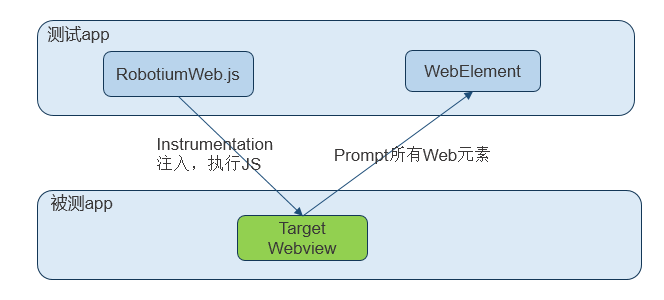

# uiautomator2简介

* uiautomator2
  * 简称：`u2`
  * 是什么：使用Python对Android设备进行UI自动化的库
  * 作用：自动化操作安卓设备，用于测试或抓包等
  * 语言：`Python`
  * 主页
    * [openatx/uiautomator2: Android Uiautomator2 Python Wrapper](https://github.com/openatx/uiautomator2)
      * 其中`openatx`中的
        * `ATX`=`AutomatorX`
  * 竞品=其他安卓自动化测试框架
    * Robotium
    * Selendroid
    * Espresso

## 基本原理

* 背景
  * Android内置的支持测试的框架
    * Android **4.2+**：`UiAutomator`
    * Android **2.3 ~ 4.1**：`Instrumentation`
* uiautomator2的原理
  * 图
    * 
  * 文字
    * 采用`Instrumentation`注入被测app后，执行`js`脚本，提取并封装成拥有`Web`元素的**文本信息**、`id`或`class`等属性、坐标信息等等的WebElement对象
      * 通过`js`注入的方式，可以获取网页中的包括文字、tag标签、属性、坐标等等信息。
        * `Android`
          * `WebChromeClient`类在`Android`中，主要用于辅助`WebView`处理`js`的对话框、提示框等等
