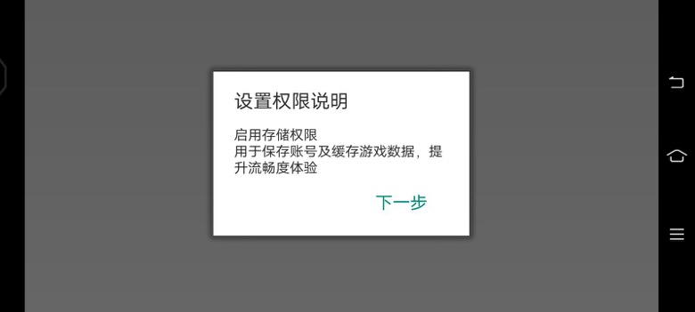
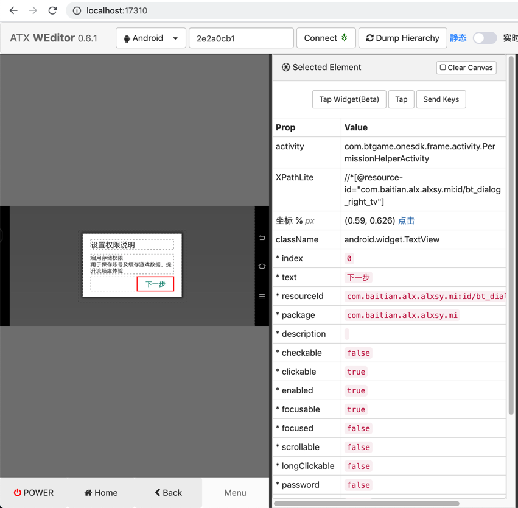
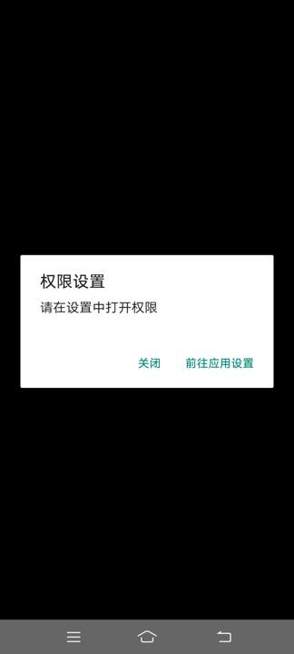
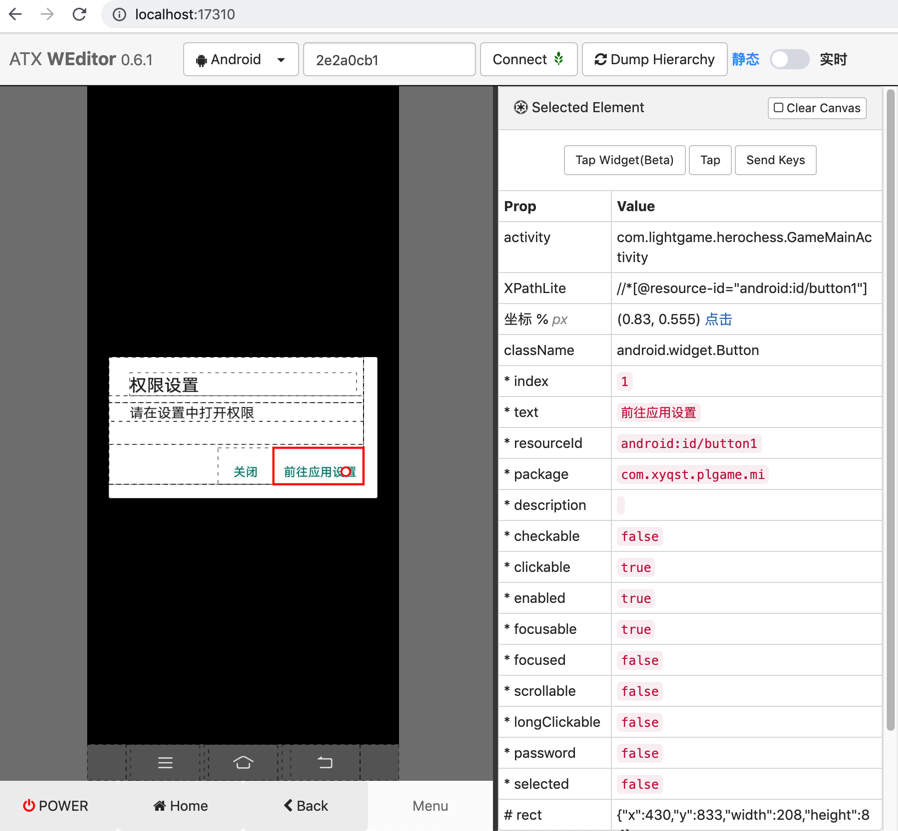

# 实际案例

此处整理和`uiautomator2`相关的一些实际案例，供参考。

## 监听特定元素

对于如下各种常见的按钮，可以用对应代码实现自动点击：

* 确定类按钮
* 广告类弹框
* Vivo自动安装app
* 奇虎360自动登录账号

详情请见后续章节。

以及其他一些小的例子：

### 下一步

代码：

```python
NextStep_Button_Xpath_List: [
    "//android.widget.TextView[@text='下一步' and contains(@resource-id, 'id/bt_dialog_right_tv')]", # 设置权限说明 启用存储权限 -> 下一步
]

for eachXpath in NextStep_Button_Xpath_List:
    self.driver.watcher.when(eachXpath).click()
```

可以点击 下一步 类的按钮：

游戏app截图：



weditor截图：



属性：

```shell
Prop    Value
activity    com.btgame.onesdk.frame.activity.PermissionHelperActivity
XPathLite    //*[@resource-id="com.baitian.alx.alxsy.mi:id/bt_dialog_right_tv"]
坐标 % px    (0.59, 0.626) 点击
className    android.widget.TextView
* index    0
* text    下一步
* resourceId    com.baitian.alx.alxsy.mi:id/bt_dialog_right_tv
* package    com.baitian.alx.alxsy.mi
* description    
* checkable    false
* clickable    true
* enabled    true
* focusable    true
* focused    false
* scrollable    false
* longClickable    false
* password    false
* selected    false
# rect    {"x":815,"y":423,"width":218,"height":85}
```

详见：

【或许解决】用uiautomator2实现自动检测并点击安卓弹框：下一步

### 自动同意前往应用设置的权限

代码：

```python
Permission_Settings_GoTo_App_Config_Xpath: "//android.widget.Button[@resource-id='android:id/button1' and @text='前往应用设置']"

def autoGrantPermission(self):
    """Auto grant permission for permission popup
        权限设置 弹框
            关闭 前往应用设置
    """
    gotoAppSettingsStr = "前往应用设置"
    gotoAppSettingsElement = self.driver(text=gotoAppSettingsStr, className="android.widget.Button", resourceId="android:id/button1", clickable="true")
    if gotoAppSettingsElement:
        gotoAppSettingsElement.click()
        logging.info("Has clicked %s button", gotoAppSettingsStr)
        time.sleep(0.1)
    else:
        logging.warning("Not found %s button", gotoAppSettingsStr)
```


游戏app截图：



weditor截图：



属性：

```shell
Prop    Value
activity    com.lightgame.herochess.GameMainActivity
XPathLite    //*[@resource-id="android:id/button1"]
坐标 % px    (0.83, 0.555) 点击
className    android.widget.Button
* index    1
* text    前往应用设置
* resourceId    android:id/button1
* package    com.xyqst.plgame.mi
* description    
* checkable    false
* clickable    true
* enabled    true
* focusable    true
* focused    false
* scrollable    false
* longClickable    false
* password    false
* selected    false
# rect    {"x":430,"y":833,"width":208,"height":84}
代码 d(resourceId="android:id/button1")
```

注：未完待续

详见：

【未解决】自动化测试工具新增逻辑：权限设置弹框前往应用设置并允许

