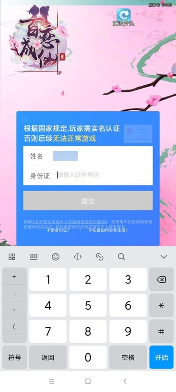

# （各大应用市场授权后的）广告类弹框

代码：

```python
PopupWindow_CloseButton_Xpath_List: [
    "//android.widget.RelativeLayout[contains(@resource-id, 'id/notice_close_view')]", # 华为应用市场登录后 广告 弹框 关闭按钮
    "//android.widget.ImageView[contains(@resource-id, 'id/h6') and @clickable='true']", # vivo应用市场登录后 广告 弹框 关闭按钮 com.vivo.sdkplugin:id/h6
    "//android.widget.ImageView[contains(@resource-id, 'id/h8') and @clickable='true']", # vivo应用市场登录后 广告 弹框 关闭按钮 com.vivo.sdkplugin:id/h8
    "//android.widget.ImageView[contains(@resource-id, 'id/vivo_acts_mutitxt_dialog_close') and @clickable='true']", # vivo应用市场登录后 广告 弹框 关闭按钮 com.vivo.sdkplugin:id/vivo_acts_mutitxt_dialog_close
    "//android.widget.ImageView[contains(@resource-id, 'id/vivo_acts_loginpic_dialog_close') and @clickable='true']", # vivo应用市场登录后 广告 弹框 关闭按钮 com.vivo.sdkplugin:id/vivo_acts_loginpic_dialog_close
    "//android.widget.ImageView[contains(@resource-id, 'id/vivo_login_acts_close_button') and @clickable='true']", # vivo应用市场登录后 广告 弹框 关闭按钮 com.vivo.sdkplugin:id/vivo_login_acts_close_button
    "//android.widget.ImageView[contains(@resource-id, 'id/d6') and @clickable='true']", # vivo应用市场登录后 广告 弹框 关闭按钮 com.vivo.sdkplugin:id/d6
    # "//android.widget.Image[@text='7cWwAAAABJRU5ErkJggg==' and @index='0' and @clickable='true']", # 小米市场登录后 广告 弹框 关闭按钮 d(text="7cWwAAAABJRU5ErkJggg==")
    # 小米市场登录后 广告 弹框 关闭按钮
    # 1. d(text="7cWwAAAABJRU5ErkJggg==")
    # 2. d(text="2d7mODgAAAAAAAAAAAAAAAACV+wGa61esTL2CSwAAAABJRU5ErkJggg==")
    # "//android.widget.Image[contains(@text, 'ggg==') and @clickable='true']",
    # 防止误判 实名认证期间输入身份证时的清楚关闭按钮
    # XPathLite    //*[@text="Iuk6V5zR2fE3Srww7HUGlCXpdxkywloAa4frPB9WqgzyMteU5acplr5nrJ4FoCqV3IQITokJqobnpSAsAoXgb4YtAy9yIXD2zlgX9dfKaFm44EagAAAABJRU5ErkJggg=="]
    # 改为：
    "//android.widget.Image[contains(@text, 'wAAAABJRU5ErkJggg==') and @clickable='true']",
    "//android.view.View[@text='知道了' and @index='0' and @clickable='true']", # 新人福利专享 5元 知道了
]

for eachXpath in PopupWindow_CloseButton_Xpath_List:
    self.driver.watcher.when(eachXpath).click()
```

可以自动点击，很多游戏在注册和登录期间遇到的，在各大安卓应用市场同意授权返回后的广告类的弹框：

## 华为应用市场 弹框广告

## 广告1

weditor截图：


属性：

```shell
Prop    Value
activity    com.huawei.jos.joint.notice.JosNoticeDialogActivity
XPathLite    //*[@resource-id="com.huawei.hwid:id/notice_close_view"]
坐标 % px    (0.665, 0.176) 点击
className    android.widget.RelativeLayout
* index    1
* text    
* resourceId    com.huawei.hwid:id/notice_close_view
* package    com.huawei.hwid
* description    
* checkable    false
* clickable    false
* enabled    true
* focusable    false
* focused    false
* scrollable    false
* longClickable    false
* password    false
* selected    false
# rect    {"x":1563,"y":146,"width":88,"height":88}
代码 d(resourceId="com.huawei.hwid:id/notice_close_view")
```

广告弹框被自动点击关闭后，相关log输出是：

```shell
your input:[I 210104 11:53:14 watcher:255] XPath(hook:): ["//android.widget.RelativeLayout[contains(@resource-id, 'id/notice_close_view')]"]
```

之后即可看到原先app的内容了：


## 小米应用市场 弹框广告

### 广告1

游戏app截图：


weditor截图：


属性：

```shell
Prop    Value
activity    com.xiaomi.gamecenter.sdk.ui.NoticeDialogsActivityKt
XPathLite    //*[@text="7cWwAAAABJRU5ErkJggg=="]
坐标 % px    (0.702, 0.208) 点击
className    android.widget.Image
* index    0
* text    7cWwAAAABJRU5ErkJggg==
* resourceId    
* package    com.xiaomi.gamecenter.sdk.service
* description    
* checkable    false
* clickable    true
* enabled    true
* focusable    false
* focused    false
* scrollable    false
* longClickable    false
* password    false
* selected    false
# rect    {"x":1603,"y":118,"width":124,"height":124}
代码 d(text="7cWwAAAABJRU5ErkJggg==")
```

### 广告2

weditor截图：


属性：

```shell
Prop    Value
activity    com.xiaomi.gamecenter.sdk.ui.prize.LoginPrizeActivity
XPathLite    //*[@text="2d7mODgAAAAAAAAAAAAAAAACV+wGa61esTL2CSwAAAABJRU5ErkJggg=="]
坐标 % px    (0.662, 0.223) 点击
className    android.widget.Image
* index    5
* text    2d7mODgAAAAAAAAAAAAAAAACV+wGa61esTL2CSwAAAABJRU5ErkJggg==
* resourceId    
* package    com.xiaomi.gamecenter.sdk.service
* description    
* checkable    false
* clickable    true
* enabled    true
* focusable    false
* focused    false
* scrollable    false
* longClickable    false
* password    false
* selected    false
# rect    {"x":1467,"y":192,"width":93,"height":93}
代码 d(text="2d7mODgAAAAAAAAAAAAAAAACV+wGa61esTL2CSwAAAABJRU5ErkJggg==")
```

### 广告3

游戏：`com.yzcm.jr.mi/巨刃`

游戏app截图：


weditor截图：


属性：

```shell
Prop    Value
activity    com.xiaomi.gamecenter.sdk.ui.NoticeDialogsActivityKt
XPathLite    //*[@text="知道了"]
坐标 % px    (0.615, 0.6) 点击
className    android.view.View
* index    0
* text    知道了
* resourceId    
* package    com.xiaomi.gamecenter.sdk.service
* description    
* checkable    false
* clickable    true
* enabled    true
* focusable    false
* focused    false
* scrollable    false
* longClickable    false
* password    false
* selected    false
# rect    {"x":198,"y":1394,"width":684,"height":176}
代码 d(text="知道了")
```

### 防止其他页面误判为小米广告

之前还遇到游戏：`com.youai.blcx.mi/百恋成仙`

会出现：

游戏app截图：



weditor截图：


会发现，当输入框后面的x关闭小按钮时，对应也有类似的字段：

```shell
Prop    Value
activity    com.xiaomi.gamecenter.sdk.ui.MiVerifyActivity
XPathLite    //*[@text="Iuk6V5zR2fE3Srww7HUGlCXpdxkywloAa4frPB9WqgzyMteU5acplr5nrJ4FoCqV3IQITokJqobnpSAsAoXgb4YtAy9yIXD2zlgX9dfKaFm44EagAAAABJRU5ErkJggg=="]
坐标 % px    (0.445, 0.444) 点击
className    android.widget.Image
* index    2
* text    Iuk6V5zR2fE3Srww7HUGlCXpdxkywloAa4frPB9WqgzyMteU5acplr5nrJ4FoCqV3IQITokJqobnpSAsAoXgb4YtAy9yIXD2zlgX9dfKaFm44EagAAAABJRU5ErkJggg==
* resourceId    
* package    com.youai.blcx.mi
* description    
* checkable    false
* clickable    true
* enabled    true
* focusable    false
* focused    false
* scrollable    false
* longClickable    false
* password    false
* selected    false
# rect    {"x":878,"y":1056,"width":38,"height":38}
```

经过调试和思考，最后改为：`wAAAABJRU5ErkJggg==`

即：

```python
  # "//android.widget.Image[@text='7cWwAAAABJRU5ErkJggg==' and @index='0' and @clickable='true']", # 小米市场登录后 广告 弹框 关闭按钮 d(text="7cWwAAAABJRU5ErkJggg==")
  # 小米市场登录后 广告 弹框 关闭按钮
  # 1. d(text="7cWwAAAABJRU5ErkJggg==")
  # 2. d(text="2d7mODgAAAAAAAAAAAAAAAACV+wGa61esTL2CSwAAAABJRU5ErkJggg==")
  # "//android.widget.Image[contains(@text, 'ggg==') and @clickable='true']",
  # 防止误判 实名认证期间输入身份证时的清楚关闭按钮
  # XPathLite    //*[@text="Iuk6V5zR2fE3Srww7HUGlCXpdxkywloAa4frPB9WqgzyMteU5acplr5nrJ4FoCqV3IQITokJqobnpSAsAoXgb4YtAy9yIXD2zlgX9dfKaFm44EagAAAABJRU5ErkJggg=="]
  # 改为：
  "//android.widget.Image[contains(@text, 'wAAAABJRU5ErkJggg==') and @clickable='true']",
```

即可防止误判：不要误判其他页面为小米的广告，而去关闭弹框了。

细节详见：

【已解决】用uiautomator2自动点击关闭小米应用市场登录后的广告弹框

## Vivo应用市场 弹框广告

### 广告1

游戏app截图：


weditor截图：


属性：

```shell
Prop    Value
activity    .core.compunctions.activity.UnionActivity
XPathLite    //*[@resource-id="com.vivo.sdkplugin:id/h6"]
坐标 % px    (0.654, 0.113) 点击
className    android.widget.ImageView
* index    1
* text    
* resourceId    com.vivo.sdkplugin:id/h6
* package    com.vivo.sdkplugin
* description    
* checkable    false
* clickable    true
* enabled    true
* focusable    true
* focused    false
* scrollable    false
* longClickable    false
* password    false
* selected    false
# rect    {"x":1517,"y":58,"width":110,"height":110}
代码 d(resourceId="com.vivo.sdkplugin:id/h6")
```

### 广告2

游戏app截图：


weditor截图：


属性：

```shell
Prop    Value
activity    .core.compunctions.activity.UnionActivity
XPathLite    //*[@resource-id="com.vivo.sdkplugin:id/h8"]
坐标 % px    (0.663, 0.186) 点击
className    android.widget.ImageView
* index    2
* text    
* resourceId    com.vivo.sdkplugin:id/h8
* package    com.vivo.sdkplugin
* description    
* checkable    false
* clickable    true
* enabled    true
* focusable    true
* focused    false
* scrollable    false
* longClickable    false
* password    false
* selected    false
# rect    {"x":1526,"y":122,"width":111,"height":132}
代码 d(resourceId="com.vivo.sdkplugin:id/h8")
```

### 广告3

游戏app截图：


weditor截图：


属性：

```shell
Prop    Value
activity    .core.compunctions.activity.UnionActivity
XPathLite    //*[@resource-id="com.vivo.sdkplugin:id/vivo_login_acts_close_button"]
坐标 % px    (0.782, 0.2) 点击
className    android.widget.ImageView
* index    2
* text    
* resourceId    com.vivo.sdkplugin:id/vivo_login_acts_close_button
* package    com.vivo.sdkplugin
* description    
* checkable    false
* clickable    true
* enabled    true
* focusable    true
* focused    false
* scrollable    false
* longClickable    false
* password    false
* selected    false
# rect    {"x":1226,"y":109,"width":48,"height":48}
代码 d(resourceId="com.vivo.sdkplugin:id/vivo_login_acts_close_button")
```

### 广告4

游戏app截图：


weditor截图：


核心属性：

* `resourceId`：`com.vivo.sdkplugin:id/d6`

