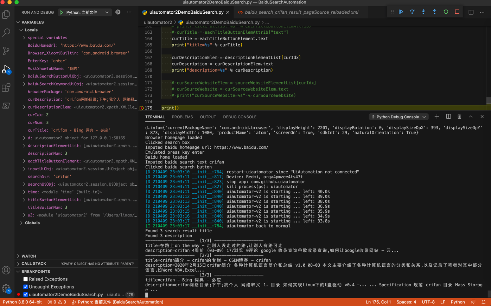
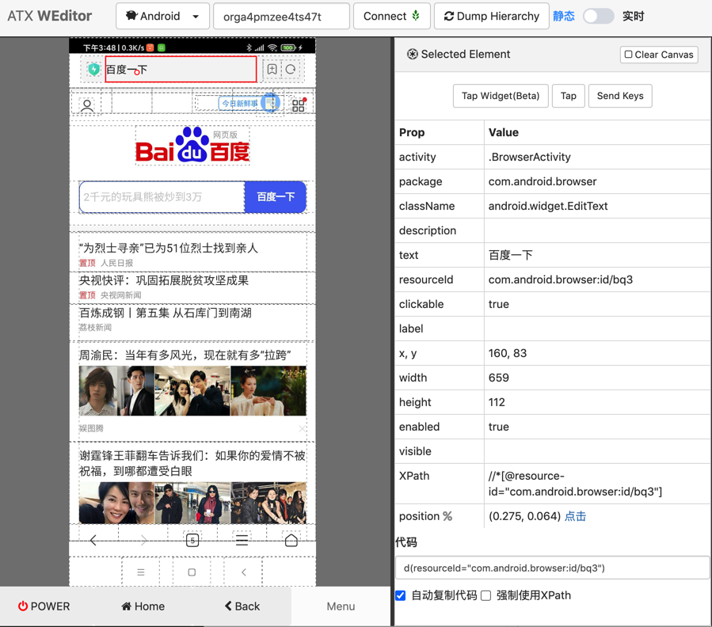

# 百度搜索自动化

用uiautomator2去操作安卓手机，模拟实现百度搜索自动化：打开浏览器，打开百度首页，输入crifan，点击搜索，显示搜索结果，解析搜索结果（的标题和链接地址）

## 代码

* 文件：[uiautomator2DemoBaiduSearch.py](../assets/file/uiautomator2DemoBaiduSearch.py)
* 贴出来是

```python
# Function: uiautomator2 demo baidu search
# Author: Crifan Li
# Update: 20210417

# import time
import uiautomator2 as u2

d = u2.connect() # connect to device
print("d.info=%s" % d.info)
# d.info={'currentPackageName': 'com.android.browser', 'displayHeight': 2201, 'displayRotation': 0, 'displaySizeDpX': 393, 'displaySizeDpY': 873, 'displayWidth': 1080, 'productName': 'atom', 'screenOn': True, 'sdkInt': 29, 'naturalOrientation': True}

# for debug: get current app info
# curApp = d.app_current()
# print("curApp=%s" % curApp)

# for debug: get running app list
# activeAppList = d.app_list_running()
# print("activeAppList=%s" % activeAppList)

################################################################################
# Launch browser
################################################################################
Browser_XiaomiBuiltin = "com.android.browser"
browserPackage = Browser_XiaomiBuiltin
# d.app_start(browserPackage)
d.app_start(browserPackage, stop=True)

# wait util browser launch complete -> appear 我的 tab
# MustShowTabName = "主页"
MustShowTabName = "我的"
# d(text=MustShowTabName).exists(timeout=10)
d(text=MustShowTabName, packageName=browserPackage).exists(timeout=10)
print("Browser homepage loaded")

################################################################################
# Open baidu homepage
################################################################################
SearchInputId = "com.android.browser:id/b4w"

# # open new window
# windowUiObj = d(resourceId="com.android.browser:id/dm")
# windowUiObj.click()

# # click add to new window
# addNewWindowUiObj = d(resourceId="com.android.browser:id/akr")
# addNewWindowUiObj.click()


# for debug
# curPageXml = d.dump_hierarchy(compressed=False, pretty=False)
# print("curPageXml=%s" % curPageXml)

# find input box inside address bar

# # Method 1: use driver pass in parameter
# inputUiObj = d(resourceId=SearchInputId, className="android.widget.TextView")
# # inputUiObj = d(resourceId=SearchInputId)
# print("type(inputUiObj)=%s" % type(inputUiObj)) # type(inputUiObj)=<class 'uiautomator2.session.UiObject'>
# print("inputUiObj=%s" % inputUiObj) # inputUiObj=<uiautomator2.session.UiObject object at 0x10a0bea00>
# inputUiObjectInfo = inputUiObj.info
# print("type(inputUiObjectInfo)=%s" % type(inputUiObjectInfo)) # type(inputUiObjectInfo)=<class 'dict'>
# print("inputUiObjectInfo=%s" % inputUiObjectInfo) # inputUiObjectInfo={'bounds': {'bottom': 172, 'left': 160, 'right': 797, 'top': 107}, 'childCount': 0, 'className': 'android.widget.TextView', 'contentDescription': '搜索框', 'packageName': 'com.android.browser', 'resourceName': 'com.android.browser:id/b4h', 'text': '', 'visibleBounds': {'bottom': 172, 'left': 160, 'right': 797, 'top': 107}, 'checkable': False, 'checked': False, 'clickable': True, 'enabled': True, 'focusable': False, 'focused': False, 'longClickable': False, 'scrollable': False, 'selected': False}
# isFoundInput = inputUiObj.exists # True

# # Method 2: use xpath
# inputXpathSelector = d.xpath("//android.widget.TextView[@resource-id=SearchInputId]")
# # inputXpathSelector = d.xpath("//*[@resource-id=SearchInputId]")
# print("type(inputXpathSelector)=%s" % type(inputXpathSelector)) # type(inputXpathSelector)=<class 'uiautomator2.xpath.XPathSelector'>
# inputXpathElem = inputXpathSelector.get()
# print("type(inputXpathElem)=%s" % type(inputXpathElem)) # type(inputXpathElem)=<class 'uiautomator2.xpath.XMLElement'>
# print("inputXpathElem=%s" % inputXpathElem) # inputXpathElem=<uiautomator2.xpath.XMLElement object at 0x108585d30>
# print("type(inputXpathElem.attrib)=%s" % type(inputXpathElem.attrib)) # type(inputXpathElem.attrib)=<class 'lxml.etree._Attrib'>
# print("inputXpathElem.attrib=%s" % inputXpathElem.attrib) # inputXpathElem.attrib={'index': '1', 'text': '', 'resource-id': 'com.android.browser:id/b4h', 'package': 'com.android.browser', 'content-desc': '搜索框', 'checkable': 'false', 'checked': 'false', 'clickable': 'true', 'enabled': 'true', 'focusable': 'false', 'focused': 'false', 'scrollable': 'false', 'long-clickable': 'false', 'password': 'false', 'selected': 'false', 'visible-to-user': 'true', 'bounds': '[160,107][797,172]'}
# isFoundInput = inputXpathSelector.exists # True


# trigger into input page

# Method 1
inputUiObj = d(resourceId=SearchInputId, className="android.widget.TextView")
inputUiObj.click()
print("Clicked search box")

# # Method 2
# inputXpathSelector = d.xpath("//android.widget.TextView[@resource-id=%s]" % SearchInputId)
# inputXpathSelector.click()

# input baidu homr url
BaiduHomeUrl = "https://www.baidu.com/"
AddressInputId = "com.android.browser:id/bqi"
searchUiObj = d(resourceId=AddressInputId, className="android.widget.EditText")
searchUiObj.set_text(BaiduHomeUrl)
print("Inputed baidu homepage url: %s" % BaiduHomeUrl)

# trigger jump to baidu home
EnterKey = "enter"
d.press(EnterKey)
print("Emulated press key %s" % EnterKey)

# wait util baidu home loaded
# d(text="百度一下", resourceId="com.android.browser:id/bq3").exists(timeout=10)
d(text="百度一下,你就知道", className="android.view.View").exists(timeout=10)
print("Baidu home loaded")

################################################################################
# Input text
################################################################################
searchStr = "crifan"

baiduSearchKeywordUiObj = d(resourceId="index-kw", className="android.widget.EditText")
baiduSearchKeywordUiObj.set_text(searchStr)
print("Inputed baidu search text %s" % searchStr)

################################################################################
# Trigger baidu search
################################################################################

# # Method 1: press key
# TriggerSearchKey = "enter" # work
# # TriggerSearchKey = "search" # not work
# # TriggerSearchKey = "go" # not work
# # TriggerSearchKey = "done" # not work
# d.press(TriggerSearchKey)
# print("Emulated press key %s" % TriggerSearchKey)

# Method 2: find 百度一下 button then click
baiduSearchButtonUiObj = d(resourceId="index-bn", className="android.widget.Button")
baiduSearchButtonUiObj.click()
print("Clicked baidu search button")

################################################################################
# Extract search result content
################################################################################

# Special: for fixbug of get page xml is not latest, so using following code to refresh to get latest page source xml
d.service("uiautomator").stop()
d.service("uiautomator").start()
# time.sleep(1)

# for debug
# get page source xml
# curPageXml = d.dump_hierarchy(compressed=False, pretty=False)
# print("curPageXml=%s" % curPageXml)
# with open("baidu_search_%s_result_pageSource_reloaded.xml" % searchStr, "w") as fp:
#     fp.write(curPageXml)

d(resourceId="results").exists(timeout=10)

# Note: following syntax can NOT find elements
# resultsSelector = d.xpath("//*[@resource-id='results']")
# titleButtonSelectorList = resultsSelector.xpath("//android.widget.Button[@clickable='true']").all()
# titleButtonSelectorList = resultsSelector.xpath(".//android.widget.Button[@clickable='true']").all()

# Xpath chain search can find elements
titleButtonElementList = d.xpath("//*[@resource-id='results']//android.widget.Button[@clickable='true']").all()
titleButtonNum = len(titleButtonElementList)
print("Found %s search result title" % titleButtonNum)

# descriptionElementList = d.xpath("//*[@resource-id='results']/android.view.View[1]/android.view.View[1]/android.view.View[2]/android.view.View[1]/android.view.View[1]/android.view.View[1]/android.view.View[1]/android.view.View[1]").all()
descriptionElementList = d.xpath("//*[@resource-id='results']/android.view.View/android.view.View[1]/android.view.View[2]/android.view.View[1]/android.view.View[1]/android.view.View[1]/android.view.View[1]/android.view.View[1]").all()
descriptionNum = len(descriptionElementList)
print("Found %s description" % descriptionNum)

# # sourceWebsiteElementList = d.xpath('//*[@resource-id="results"]/android.view.View/android.view.View[1]/android.view.View[2]/android.view.View[1]').all()
# sourceWebsiteElementList = d.xpath('//*[@resource-id="results"]/android.view.View/android.view.View[1]/android.view.View[2]/android.view.View[2]').all()
# sourceWebsiteNum = len(sourceWebsiteElementList)
# print("Found %s source website" % sourceWebsiteNum)

for curIdx, eachTitleButtonElement in enumerate(titleButtonElementList):
    curNum = curIdx + 1
    print("%s  [%d/%d] %s" % ("-"*20, curNum, titleButtonNum, "-"*20))
    # eachTitleButtonElemAttrib = eachTitleButtonElement.attrib
    # print("title attrib: %s" % eachTitleButtonElemAttrib)
    # curTitle = eachTitleButtonElemAttrib["text"]
    curTitle = eachTitleButtonElement.text
    print("title=%s" % curTitle)

    curDescriptionElem = descriptionElementList[curIdx]
    curDescription = curDescriptionElem.text
    print("description=%s" % curDescription)

    # curSourceWebsiteElem = sourceWebsiteElementList[curIdx]
    # curSourceWebsite = curSourceWebsiteElem.text
    # print("curSourceWebsite=%s" % curSourceWebsite)

print("Demo baidu search complete")
```

实现了：

* 打开安卓中浏览器，进入首页
* 输入百度首页地址，进入百度首页
* 给输入框中输入crifan，并触发搜索
* 等待页面加载完毕
  * （由于手机屏幕有限，当前页面只显示了3个搜索结果）
* 获取并解析每一条的标题title和description描述
* 并打印输出

视频：

<video id="uiautomator2DemoBaiduSearch" controls="controls" preload="none" width="800" height="600">
  <source src="../assets/file/uiautomator2DemoBaiduSearch.mp4" type="video/mp4">
</video>

截图：



输出：

```bash
d.info={'currentPackageName': 'com.android.browser', 'displayHeight': 2201, 'displayRotation': 0, 'displaySizeDpX': 393, 'displaySizeDpY': 873, 'displayWidth': 1080, 'productName': 'atom', 'screenOn': True, 'sdkInt': 29, 'naturalOrientation': True}
Browser homepage loaded
Clicked search box
Inputed baidu homepage url: https://www.baidu.com/
Emulated press key enter
Baidu home loaded
Inputed baidu search text crifan
Clicked baidu search button
[D 210409 23:03:10 __init__:764] restart-uiautomator since "UiAutomation not connected"
[D 210409 23:03:11 __init__:817] Device: Redmi, orga4pmzee4ts47t
[D 210409 23:03:11 __init__:823] stop app: com.github.uiautomator
[D 210409 23:03:11 __init__:827] kill process(ps): uiautomator
[D 210409 23:03:11 __init__:840] uiautomator-v2 is starting ... left: 40.0s
[D 210409 23:03:12 __init__:840] uiautomator-v2 is starting ... left: 39.0s
[D 210409 23:03:13 __init__:840] uiautomator-v2 is starting ... left: 38.0s
[D 210409 23:03:14 __init__:840] uiautomator-v2 is starting ... left: 36.9s
[D 210409 23:03:15 __init__:840] uiautomator-v2 is starting ... left: 35.9s
[D 210409 23:03:16 __init__:840] uiautomator-v2 is starting ... left: 34.9s
[D 210409 23:03:17 __init__:840] uiautomator-v2 is starting ... left: 33.8s
[I 210409 23:03:17 __init__:784] uiautomator back to normal
Found 3 search result title
Found 3 description
--------------------  [1/3] --------------------
title=在路上on the way - 走别人没走过的路,让别人有路可走
description=crifan 4周前 (03-09) 177浏览 0评论 google 收录查询谷歌收录查询,如何让Google收录网站 – 云...
--------------------  [2/3] --------------------
title=crifan简介 - crifan的专栏 - CSDN博客 - crifan
description=2020年2月15日crifan简介 各种计算机语言简介和总结 v1.0 08-03 本文主要介绍了各种计算机语言的分类和关系,以及记录了笔者对其中部分语言,如Word VBA,Excel...
--------------------  [3/3] --------------------
title=crifan - Bing 词典 - 必应
description=crifan网络目录;下午;我个人 网络释义 1. 目录 如何实现Linux下的U盘驱动 v0.4 -... ... Specification 规范 crifan 目录 Mass Storage ...
```

## 调试

期间用weditor调试页面，找元素属性。

比如：

找浏览器中 百度一下 的标题：



拷贝出元素属性值：

```bash
Prop    Value
activity    .BrowserActivity
package    com.android.browser
className    android.widget.EditText
description    
text    百度一下
resourceId    com.android.browser:id/bq3
clickable    true
label    
x, y    160, 83
width    659
height    112
enabled    true
visible    
XPath    //*[@resource-id="com.android.browser:id/bq3"]
position     (0.275, 0.064) 点击
代码 d(resourceId="com.android.browser:id/bq3")
```

其中（常可用于定位元素的）核心参数是：

* `resourceId`： `com.android.browser:id/bq3`
* `text`：`百度一下`
* `className`： `android.widget.EditText`

即可写出，比如，判断该元素是否出现的代码了：

```python
d(text="百度一下", resourceId="com.android.browser:id/bq3").exists(timeout=10)
```

