# 确定类的按钮

代码：

```python
# 注：此处 确定 按钮，加了这么多 属性判断，目的是为了防止误触发其他情况，比如vivo的账号登录弹框中的 确定
Confirm_Button_Xpath_List: [
    "//android.widget.Button[@text='确定' and @resource-id='android:id/button2' and @index='0' and @enabled='true']", # 权限申请 确定
    "//android.widget.Button[@text='确认' and @resource-id='android:id/button1' and @index='0' and @enabled='true']", # 提醒：权限授权确认 为了更好的游戏体验。。。 -> 确定
    "//android.widget.Button[@text='确定' and @resource-id='android:id/button1' and @index='0' and @enabled='true']", # 应用权限运行需要被授予读取外部存储。。。 -> 确定
    "//android.widget.Button[@text='确定' and @resource-id='android:id/button1' and @index='1' and @enabled='true' and @clickable='true']", # 客户端更新。。。 -> 确定
    "//android.widget.Button[@text='确定' and @resource-id='android:id/button1' and @index='2' and @enabled='true']", # 亲爱的玩家。。。申请一些权限。。。 -> 确定
    "//android.widget.Button[@text='确定' and contains(@resource-id, 'id/continue_button') and @index='1' and @enabled='true' and @clickable='true']", # 请选择要向...授予的权限-> 确定 com.android.permissioncontroller:id/continue_button
    "//android.widget.Button[@text='确定' and @resource-id='android:id/button3' and @index='0'  and @enabled='true' and @clickable='true']", # 重要提醒。。。点击确定接收我们的条款与隐私保护政策 确定 服务条款
    "//android.widget.Button[@text='同意' and @resource-id='android:id/button1' and @index='2' and @enabled='true' and @clickable='true']", # 为保证您正常的游戏体验。。。 -> 确定
    "//android.widget.Button[contains(@text, '知道了') and @resource-id='android:id/button1' and @index='0' and @clickable='true']", # 提示 游戏需要以下权限才能访问。。。 -> 知道了
    "//android.widget.Button[@text='同意' and contains(@resource-id, 'id/gasdk_base_privacy_agree') and @index='1' and @enabled='true' and @clickable='true']", # 隐私保护提示。。。请点击同意 -> 确定
    "//android.widget.Button[@text='同意' and @resource-id='android:id/button3' and @index='1'  and @enabled='true' and @clickable='true']", # 权限提醒 设备权限。。。 拒绝 同意
    "//android.widget.LinearLayout[contains(@resource-id, 'id/uni_p_accept_ll') and @index='1' and @enabled='true']", # 网易 用户协议和隐私政策 拒绝 同意
    # "//android.widget.Button[@text='同意并继续' and @index='2' and @clickable='true']", # 同意并继续 //*[@resource-id="com.zsfz.zwnzjsw3.vivo:string/destroy_ad_bn"]
    "//android.widget.Button[@text='同意并继续' and @clickable='true']", # 同意并继续 //*[@resource-id="com.zsfz.zwnzjsw3.vivo:string/destroy_ad_bn"]
    "//android.widget.Button[@text='同意继续' and @clickable='true']", # com.sy4399.zmxyol.vivo/造梦西游OL-新职业 稍后再说 同意继续 d(text="同意继续")
    "//android.widget.TextView[@text='同意并继续' and @clickable='true']", # 某游戏 弹框 放弃并退出 同意并继续
]

for eachXpath in Confirm_Button_Xpath_List:
    self.driver.watcher.when(eachXpath).click()
```

自动识别和点击：弹框中各种常见的**确定类**的按钮

## 权限提醒

weditor截图：

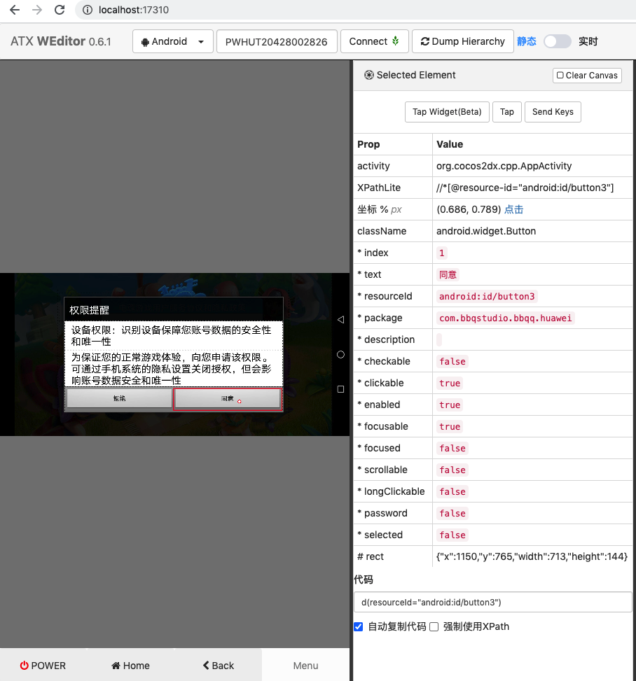

属性：

```shell
Prop    Value
activity    org.cocos2dx.cpp.AppActivity
XPathLite    //*[@resource-id="android:id/button3"]
坐标 % px    (0.686, 0.789) 点击
className    android.widget.Button
* index    1
* text    同意
* resourceId    android:id/button3
* package    com.bbqstudio.bbqq.huawei
* description    
* checkable    false
* clickable    true
* enabled    true
* focusable    true
* focused    false
* scrollable    false
* longClickable    false
* password    false
* selected    false
# rect    {"x":1150,"y":765,"width":713,"height":144}
代码 d(resourceId="android:id/button3")
```

## 隐私政策 同意并继续

weditor截图：

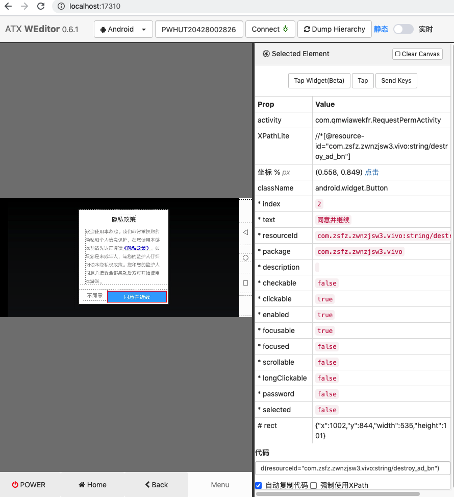

属性：

```shell
Prop    Value
activity    com.qmwiawekfr.RequestPermActivity
XPathLite    //*[@resource-id="com.zsfz.zwnzjsw3.vivo:string/destroy_ad_bn"]
坐标 % px    (0.558, 0.849) 点击
className    android.widget.Button
* index    2
* text    同意并继续
* resourceId    com.zsfz.zwnzjsw3.vivo:string/destroy_ad_bn
* package    com.zsfz.zwnzjsw3.vivo
* description    
* checkable    false
* clickable    true
* enabled    true
* focusable    true
* focused    false
* scrollable    false
* longClickable    false
* password    false
* selected    false
# rect    {"x":1002,"y":844,"width":535,"height":101}
代码 d(resourceId="com.zsfz.zwnzjsw3.vivo:string/destroy_ad_bn")
```

## 网易的 用户协议与隐私政策 接收

游戏`com.netease.wyclx.huawei/一梦江湖`的 weditor截图：

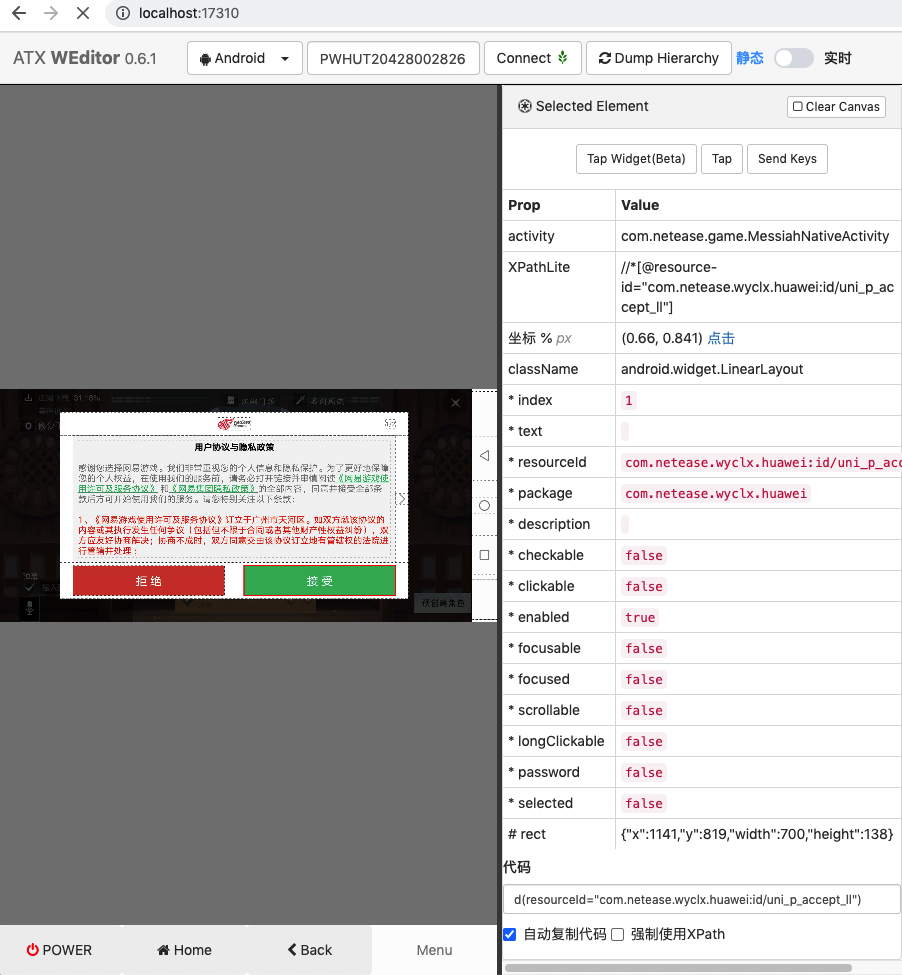

属性：

```shell
Prop    Value
activity    com.netease.game.MessiahNativeActivity
XPathLite    //*[@resource-id="com.netease.wyclx.huawei:id/uni_p_accept_ll"]
坐标 % px    (0.66, 0.841) 点击
className    android.widget.LinearLayout
* index    1
* text    
* resourceId    com.netease.wyclx.huawei:id/uni_p_accept_ll
* package    com.netease.wyclx.huawei
* description    
* checkable    false
* clickable    false
* enabled    true
* focusable    false
* focused    false
* scrollable    false
* longClickable    false
* password    false
* selected    false
# rect    {"x":1141,"y":819,"width":700,"height":138}
代码 d(resourceId="com.netease.wyclx.huawei:id/uni_p_accept_ll")
```

## 个人信息保护引导 同意并继续

app截图：

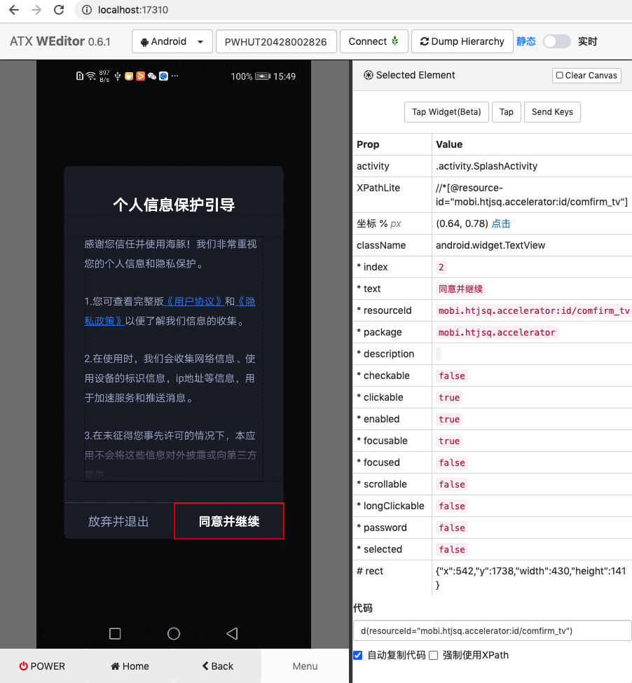

属性：

```shell
Prop    Value
activity    .activity.SplashActivity
XPathLite    //*[@resource-id="mobi.htjsq.accelerator:id/comfirm_tv"]
坐标 % px    (0.64, 0.78) 点击
className    android.widget.TextView
* index    2
* text    同意并继续
* resourceId    mobi.htjsq.accelerator:id/comfirm_tv
* package    mobi.htjsq.accelerator
* description    
* checkable    false
* clickable    true
* enabled    true
* focusable    true
* focused    false
* scrollable    false
* longClickable    false
* password    false
* selected    false
# rect    {"x":542,"y":1738,"width":430,"height":141}
代码 d(resourceId="mobi.htjsq.accelerator:id/comfirm_tv")
```

## 获取系统权限说明 同意继续

游戏`com.sy4399.zmxyol.vivo/造梦西游OL-新职业`的weditor截图：


## 提示 需要权限 知道了

游戏`com.cocoyx.cocotafang.vivo/战争模拟器`

weditor截图：

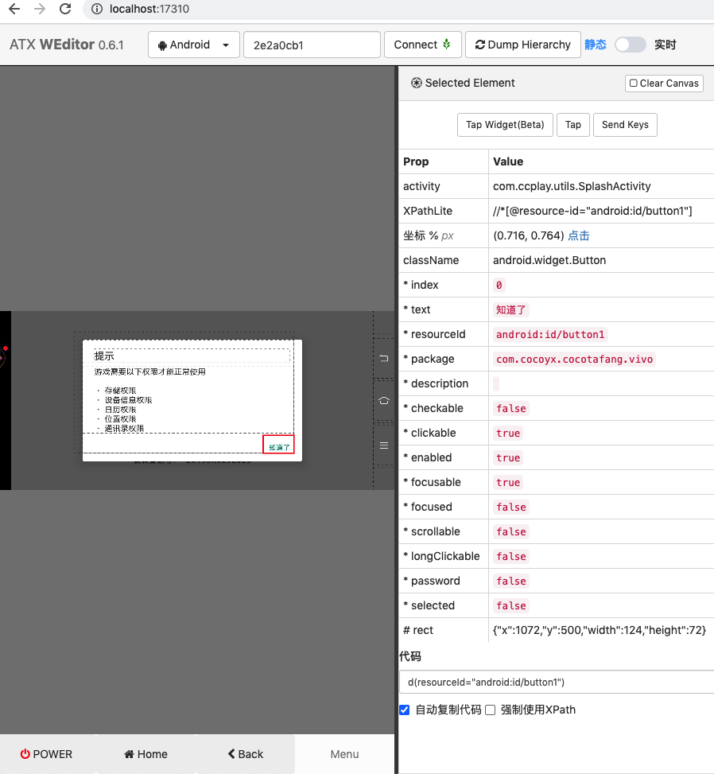

属性：

```shell
Prop    Value
activity    com.ccplay.utils.SplashActivity
XPathLite    //*[@resource-id="android:id/button1"]
坐标 % px    (0.716, 0.764) 点击
className    android.widget.Button
* index    0
* text    知道了
* resourceId    android:id/button1
* package    com.cocoyx.cocotafang.vivo
* description    
* checkable    false
* clickable    true
* enabled    true
* focusable    true
* focused    false
* scrollable    false
* longClickable    false
* password    false
* selected    false
# rect    {"x":1072,"y":500,"width":124,"height":72}
代码 d(resourceId="android:id/button1")
```

## 应用正常运行需要被授予 权限 确定

weditor截图：


属性：

```shell

Prop    Value
activity    com.wanmei.permission.newapi.PermissionSupportActivity
XPathLite    //*[@resource-id="android:id/button1"]
坐标 % px    (0.716, 0.558) 点击
className    android.widget.Button
* index    0
* text    确定
* resourceId    android:id/button1
* package    com.pwrd.xsmdl.mi
* description    
* checkable    false
* clickable    true
* enabled    true
* focusable    true
* focused    false
* scrollable    false
* longClickable    false
* password    false
* selected    false
# rect    {"x":1076,"y":370,"width":120,"height":72}
代码
d(resourceId="android:id/button1")
```

## 亲爱的玩家 申请一些权限 确定

weditor截图：

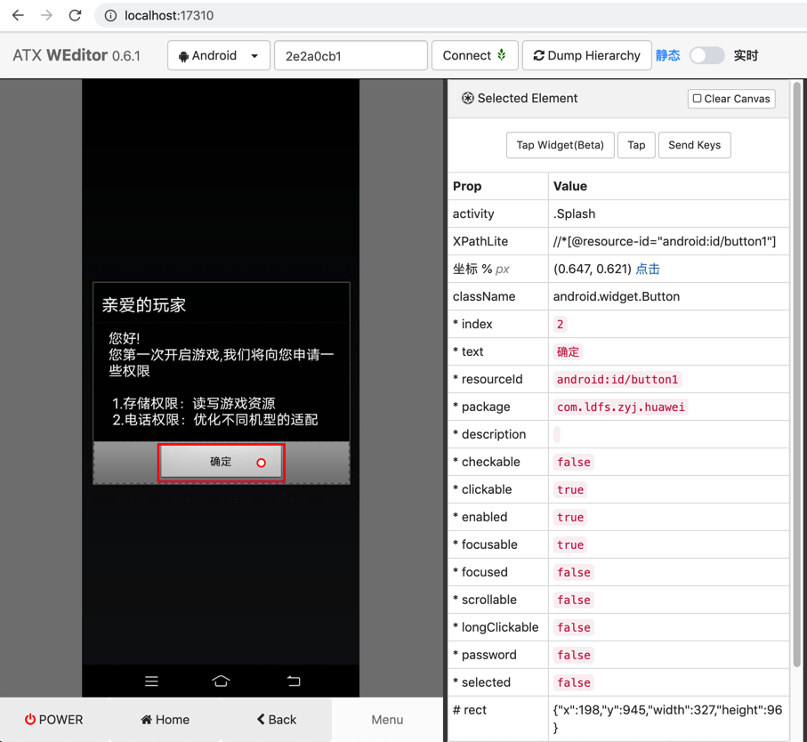


属性：

```shell
Prop    Value
activity    .Splash
XPathLite    //*[@resource-id="android:id/button1"]
坐标 % px    (0.647, 0.621) 点击
className    android.widget.Button
* index    2
* text    确定
* resourceId    android:id/button1
* package    com.ldfs.zyj.huawei
* description    
* checkable    false
* clickable    true
* enabled    true
* focusable    true
* focused    false
* scrollable    false
* longClickable    false
* password    false
* selected    false
# rect    {"x":198,"y":945,"width":327,"height":96}
代码 d(resourceId="android:id/button1")
```

## 为保证您正常的游戏体验 申请权限 同意

游戏：千年血战

weditor截图：

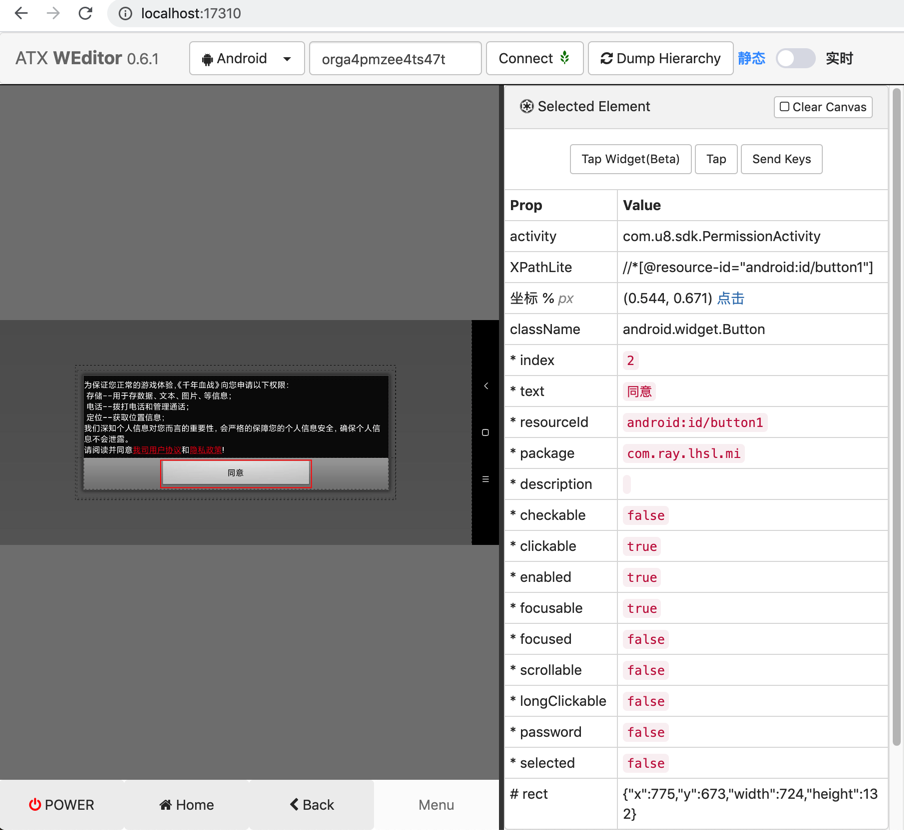


属性：

```shell
Prop    Value
activity    com.u8.sdk.PermissionActivity
XPathLite    //*[@resource-id="android:id/button1"]
坐标 % px    (0.544, 0.671) 点击
className    android.widget.Button
* index    2
* text    同意
* resourceId    android:id/button1
* package    com.ray.lhsl.mi
* description    
* checkable    false
* clickable    true
* enabled    true
* focusable    true
* focused    false
* scrollable    false
* longClickable    false
* password    false
* selected    false
# rect    {"x":775,"y":673,"width":724,"height":132}
代码 d(resourceId="android:id/button1")
```

## 隐私保护提示 同意

weditor截图：

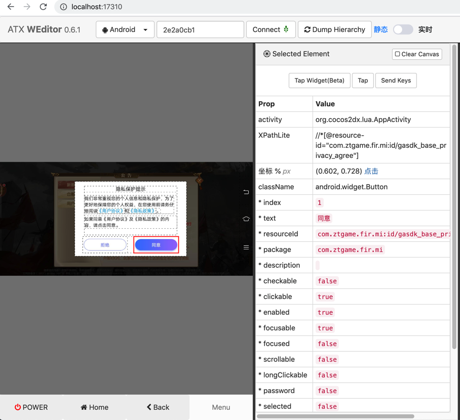


属性：

```shell
Prop    Value
activity    org.cocos2dx.lua.AppActivity
XPathLite    //*[@resource-id="com.ztgame.fir.mi:id/gasdk_base_privacy_agree"]
坐标 % px    (0.602, 0.728) 点击
className    android.widget.Button
* index    1
* text    同意
* resourceId    com.ztgame.fir.mi:id/gasdk_base_privacy_agree
* package    com.ztgame.fir.mi
* description    
* checkable    false
* clickable    true
* enabled    true
* focusable    true
* focused    false
* scrollable    false
* longClickable    false
* password    false
* selected    false
# rect    {"x":848,"y":472,"width":283,"height":104}
代码 d(resourceId="com.ztgame.fir.mi:id/gasdk_base_privacy_agree")
```

## 客户端更新 确定

weditor截图：

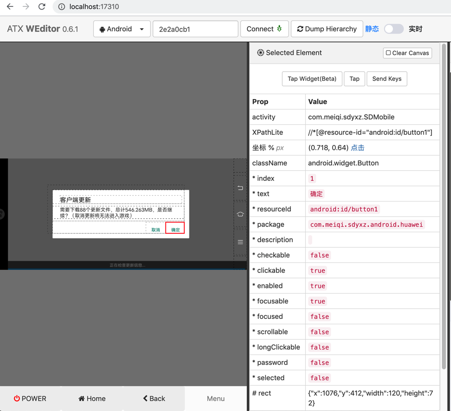


属性：

```shell
Prop    Value
activity    com.meiqi.sdyxz.SDMobile
XPathLite    //*[@resource-id="android:id/button1"]
坐标 % px    (0.718, 0.64) 点击
className    android.widget.Button
* index    1
* text    确定
* resourceId    android:id/button1
* package    com.meiqi.sdyxz.android.huawei
* description    
* checkable    false
* clickable    true
* enabled    true
* focusable    true
* focused    false
* scrollable    false
* longClickable    false
* password    false
* selected    false
# rect    {"x":1076,"y":412,"width":120,"height":72}
代码 d(resourceId="android:id/button1")
```

## 请选择要向授予权限 确定

weditor截图：

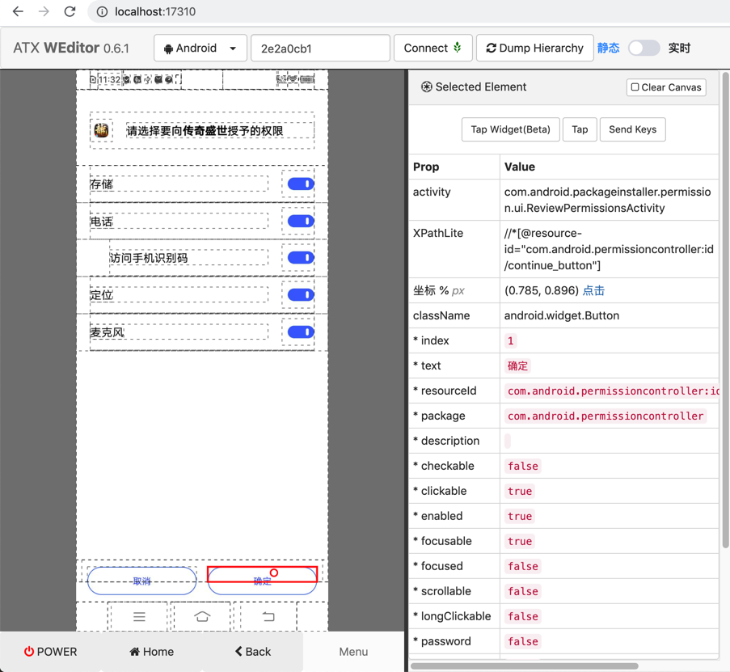


属性：

```shell
Prop    Value
activity    com.android.packageinstaller.permission.ui.ReviewPermissionsActivity
XPathLite    //*[@resource-id="com.android.permissioncontroller:id/continue_button"]
坐标 % px    (0.785, 0.896) 点击
className    android.widget.Button
* index    1
* text    确定
* resourceId    com.android.permissioncontroller:id/continue_button
* package    com.android.permissioncontroller
* description    
* checkable    false
* clickable    true
* enabled    true
* focusable    true
* focused    false
* scrollable    false
* longClickable    false
* password    false
* selected    false
# rect    {"x":376,"y":1416,"width":312,"height":43}
代码 d(resourceId="com.android.permissioncontroller:id/continue_button")
```

## 重要提醒 接受条款 确定

游戏：部落冲突

weditor截图：

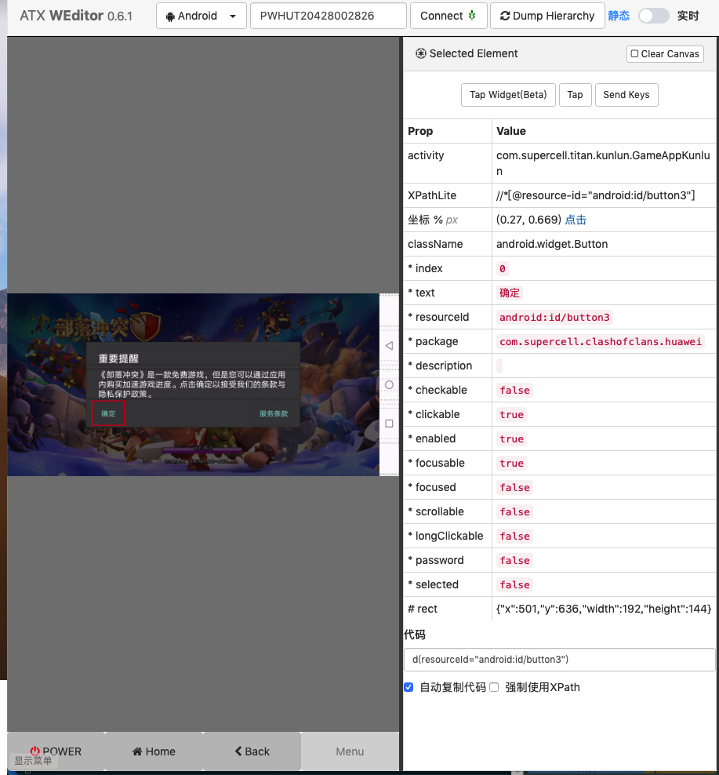


属性：

```shell
Prop    Value
activity    com.supercell.titan.kunlun.GameAppKunlun
XPathLite    //*[@resource-id="android:id/button3"]
坐标 % px    (0.27, 0.669) 点击
className    android.widget.Button
* index    0
* text    确定
* resourceId    android:id/button3
* package    com.supercell.clashofclans.huawei
* description    
* checkable    false
* clickable    true
* enabled    true
* focusable    true
* focused    false
* scrollable    false
* longClickable    false
* password    false
* selected    false
# rect    {"x":501,"y":636,"width":192,"height":144}
```

