# 奇虎360账号自动登录

## 背景

游戏测试期间，遇到很多游戏app，都是来自360应用市场的。

其中在注册和登录期间，会涉及到：

360账号的注册和登录

比如：

游戏：`com.supercell.clashroyale.qihoo_皇室战争`

弹框：

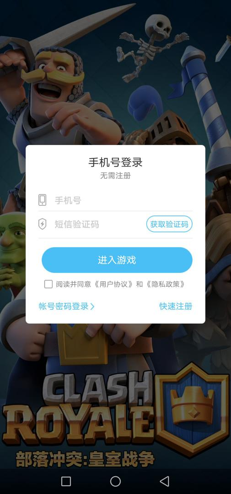

此时：往往需要手动去，切换登录方式，手动输入（已有的）360的账号和密码等操作。比较耗时。

此处用代码实现，自动切换登录方式，输入账号和密码，点击登录。

## 代码

```python
Qihoo360_Account: "yourAccount"
Qihoo360_Password: "yourPassword"

# Qihoo360_Login_ReadAndAgree_Xpath: "//android.widget.TextView[@text='阅读并同意' and @resource-id='com.qihoo.gamecenter.pluginapk:id/lpn_checkuseragent_tv1']"
# Qihoo360_Login_ReadAndAgree_Xpath: "//android.widget.TextView[@resource-id='com.qihoo.gamecenter.pluginapk:id/lpn_checkuseragent_userplan']"
Qihoo360_PasswordLogin_Xpath: "//android.widget.TextView[@resource-id='com.qihoo.gamecenter.pluginapk:id/lpn_regphone_acount_entry_tv']"

self.driver.watcher.when(Qihoo360_PasswordLogin_Xpath).call(self.autoDo360AccountLogin)

def selectorSetText(self, curXpathSelector, inputText):
    # Special: add click to try workaround for 360 pwd EditText input but input to 360 account EditText
    # curXpathSelector.click()
    # curXpathSelector.clear_text()
    selectorSetTextResp = curXpathSelector.set_text(inputText)
    logging.debug("selectorSetTextResp=%s", selectorSetTextResp) # selectorSetTextResp=None
    # 在set_text后，输入法会变成FastInputIME输入法
    # 用下面代码可以实现：关掉FastInputIME输入法，切换回系统默认输入法
    self.driver.set_fastinput_ime(False)

def autoDo360AccountLogin(self):
    """Auto do 360=qihoo=qihu account login"""
    logging.info("Try auto do qihoo 360 account login")

    # AccountPwdStr = "帐号密码登录"
    AccountPwdStr = "密码登录"
    # reg360AccountPwdXpath = """//android.widget.TextView[@text="%s"]""" % AccountPwdStr
    # reg360AccountPwdXpath = """//android.widget.TextView[@resource-id="com.qihoo.gamecenter.pluginapk:id/lpn_regphone_exchange_logintype_tv" and @text="%s" and @index="0"]""" % AccountPwdStr
    reg360AccountPwdXpath = """//android.widget.TextView[@resource-id="com.qihoo.gamecenter.pluginapk:id/lpn_regphone_acount_entry_tv" and @text="%s" and @index="0"]""" % AccountPwdStr
    # '//android.widget.TextView[@resource-id="com.qihoo.gamecenter.pluginapk:id/lpn_regphone_exchange_logintype_tv" and @text="帐号密码登录" and @index="0"]'
    reg360AccountPwdSelector = self.driver.xpath(reg360AccountPwdXpath)
    if reg360AccountPwdSelector.exists:
        # doScreenshot(u2Dev)
        # logging.info("Found %s", AccountPwdStr)
        reg360AccountPwdSelector.click()
        time.sleep(0.1)
        logging.info("Has clicked %s button", AccountPwdStr)
    else:
        logging.warning("Not found %s button", AccountPwdStr)

    SwitchLoginTypeStr = "切换登录方式"
    switchLoginTypeXpath = """//android.widget.TextView[@resource-id="com.qihoo.gamecenter.pluginapk:id/lpn_ap_exchange_logintype_tv" and @text="%s" and @index="0"]""" % SwitchLoginTypeStr
    switchLoginTypeSelector = self.driver.xpath(switchLoginTypeXpath)
    isInAccountPwdLoginPage = switchLoginTypeSelector.exists
    if isInAccountPwdLoginPage:
        logging.info("Found %s", SwitchLoginTypeStr)

    if not isInAccountPwdLoginPage:
        ShortSmsVerifyCodeLoginStr = "短信验证码登录 "
        # shortSmsVerifyCodeLoginXpath = """//android.widget.TextView[@resource-id="com.qihoo.gamecenter.pluginapk:id/lpn_ap_sms_code_enter_tv" and @text="%s" and @index="0"]""" % ShortSmsVerifyCodeLoginStr
        shortSmsVerifyCodeLoginXpath = """//android.widget.TextView[@resource-id="com.qihoo.gamecenter.pluginapk:id/lpn_ap_sms_code_enter_tv" and @index="0"]"""
        shortSmsVerifyCodeLoginSelector = self.driver.xpath(shortSmsVerifyCodeLoginXpath)
        isInAccountPwdLoginPage = shortSmsVerifyCodeLoginSelector.exists
        if isInAccountPwdLoginPage:
            logging.info("Found %s", ShortSmsVerifyCodeLoginStr)

    if not isInAccountPwdLoginPage:
        AccountLogin360Str = "360帐号登录"
        accountLogin360Xpath = """//android.widget.TextView[@resource-id="com.qihoo.gamecenter.pluginapk:id/lpid_hint_name_tv" and @text="%s" and @index="0"]""" % AccountLogin360Str
        accountLogin360Selector = self.driver.xpath(accountLogin360Xpath)
        isInAccountPwdLoginPage = accountLogin360Selector.exists
        if isInAccountPwdLoginPage:
            logging.info("Found %s", AccountLogin360Str)

    if not isInAccountPwdLoginPage:
        logging.error("Not in 360 account and password login page, can NOT do 360 auto login")
        return

    logging.info("In 360 account and password login page, continue do 360 auto login")

    AccountStr = "360帐号/手机号/邮箱"
    # accountXpath = """//android.widget.EditText[@resource-id="com.qihoo.gamecenter.pluginapk:id/lp_account_input_edit" and @text="%s" and @index="1"]""" % AccountStr
    accountXpath = """//android.widget.EditText[@resource-id="com.qihoo.gamecenter.pluginapk:id/lp_account_input_edit" and @index="1"]"""
    accountSelector = self.driver.xpath(accountXpath)
    if accountSelector.exists:
        logging.info("Found %s", AccountStr)
        # check already input or not
        curAccount = accountSelector.text
        if curAccount and (curAccount == Qihoo360_Account):
            logging.info("Already inputed 360 account")
        else:
            self.selectorSetText(accountSelector, Qihoo360_Account)
            logging.info("Has input 360 account")
    else:
        logging.warning("Not found %s", AccountStr)

    # Specia: 华为Nova 5i此处元素错乱
    # 密码输入框 此时的位置 已经变成了 进入游戏 所以 输入密码 会误点击 进入游戏，暂时放弃，待后续研究
    # TODO: try xiaomi 10X is or or not
    return

    PasswordStr = "密码"

    # # passwordXpath = """//android.widget.EditText[@resource-id="com.qihoo.gamecenter.pluginapk:id/lp_pwd_input_edit" and @text="%s" and @index="1" and @password="true"]""" % PasswordStr
    # # passwordXpath = """//android.widget.EditText[@resource-id="com.qihoo.gamecenter.pluginapk:id/lp_pwd_input_edit" and @index="1" and @password="true"]"""
    # # passwordXpath = """//android.widget.EditText[@resource-id="com.qihoo.gamecenter.pluginapk:id/lp_pwd_input_edit" and @index="1"]"""
    # passwordXpath = """//android.widget.EditText[@resource-id="com.qihoo.gamecenter.pluginapk:id/lp_pwd_input_edit"]"""
    # passwordSelector = self.driver.xpath(passwordXpath)
    # if passwordSelector.exists:
    # 	logging.info("Found %s", PasswordStr)
    # 	# curPassword = passwordSelector.text
    # 	# if curPassword and (curPassword == Qihoo360_Password):
    # 	# 	logging.info("Already inputed 360 password")
    # 	# else:
    # 	self.selectorSetText(passwordSelector, Qihoo360_Password)
    # 	logging.info("Has input 360 password")
    # else:
    # 	logging.warning("Not found %s", PasswordStr)

    passwordElement = self.driver(className="android.widget.EditText", resourceId="com.qihoo.gamecenter.pluginapk:id/lp_pwd_input_edit")
    logging.info("passwordElement.exists=%s", passwordElement.exists)
    if passwordElement.exists:
        passwordElement.set_text(Qihoo360_Password)
        logging.info("Has input 360 password")
    else:
        logging.warning("Not found %s", PasswordStr)

    AggreeStr = "阅读并同意用户协议"
    # aggreeCheckboxElement = u2Dev(className="android.widget.CheckBox", checkable="true", clickable="true")
    # if aggreeCheckboxElement.exists:
    #     aggreeCheckboxElement.click()
    aggreeCheckboxXpath = """//android.widget.CheckBox[@resource-id="com.qihoo.gamecenter.pluginapk:id/l_plugin_checkuseragent_cb" and @index="0" and @clickable="true"]"""
    aggreeCheckboxSelector = self.driver.xpath(aggreeCheckboxXpath)
    if aggreeCheckboxSelector.exists:
        aggreeCheckboxSelector.click()
        time.sleep(0.1)
        logging.info("Has clicked %s checkbox", AggreeStr)
    else:
        logging.warning("Not found %s checkbox", AggreeStr)
        return

    IntoGameStr = "进入游戏"
    IntoGameXpath = """//android.widget.TextView[@resource-id="com.qihoo.gamecenter.pluginapk:id/lpid_ap_login_btn" and @text="%s" and @index="2" and @clickable="true"]""" % IntoGameStr
    loginSelector = self.driver.xpath(IntoGameXpath)
    if loginSelector.exists:
        loginSelector.click()
        time.sleep(0.1)
        logging.info("Has clicked %s button", IntoGameStr)
    else:
        logging.warning("Not found %s button", IntoGameStr)

    # check 请同意用户协议和隐私政策 弹框
    PleaseAggreePopupStr = "请同意用户协议和隐私政策"
    PleaseAggreePopupXpath = """//android.widget.TextView[@resource-id="com.qihoo.gamecenter.pluginapk:id/txt_msg" and @text="%s" and @index="1"]""" % PleaseAggreePopupStr
    PleaseAggreePopupSelector = self.driver.xpath(PleaseAggreePopupXpath)
    if PleaseAggreePopupSelector.exists:
        logging.info("Found %s popup", PleaseAggreePopupStr)

        PositiveButtonStr = "确定"
        positiveButtonXpath = """//android.widget.TextView[@resource-id="com.qihoo.gamecenter.pluginapk:id/btn_pos" and @text="%s" and @index="2" and @clickable="true"]""" % PositiveButtonStr
        positiveButtonSelector = self.driver.xpath(positiveButtonXpath)
        if positiveButtonSelector.exists:
            positiveButtonSelector.click()
            logging.info("Has clicked %s button", PositiveButtonStr)
            time.sleep(0.1)

            # do second time
            IntoGameStr = "进入游戏"
            IntoGameXpath = """//android.widget.TextView[@resource-id="com.qihoo.gamecenter.pluginapk:id/lpid_ap_login_btn" and @text="%s" and @index="2" and @clickable="true"]""" % IntoGameStr
            loginSelector = self.driver.xpath(IntoGameXpath)
            if loginSelector.exists:
                loginSelector.click()
                time.sleep(0.1)
                logging.info("Has clicked %s button", IntoGameStr)
            else:
                logging.warning("Not found %s button", IntoGameStr)
    else:
        logging.info("Not found %s", PleaseAggreePopupStr)

    # wait doing login
    LoginingStr = "正在登录..."
    loginingXpath = """//android.widget.TextView[@text="%s" and @index="1"]""" % LoginingStr
    loginingSelector = self.driver.xpath(loginingXpath)
    isLogining = loginingSelector.exists
    while isLogining:
        loginingSelector = self.driver.xpath(loginingXpath)
        isLogining = loginingSelector.exists
        logging.info("Is doing login, wait sometime")
        time.sleep(1)

    # locate input cursor to verify code
    VerifyCodeErrorStr = "请输入验证码（错误码：5010a）"
    verifyCodeErrorXpath = """//android.widget.TextView[@resource-id="com.qihoo.gamecenter.pluginapk:id/lpid_hint_erro_msg_tv" and @text="%s" and @index="0"]""" % VerifyCodeErrorStr
    verifyCodeErrorSelector = self.driver.xpath(verifyCodeErrorXpath)
    if verifyCodeErrorSelector.exists:
        logging.info("Found %s notice", VerifyCodeErrorStr)

        # locate input cursor
        PleaseInputRightVerifyCodeStr = "请输入右侧的验证码"
        # pleaseInputRightVerifyCodeXpath = """//android.widget.EditText[@resource-id="com.qihoo.gamecenter.pluginapk:id/lp_vertycode_input_edit" and @index="1" and @longClickable="true"]"""
        pleaseInputRightVerifyCodeXpath = """//android.widget.EditText[@resource-id="com.qihoo.gamecenter.pluginapk:id/lp_vertycode_input_edit" and @index="1"]"""
        pleaseInputRightVerifyCodeSelector = self.driver.xpath(pleaseInputRightVerifyCodeXpath)
        if pleaseInputRightVerifyCodeSelector.exists:
            pleaseInputRightVerifyCodeSelector.click()
            logging.info("Has clicked %s", PleaseInputRightVerifyCodeStr)
        else:
            logging.warning("Not found %s button", PleaseInputRightVerifyCodeStr)
    else:
        logging.warning("Not found %s button", VerifyCodeErrorStr)
```

## 相关截图

### 调试时

weditor截图：

点击 账号和密码登录：

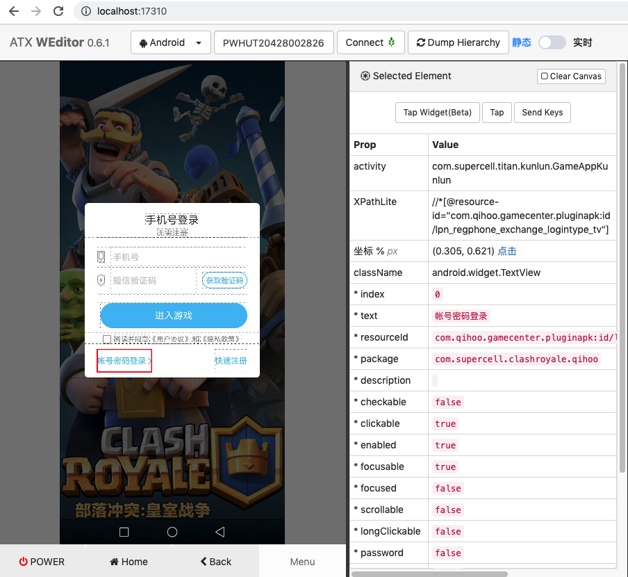

切换到 360账号登录：

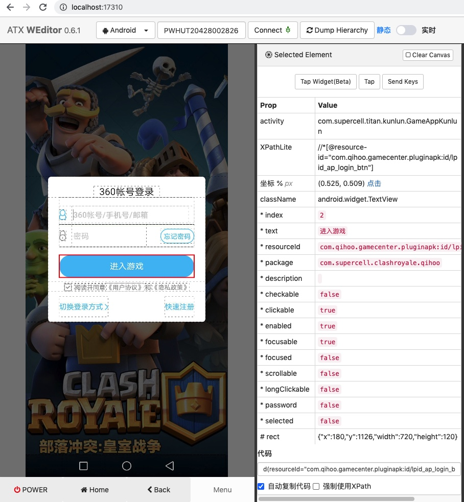

已输入360账号：

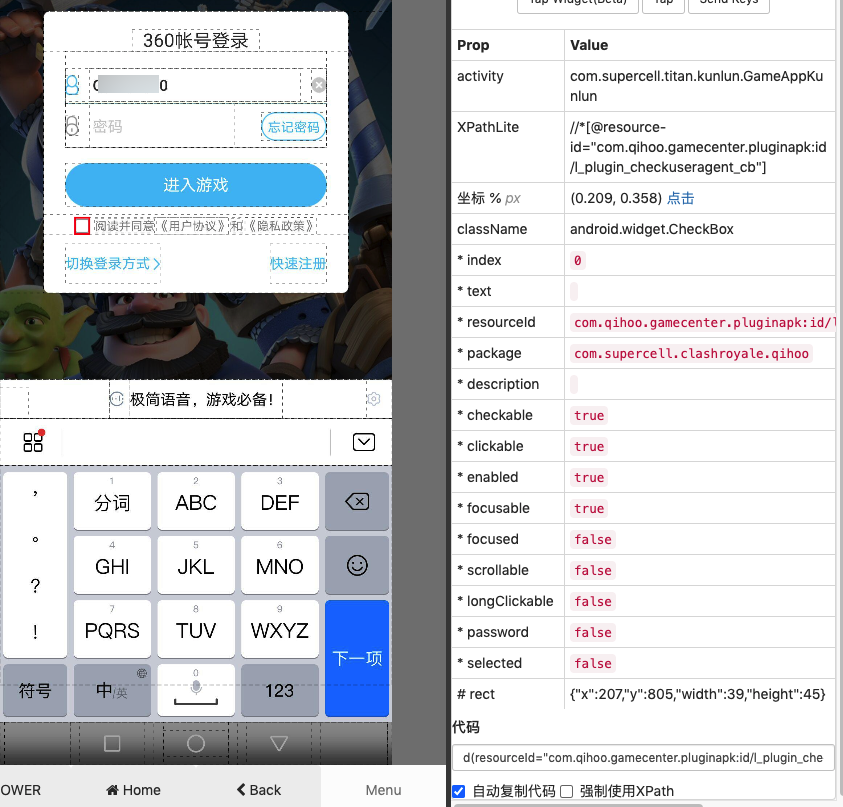

点击登录时，提示：请同意用户协议和隐私政策

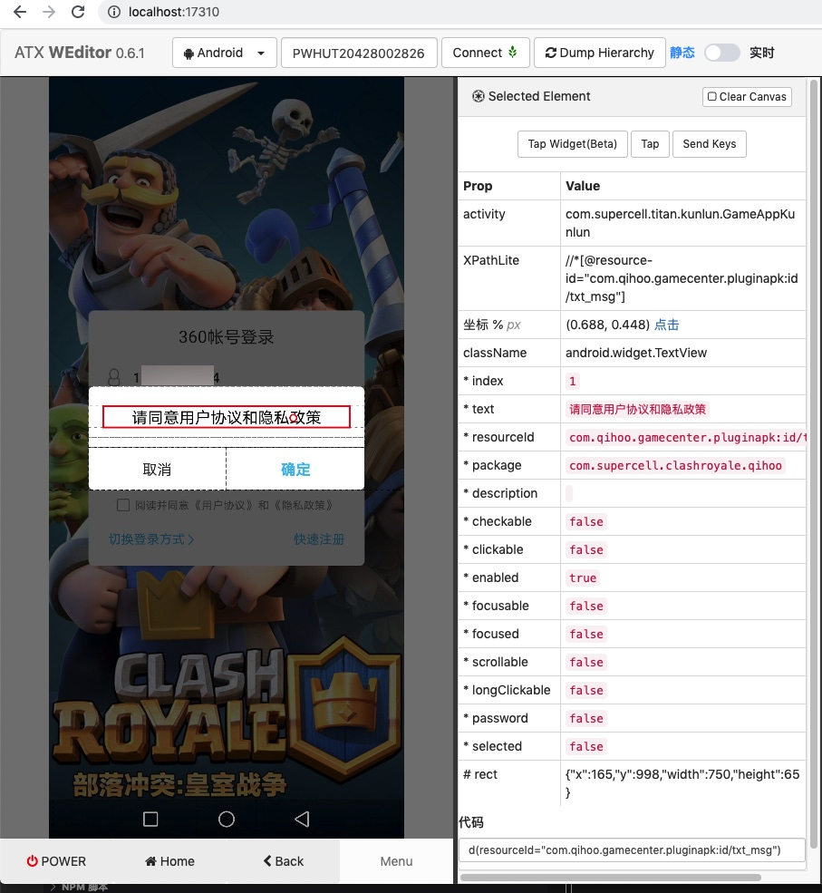

勾线后，点击 进入游戏

往往会提示：正在登录

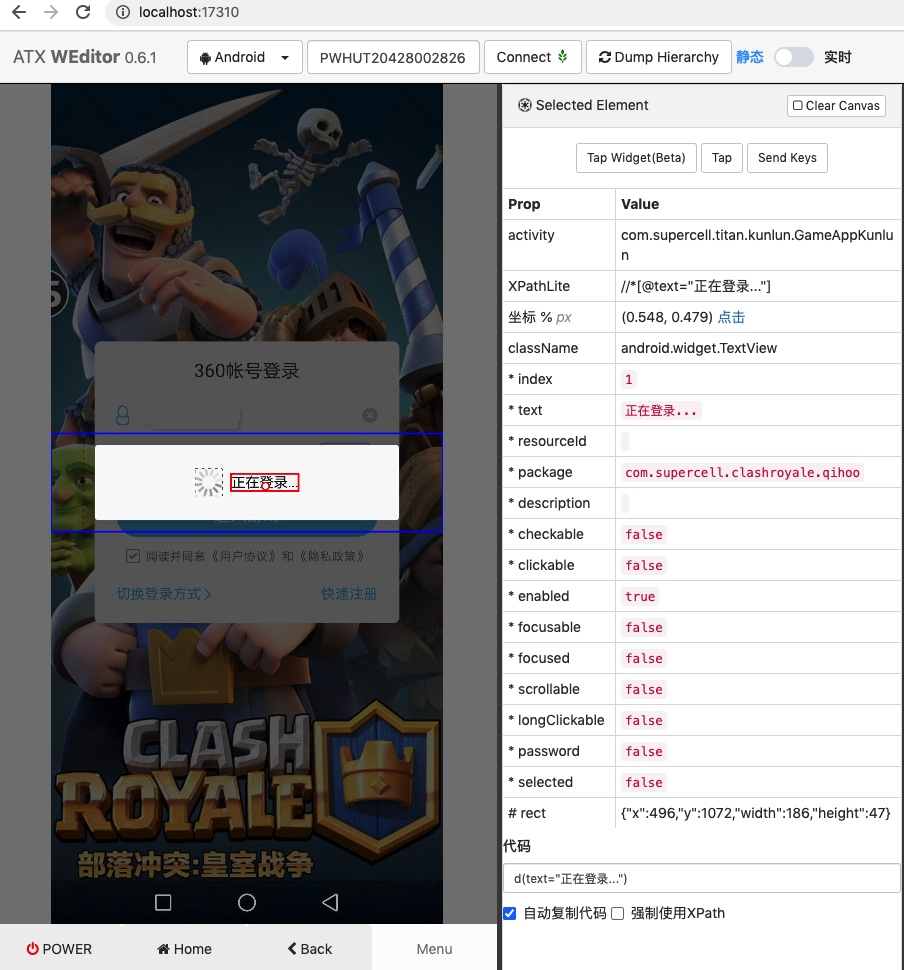

有时候，经常，会出现错误：请输入验证码

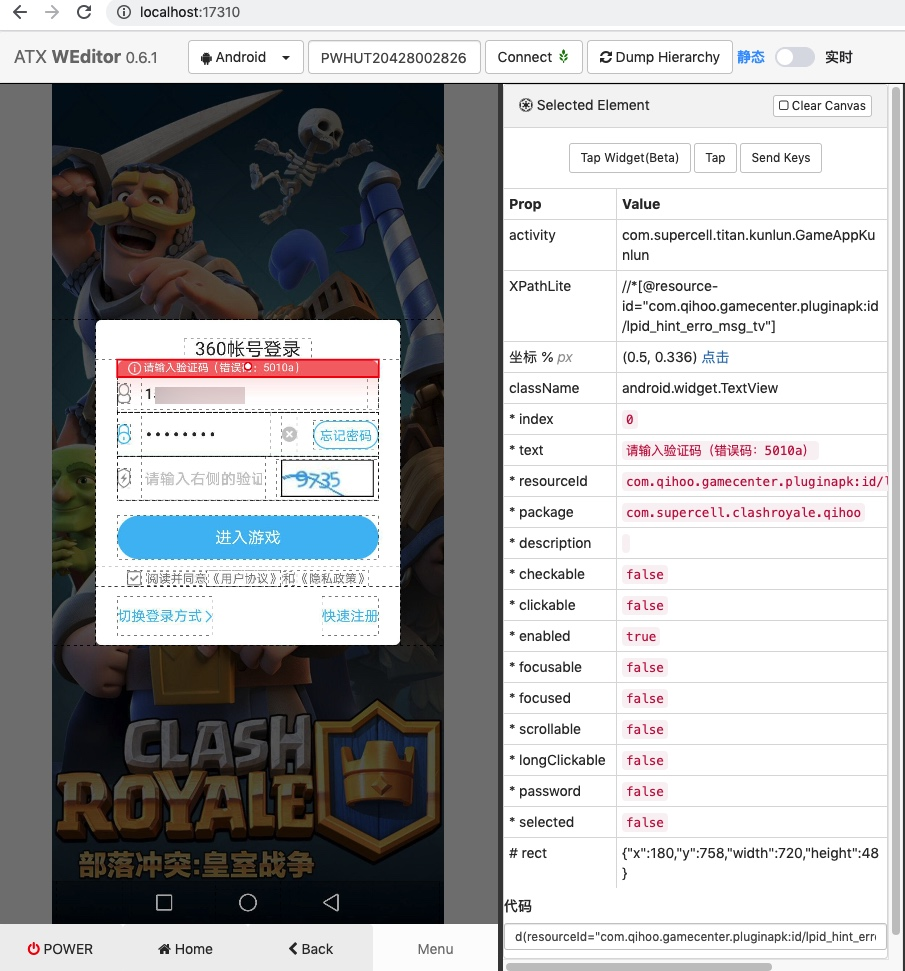

### 实际运行效果

此处实际运行后发现，上述代码，只对于部分360的游戏有效

比如：

* `com.zhw.xzjh.qihoo_修真江湖`

其他还有很多

* 弹框即使一样，但是却也不工作，不起效果的
* 弹框不太一样的

比如：

游戏：`com.qianhuan.mjfy.qihoo360/萌将风云`

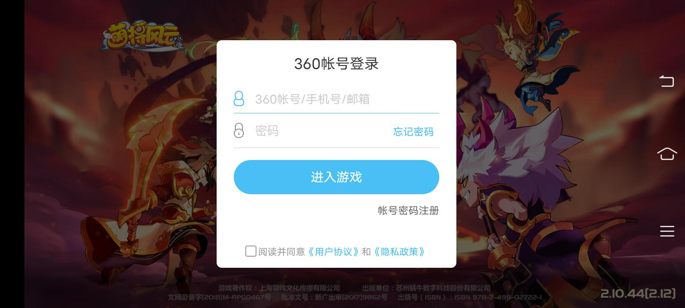

-》都没有 短信密码登录 的按钮

-》只有 右边才有的 账号密码注册

以及点击登录后，报错也不同：响应超时，请稍后再试 错误码 -4a

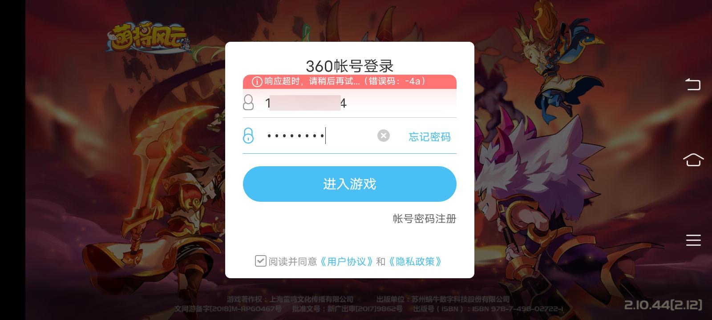

红米10X中的游戏 `com.mandong.jxqy.qihoo_剑侠棋缘`

是旧版本的360账号登录页面：


和游戏 `com.Tq.CQ2ClientAndroid.qihoo/口袋征服`的：

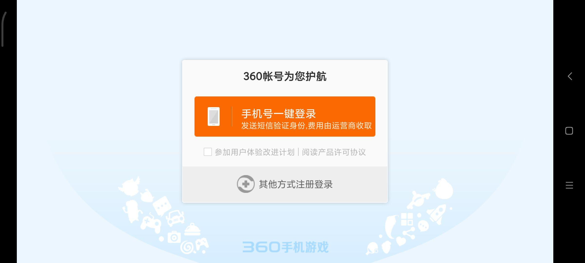

以及游戏 `com.noumena.android.tinywarcnqh_合金要塞`的：

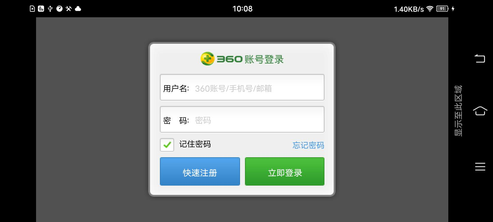

