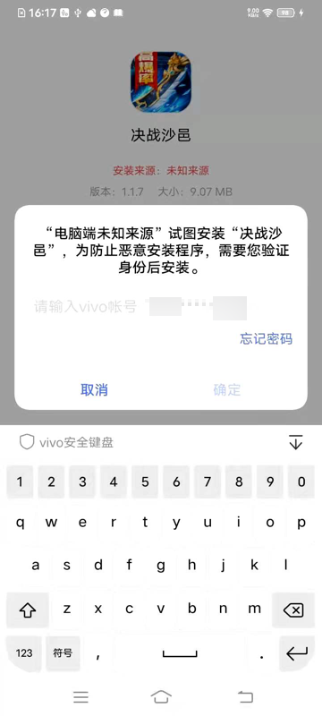
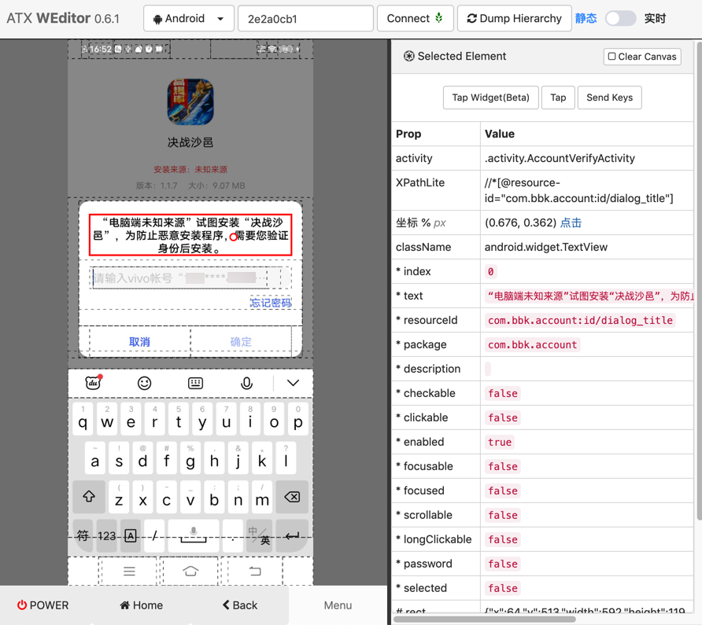
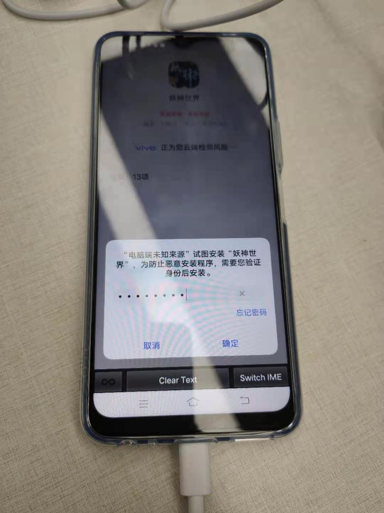
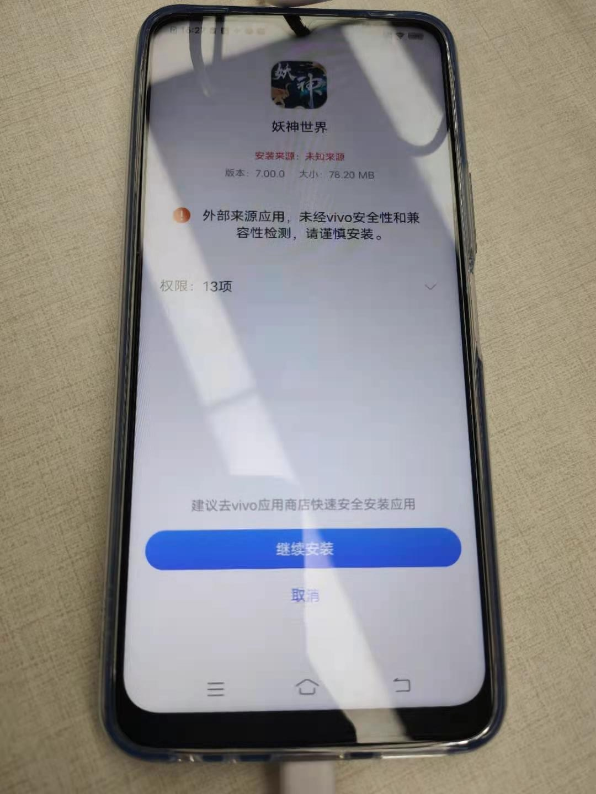
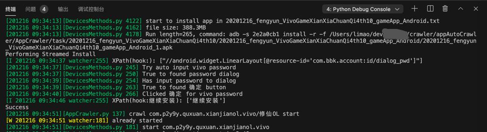

# Vivo手机中安装应用时，自动输入账号密码

背景：

用`adb`去给安卓手机安卓`apk`，比如：

`adb -s 2e2a0cb1 install 决战沙邑.apk`

时，Vivo手机，由于默认安全限制很死，导致无法关闭安全验证，会弹框：



必须手动输入账号和密码后才能继续安装。

对应的weditor截图：



属性是：

```shell
Prop    Value
activity    .activity.AccountVerifyActivity
XPathLite    //*[@resource-id="com.bbk.account:id/dialog_title"]
坐标 % px    (0.676, 0.362) 点击
className    android.widget.TextView
* index    0
* text    “电脑端未知来源”试图安装“决战沙邑”，为防止恶意安装程序，需要您验证身份后安装。
* resourceId    com.bbk.account:id/dialog_title
* package    com.bbk.account
* description    
* checkable    false
* clickable    false
* enabled    true
* focusable    false
* focused    false
* scrollable    false
* longClickable    false
* password    false
* selected    false
# rect    {"x":64,"y":513,"width":592,"height":119}
代码 d(resourceId="com.bbk.account:id/dialog_title")
```

经过调试，最终实现了 自动化输入账号和密码，得以自动继续安装。

代码：

```python
Vivo_Account: "yourPhone" # Vivo account
Vivo_Password: "yourPassword" # password for Vivo account

Vivo_Password_Input_Xpath: "//android.widget.LinearLayout[@resource-id='com.bbk.account:id/dialog_pwd']"

self.driver.watcher.when(Vivo_Password_Input_Xpath]).call(self.autoInputVivoPassword)

def selectorSetText(self, curXpathSelector, inputText):
    # Special: add click to try workaround for 360 pwd EditText input but input to 360 account EditText
    # curXpathSelector.click()
    # curXpathSelector.clear_text()
    selectorSetTextResp = curXpathSelector.set_text(inputText)
    logging.debug("selectorSetTextResp=%s", selectorSetTextResp) # selectorSetTextResp=None
    # 在set_text后，输入法会变成FastInputIME输入法
    # 用下面代码可以实现：关掉FastInputIME输入法，切换回系统默认输入法
    self.driver.set_fastinput_ime(False)

def autoInputVivoPassword(self):
    """Auto input Vivo account password"""
    logging.info("Try auto input vivo password")

    pwdDiaglogSelector = self.driver.xpath(Vivo_Password_Input_Xpath)
    logging.debug("pwdDiaglogSelector=%s", pwdDiaglogSelector)
    # PwdDiaglogSelector=XPathSelector(//android.widget.LinearLayout[@resource-id='com.bbk.account:id/dialog_pwd']
    logging.info("%s to found password dialog", pwdDiaglogSelector.exists)
    # selectorSetTextResp = pwdDiaglogSelector.set_text(Vivo_Password)
    # logging.debug("selectorSetTextResp=%s", selectorSetTextResp)
    # # selectorSetTextResp=None
    # # 在set_text后，输入法会变成FastInputIME输入法
    # # 用下面代码可以实现：关掉FastInputIME输入法，切换回系统默认输入法
    # self.driver.set_fastinput_ime(False)
    self.selectorSetText(pwdDiaglogSelector, Vivo_Password)
    logging.info("Has input password to dialog")

    okButtonText = "确定"
    okButtonElement = self.driver(text=okButtonText, className="android.widget.Button", resourceId="android:id/button1")
    logging.debug("okButtonElement=%s", okButtonElement)
    logging.info("%s to found %s button", okButtonElement.exists, okButtonText)
    if okButtonElement.exists:
        okButtonElement.click()
        logging.info("Clicked 确定 for vivo password")

    logging.info("Complete auto input vivo password")
```

对应自动化操作期间的手机截图：

自动输入了密码：



点击了 确定后，再点击点击 继续安装



之后即可在手机中看到成功安装的app：


相关shell终端中的日志是：

```shell
adb -s 2e2a0cb1 install 斩月屠龙_13.5MB.apk
Performing Streamed Install
Success
```

整个调试过程的log是：

```shell
_VivoGameXianXiaChuanQi4th10_gameApp_Android_1.apk
Performing Streamed Install
[I 201216 09:34:37 watcher:255] XPath(hook:): ["//android.widget.LinearLayout[@resource-id='com.bbk.account:id/dialog_pwd']"]
[201216 09:34:37][DevicesMethods.py 245] Try auto input vivo password
[201216 09:34:37][DevicesMethods.py 250] True to found password dialog
[201216 09:34:39][DevicesMethods.py 254] Has input password to dialog
[201216 09:34:39][DevicesMethods.py 263] True to found 确定 button
[201216 09:34:40][DevicesMethods.py 266] Clicked 确定 for vivo password
[I 201216 09:34:46 watcher:255] XPath(hook:继续安装): ['继续安装']
Success
```




详见：

【已解决】用Python的uiautomator2自动识别和输入vivo账号密码以自动安装安卓apk

【已解决】uiautomator2中如何自动实现检测发现匹配元素就执行对应回调函数

