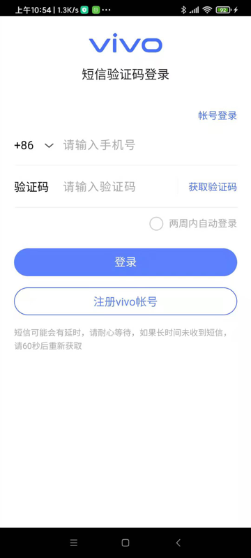
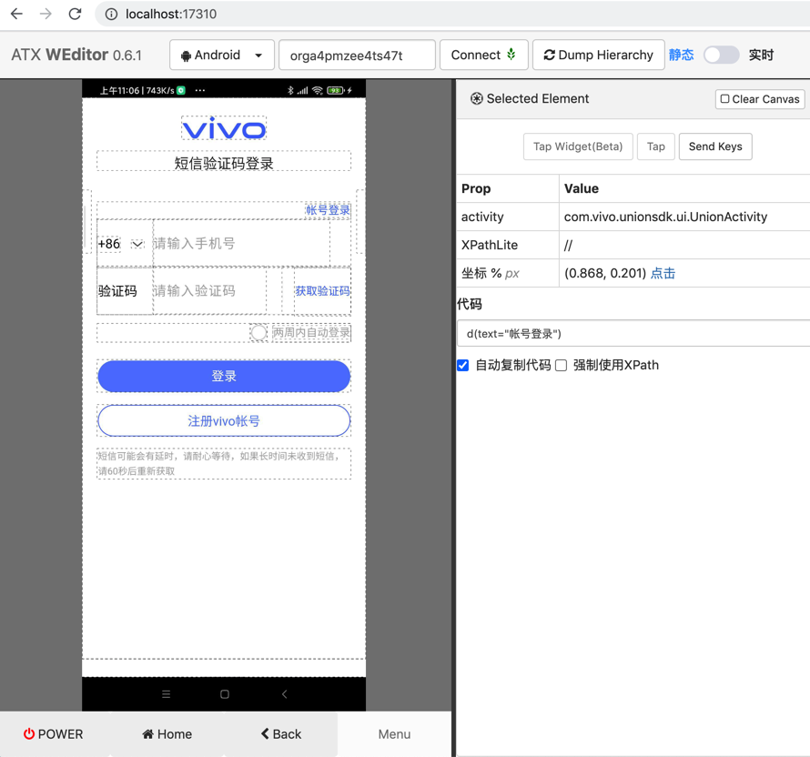
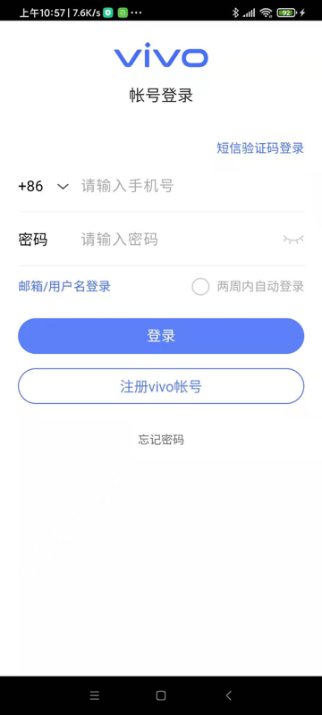
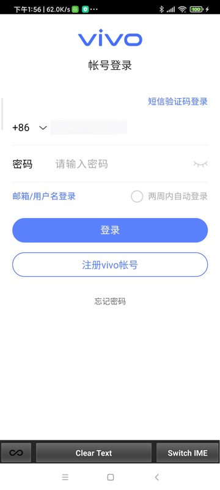
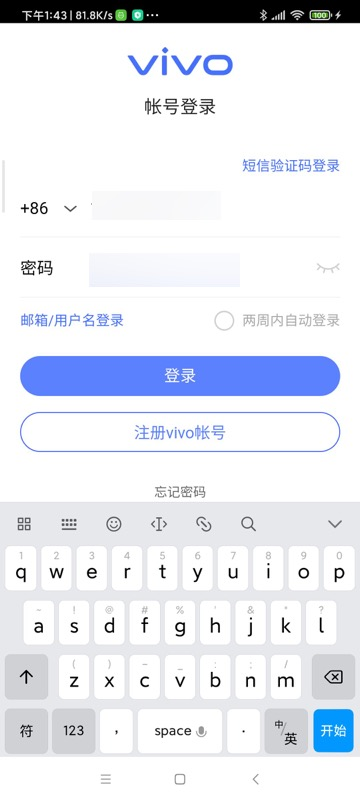
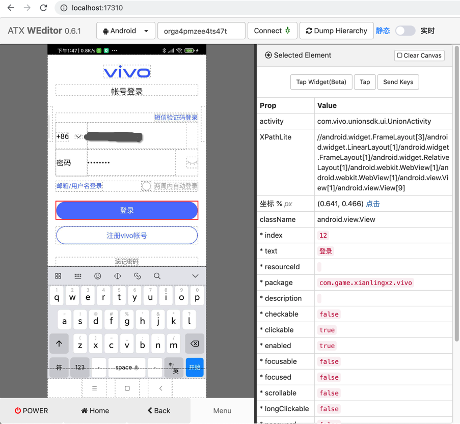
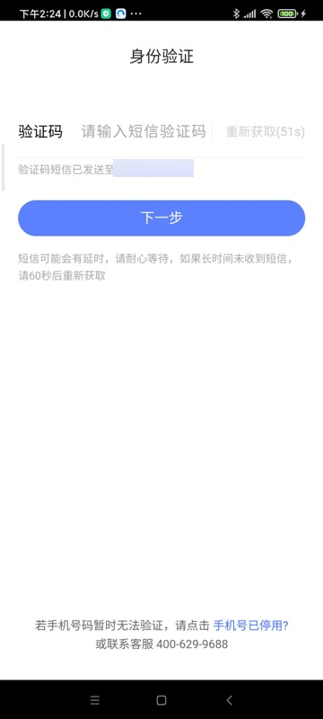
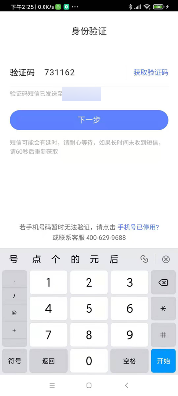

# Vivo账号自动登录

自动化输入vivo账号和密码并登录

背景：

测试游戏期间，遇到非Vivo手机，需要手动输入Vivo的账号和密码，才能继续测试。

所以写代码将此过程自动化。

具体过程：

* 短信验证码登录页
  * 
    * weditor调试
      * 
  * 点击：账号登录 按钮
    * 切换页面到：账号登录页
    * 支持已经切换到 账号登录页，而不会误点击 中间顶部的 账号登录 文字
* 账号登录页
  * 
  * 请输入手机号：输入手机号
    * 
    * 支持已经输入手机号，再次重新输入手机号
    * 此处输入手机号会触发输入法切换到 fastIME
  * 请输入密码：输入密码
    * 
      * 真机效果
        * 
      * weditor调试
        * 
    * 支持已经输入密码，再次重新输入密码
  * 点击：登录 按钮

代码：

原始独立测试代码：

```python
import time
import uiautomator2 as u2

def selectorSetText(u2Dev, curXpathSelector, inputText):
    selectorSetTextResp = curXpathSelector.set_text(inputText)
    logging.info("selectorSetTextResp=%s", selectorSetTextResp) # selectorSetTextResp=None
    # 在set_text后，输入法会变成FastInputIME输入法
    # 用下面代码可以实现：关掉FastInputIME输入法，切换回系统默认输入法
    u2Dev.set_fastinput_ime(False)

################################################################################
# for Redmi 10X: auto do vivo account login, input phone and password to login
################################################################################

def autoDoVivoLogin(u2Dev):
    doScreenshot(u2Dev)

    RegVivoAccountStr = "注册vivo帐号"
    regVivoAccountXpath = """//android.view.View[@text="%s"]""" % RegVivoAccountStr
    # '//android.view.View[@text="注册vivo帐号"]'
    regVivoAccountSelector = u2Dev.xpath(regVivoAccountXpath)
    if regVivoAccountSelector.exists:
        logging.info("Found %s", RegVivoAccountStr)
        accountLoginStr = "帐号登录"
        # accountLoginXpath = """//android.view.View[@text="%s"]""" % accountLoginStr
        # #
        # accountLoginSelector = u2Dev.xpath(accountLoginXpath)
        # if accountLoginSelector.exists:
        #     logging.info("Found %s", accountLoginStr)
        #     accountLoginSelector.click()
        # accountLoginElement = u2Dev(text=accountLoginStr, className="android.view.View")
        accountLoginElement = u2Dev(text=accountLoginStr, className="android.view.View", clickable="true")
        logging.info("accountLoginElement=%s", accountLoginElement) # accountLoginElement=<uiautomator2._selector.UiObject object at 0x10dd4be80>
        logging.info("accountLoginElement.exists=%s", accountLoginElement.exists) # accountLoginElement.exists=True
        if accountLoginElement.exists:
            accountLoginElement.click()
            logging.info("Has clicked %s button", accountLoginStr)

            time.sleep(0.1)
            doScreenshot(u2Dev)
        else:
            logging.warning("Not found %s button", accountLoginStr)

        # phoneXpath = """//android.widget.EditText[@text="" and @index="5"]"""
        phoneXpath = """//android.widget.EditText[@index="5" and @clickable="true" and @focusable="true"]"""
        phoneSelector = u2Dev.xpath(phoneXpath)
        if phoneSelector.exists:
            logging.info("Found 请输入手机号")
            # phoneSelector.set_text(Vivo_Account)
            selectorSetText(u2Dev, phoneSelector, Vivo_Account)
            logging.info("Has input vivo account phone number")
        else:
            logging.warning("Not found 请输入手机号")

        passwordStr = "请输入密码"
        # passwordXpath = """//android.widget.EditText[@text="%s" and @index="2" and @clickable="true"]""" % passwordStr
        passwordXpath = """//android.widget.EditText[@index="2" and @clickable="true" and @focusable="true"]"""
        passwordSelector = u2Dev.xpath(passwordXpath)
        if passwordSelector.exists:
            logging.info("Found %s", passwordStr)
            # pwdClickResp = passwordSelector.click()
            # logging.debug("pwdClickResp=%s", pwdClickResp)
            # doScreenshot(u2Dev)
            selectorSetText(u2Dev, passwordSelector, Vivo_Password)
            logging.info("Has input vivo password")
        else:
            logging.warning("Not found %s", passwordStr)
        
        loginStr = "登录"
        # loginXpath = """//android.view.View[@text="登录" and @clickable="true"]"""
        loginXpath = """//android.view.View[@text="登录" and @index="12" and @clickable="true"]"""
        loginSelector = u2Dev.xpath(loginXpath)
        if loginSelector.exists:
            loginSelector.click()
            logging.info("Has clicked %s button", loginStr)
            doScreenshot(u2Dev)
        else:
            logging.warning("Not found %s", loginStr)

def androidAutomation():
    u2Dev = u2.connect(DeviveId)
    logging.info("u2Dev=%s", u2Dev) # u2Dev=<uiautomator2.Device object at 0x1079bee20>
。。。
    autoDoVivoLogin(u2Dev)
```

合并到项目后：

```python
Vivo_Register_Vivo_Account_Xpath: "//android.view.View[@text='注册vivo帐号']"

self.driver.watcher.when(self.config["Vivo_Register_Vivo_Account_Xpath"]).call(self.autoDoVivoAccountLogin)

def autoDoVivoAccountLogin(self):
    """Auto do Vivo account login"""
    logging.info("Try auto do vivo account login")

    accountLoginStr = "帐号登录"
    # accountLoginXpath = """//android.view.View[@text="%s"]""" % accountLoginStr
    # # 
    # accountLoginSelector = self.driver.xpath(accountLoginXpath)
    # if accountLoginSelector.exists:
    #     logging.info("Found %s", accountLoginStr)
    #     accountLoginSelector.click()
    # accountLoginElement = self.driver(text=accountLoginStr, className="android.view.View")
    accountLoginElement = self.driver(text=accountLoginStr, className="android.view.View", clickable="true")
    logging.debug("accountLoginElement=%s", accountLoginElement) # accountLoginElement=<uiautomator2._selector.UiObject object at 0x10dd4be80>
    logging.debug("accountLoginElement.exists=%s", accountLoginElement.exists) # accountLoginElement.exists=True
    if accountLoginElement.exists:
        accountLoginElement.click()
        logging.info("Has clicked %s button", accountLoginStr)

        time.sleep(0.1)
    else:
        logging.warning("Not found %s button", accountLoginStr)

    # phoneXpath = """//android.widget.EditText[@text="" and @index="5"]"""
    phoneXpath = """//android.widget.EditText[@index="5" and @clickable="true" and @focusable="true"]"""
    phoneSelector = self.driver.xpath(phoneXpath)
    if phoneSelector.exists:
        logging.info("Found 请输入手机号")
        # phoneSelector.set_text(Vivo_Account)
        self.selectorSetText(phoneSelector, self.config["Vivo_Account"])
        logging.info("Has input vivo account phone number")
    else:
        logging.warning("Not found 请输入手机号")

    passwordStr = "请输入密码"
    # passwordXpath = """//android.widget.EditText[@text="%s" and @index="2" and @clickable="true"]""" % passwordStr
    passwordXpath = """//android.widget.EditText[@index="2" and @clickable="true" and @focusable="true"]"""
    passwordSelector = self.driver.xpath(passwordXpath)
    if passwordSelector.exists:
        logging.info("Found %s", passwordStr)
        # pwdClickResp = passwordSelector.click()
        # logging.debug("pwdClickResp=%s", pwdClickResp)
        # doScreenshot(u2Dev)
        self.selectorSetText(passwordSelector, self.config["Vivo_Password"])
        logging.info("Has input vivo password")
    else:
        logging.warning("Not found %s", passwordStr)

    loginStr = "登录"
    # loginXpath = """//android.view.View[@text="登录" and @clickable="true"]"""
    loginXpath = """//android.view.View[@text="登录" and @index="12" and @clickable="true"]"""
    loginSelector = self.driver.xpath(loginXpath)
    if loginSelector.exists:
        loginSelector.click()
        logging.info("Has clicked %s button", loginStr)
    else:
        logging.warning("Not found %s", loginStr)
    
    logging.info("Complete auto do vivo account login")
```

* 后记：
  * 还会额外弹出验证码手动输入页面
    * 此处无法通过代码获取（另外手机收到的）验证码，所以无法代码自动化，只能手动输入
      * 效果
        * 
        * 
  * 验证后，会自动返回
    * 


