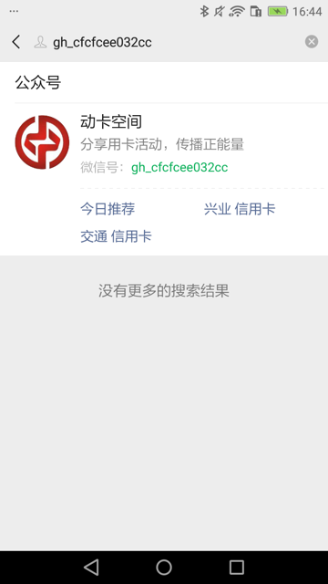
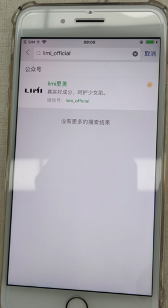

# 微信相关

## 查找微信公众号中文全名

代码：

```python
# def findWeixinPublicAccountZhcnSoup(self, soup, curAccountId):
def findWeixinPublicAccountZhcnFullName(self, soup, curAccountId):
    """Find weixin public account element's zh-CN full name

    Args:
        soup (soup): soup of current page xml
    Returns:
        public account zh-CN full name
    Raises:
    """
    # accountZhcnTextSoup = None
    accountZhcnFullName = ""
    parentNodeLocator = None

    """
        搜索结果中文名节点是Text
            <XCUIElementTypeOther type="XCUIElementTypeOther" name="搜一搜" label="搜一搜" enabled="true" visible="true" x="0" y="70" width="414" height="666">
                <XCUIElementTypeOther type="XCUIElementTypeOther" value="2" name="公众号" label="公众号" enabled="true" visible="true" x="16" y="83" width="398" height="23">
                    <XCUIElementTypeOther type="XCUIElementTypeOther" value="2" enabled="true" visible="true" x="16" y="83" width="52" height="23">
                        <XCUIElementTypeStaticText type="XCUIElementTypeStaticText" value="2" name="公众号" label="公众号" enabled="true" visible="true" x="16" y="83" width="52" height="22"/>
                    </XCUIElementTypeOther>
                </XCUIElementTypeOther>
                <XCUIElementTypeOther type="XCUIElementTypeOther" enabled="true" visible="false" x="16" y="129" width="60" height="60"/>
                <XCUIElementTypeOther type="XCUIElementTypeOther" enabled="true" visible="true" x="88" y="126" width="310" height="23">
                    <XCUIElementTypeStaticText type="XCUIElementTypeStaticText" value="动卡空间" name="动卡空间" label="动卡空间" enabled="true" visible="true" x="88" y="126" width="70" height="22"/>
                </XCUIElementTypeOther>
                <XCUIElementTypeOther type="XCUIElementTypeOther" enabled="true" visible="true" x="88" y="151" width="310" height="21">
                    <XCUIElementTypeStaticText type="XCUIElementTypeStaticText" value="分享用卡活动，传播正能量" name="分享用卡活动，传播正能量" label="分享用卡活动，传播正能量" enabled="true" visible="true" x="88" y="152" width="184" height="19"/>
                </XCUIElementTypeOther>
                <XCUIElementTypeOther type="XCUIElementTypeOther" enabled="true" visible="true" x="88" y="178" width="266" height="20">
                    <XCUIElementTypeStaticText type="XCUIElementTypeStaticText" value="微信号：" name="微信号：" label="微信号：" enabled="true" visible="true" x="88" y="178" width="58" height="19"/>
                    <XCUIElementTypeStaticText type="XCUIElementTypeStaticText" value="gh_cfcfcee032cc" name="gh_cfcfcee032cc" label="gh_cfcfcee032cc" enabled="true" visible="true" x="145" y="178" width="112" height="19"/>
                </XCUIElementTypeOther>
        
        搜索结果中文名节点是Other，其下是多个Text节点：
            <XCUIElementTypeOther type="XCUIElementTypeOther" name="搜一搜" label="搜一搜" enabled="true" visible="true" x="0" y="70" width="375" height="600">
                <XCUIElementTypeOther type="XCUIElementTypeOther" value="2" name="公众号" label="公众号" enabled="true" visible="true" x="16" y="83" width="359" height="23">
                    <XCUIElementTypeStaticText type="XCUIElementTypeStaticText" value="2" name="公众号" label="公众号" enabled="true" visible="true" x="16" y="83" width="52" height="23"/>
                </XCUIElementTypeOther>
                <XCUIElementTypeOther type="XCUIElementTypeOther" enabled="true" visible="false" x="16" y="129" width="60" height="60"/>
                <XCUIElementTypeImage type="XCUIElementTypeImage" enabled="true" visible="true" x="343" y="128" width="16" height="16"/>
                <XCUIElementTypeImage type="XCUIElementTypeImage" enabled="true" visible="true" x="324" y="128" width="16" height="16"/>
                <XCUIElementTypeOther type="XCUIElementTypeOther" enabled="true" visible="true" x="88" y="126" width="271" height="23">
                    <XCUIElementTypeStaticText type="XCUIElementTypeStaticText" value="牛尔" name="牛尔" label="牛尔" enabled="true" visible="true" x="88" y="126" width="35" height="22"/>
                    <XCUIElementTypeStaticText type="XCUIElementTypeStaticText" value="Tmall" name="Tmall" label="Tmall" enabled="true" visible="true" x="122" y="126" width="41" height="22"/>
                    <XCUIElementTypeStaticText type="XCUIElementTypeStaticText" value="旗舰店" name="旗舰店" label="旗舰店" enabled="true" visible="true" x="162" y="126" width="53" height="22"/>
                </XCUIElementTypeOther>
                <XCUIElementTypeOther type="XCUIElementTypeOther" enabled="true" visible="true" x="88" y="151" width="271" height="21">
                    <XCUIElementTypeStaticText type="XCUIElementTypeStaticText" value="牛尔亲研天猫官方旗舰店" name="牛尔亲研天猫官方旗舰店" label="牛尔亲研天猫官方旗舰店" enabled="true" visible="true" x="88" y="152" width="169" height="19"/>
                </XCUIElementTypeOther>
                <XCUIElementTypeOther type="XCUIElementTypeOther" enabled="true" visible="true" x="88" y="178" width="271" height="19">
                    <XCUIElementTypeStaticText type="XCUIElementTypeStaticText" value="微信号：" name="微信号：" label="微信号：" enabled="true" visible="true" x="88" y="178" width="58" height="18"/>
                    <XCUIElementTypeStaticText type="XCUIElementTypeStaticText" value="niuer-tmall" name="niuer-tmall" label="niuer-tmall" enabled="true" visible="true" x="145" y="178" width="70" height="18"/>
                </XCUIElementTypeOther>

        公众号中文名全部是绿色的：
            <XCUIElementTypeOther type="XCUIElementTypeOther" name="搜一搜" label="搜一搜" enabled="true" visible="true" x="0" y="70" width="414" height="666">
                <XCUIElementTypeOther type="XCUIElementTypeOther" value="2" name="公众号" label="公众号" enabled="true" visible="true" x="16" y="83" width="398" height="23">
                    <XCUIElementTypeOther type="XCUIElementTypeOther" value="2" enabled="true" visible="true" x="16" y="83" width="52" height="23">
                        <XCUIElementTypeStaticText type="XCUIElementTypeStaticText" value="2" name="公众号" label="公众号" enabled="true" visible="true" x="16" y="83" width="52" height="22"/>
                    </XCUIElementTypeOther>
                </XCUIElementTypeOther>
                <XCUIElementTypeOther type="XCUIElementTypeOther" enabled="true" visible="false" x="16" y="129" width="60" height="60"/>
                <XCUIElementTypeImage type="XCUIElementTypeImage" enabled="true" visible="true" x="382" y="128" width="16" height="16"/>
                <XCUIElementTypeOther type="XCUIElementTypeOther" enabled="true" visible="true" x="88" y="126" width="310" height="23">
                    <XCUIElementTypeStaticText type="XCUIElementTypeStaticText" value="limi里美" name="limi里美" label="limi里美" enabled="true" visible="true" x="88" y="126" width="61" height="22"/>
                </XCUIElementTypeOther>
                <XCUIElementTypeOther type="XCUIElementTypeOther" enabled="true" visible="true" x="88" y="151" width="310" height="21">
                    <XCUIElementTypeStaticText type="XCUIElementTypeStaticText" value="真实好成分，呵护少女肌。" name="真实好成分，呵护少女肌。" label="真实好成分，呵护少女肌。" enabled="true" visible="true" x="88" y="152" width="184" height="19"/>
                </XCUIElementTypeOther>
                <XCUIElementTypeOther type="XCUIElementTypeOther" enabled="true" visible="true" x="88" y="178" width="310" height="19">
                    <XCUIElementTypeStaticText type="XCUIElementTypeStaticText" value="微信号：" name="微信号：" label="微信号：" enabled="true" visible="true" x="88" y="178" width="58" height="18"/>
                    <XCUIElementTypeStaticText type="XCUIElementTypeStaticText" value="limi_official" name="limi_official" label="limi_official" enabled="true" visible="true" x="145" y="178" width="72" height="18"/>
                </XCUIElementTypeOther>
                <XCUIElementTypeOther type="XCUIElementTypeOther" enabled="true" visible="false" x="0" y="0" width="0" height="0"/>
                <XCUIElementTypeOther type="XCUIElementTypeOther" enabled="true" visible="true" x="0" y="237" width="414" height="25">
                    <XCUIElementTypeStaticText type="XCUIElementTypeStaticText" value="没有更多的搜索结果" name="没有更多的搜索结果" label="没有更多的搜索结果" enabled="true" visible="true" x="133" y="239" width="148" height="20"/>
                </XCUIElementTypeOther>
            </XCUIElementTypeOther>
    """
    foundAccountId = soup.find(
        'XCUIElementTypeStaticText',
        attrs={"value": curAccountId, "name": curAccountId, "type": "XCUIElementTypeStaticText"},
    )
    logging.debug("foundAccountId=%s", foundAccountId)
    # foundAccountId=<XCUIElementTypeStaticText enabled="true" height="18" label="gh_cfcfcee032cc" name="gh_cfcfcee032cc" type="XCUIElementTypeStaticText" value="gh_cfcfcee032cc" visible="true" width="112" x="145" y="178"/>
    if foundAccountId:
        idParent = foundAccountId.parent
        logging.debug("idParent=%s", idParent)
        if idParent:
            # method 1: two prev.prev
            # # idParentPrev = idParent.previous_sibling
            # idParentPrev = idParent.previous_sibling.previous_sibling
            # accountDescNode = idParentPrev
            # logging.info("accountDescNode=%s", accountDescNode) # '\n'
            # if accountDescNode:
            #     # accountZhcnNode = accountDescNode.previous_sibling
            #     accountZhcnNode = accountDescNode.previous_sibling.previous_sibling
            #     logging.info("accountZhcnNode=%s", accountZhcnNode)

            # # method 2: siblings[-2] of XCUIElementTypeOther
            # idParentPrevSiblingList = idParent.previous_siblings

            # accountDescNode = None
            # accountZhcnNode = None

            # TypeOther = "XCUIElementTypeOther"
            # typeOtherNodeCurIdx = 0
            # AccountDescNodeIdx = 1
            # AccountZhcnNodeIdx = 2

            # for eachPrevSiblingNode in idParentPrevSiblingList:
            #     curNodeName = eachPrevSiblingNode.name
            #     isTypeOtherNode = curNodeName == TypeOther
            #     if isTypeOtherNode:
            #         typeOtherNodeCurIdx += 1

            #         if AccountDescNodeIdx == typeOtherNodeCurIdx:
            #             accountDescNode = eachPrevSiblingNode
            #         elif AccountZhcnNodeIdx == typeOtherNodeCurIdx:
            #             accountZhcnNode = eachPrevSiblingNode
                
            #     hasFoundAll = accountDescNode and accountZhcnNode
            #     if hasFoundAll:
            #         break
            
            # logging.info("accountDescNode=%s", accountDescNode)
            # logging.info("accountZhcnNode=%s", accountZhcnNode)

            # if accountZhcnNode:
            #     accountZhcnTextSoup = accountZhcnNode.find(
            #         'XCUIElementTypeStaticText',
            #         attrs={ "type": "XCUIElementTypeStaticText"},
            #     )

            # method 3: parent'parent is 搜一搜, direct child 2nd XCUIElementTypeOther of enabled="true" visible="true"
            idParentParent = idParent.parent
            if idParentParent:
                otherSoupList = idParentParent.find_all(
                    "XCUIElementTypeOther",
                    attrs={"type": "XCUIElementTypeOther", "enabled":"true", "visible":"true"},
                    recursive=False,
                )
                if otherSoupList and (len(otherSoupList) >= 2):
                    firstOtherSoup = otherSoupList[0]
                    if firstOtherSoup.attrs["name"] == "公众号":
                        secondOtherSoup = otherSoupList[1]
                        zhcnNameSoupList = secondOtherSoup.find_all(
                            "XCUIElementTypeStaticText",
                            attrs={"type": "XCUIElementTypeStaticText", "enabled":"true", "visible":"true"},
                        )
                        if zhcnNameSoupList:
                            for eachTextSoup in zhcnNameSoupList:
                                curPartName = eachTextSoup.attrs.get("value")
                                accountZhcnFullName += curPartName
                            
                            if accountZhcnFullName:
                                secondOtherAttrDict = secondOtherSoup.attrs
                                parentX = secondOtherAttrDict["x"]
                                parentY = secondOtherAttrDict["y"]
                                parentWidth = secondOtherAttrDict["width"]
                                parentHeight = secondOtherAttrDict["height"]
                                parentNodeLocator = {
                                    "type": "XCUIElementTypeOther",
                                    "enabled": "true",
                                    "visible": "true",
                                    "x": parentX,
                                    "y": parentY,
                                    "width": parentWidth,
                                    "height": parentHeight,
                                }

    # return accountZhcnTextSoup
    # return accountZhcnFullName
    return accountZhcnFullName, parentNodeLocator
```

支持多种情况：

* 普通的：`动卡空间`
  * 
* 中英文混合：`牛尔Tmall旗舰店`
  * 
* 中英文混合带绿色的：`limi里美`
  * 

