# weditor

折腾u2期间，少不了要调试设备当前的页面，以及希望了解其中的元素和细节。

这时候，同一个作者开发的，用于辅助u2的`weditor`，就可以派上用场了。

* 主页
  * Github
    * [openatx/weditor: web editor for atx](https://github.com/openatx/weditor)

安装：

```bash
pip3 install -U weditor
```

启动：

```bash
python -m weditor
```

会自动调用浏览器并打开网址：

http://localhost:17310

效果：

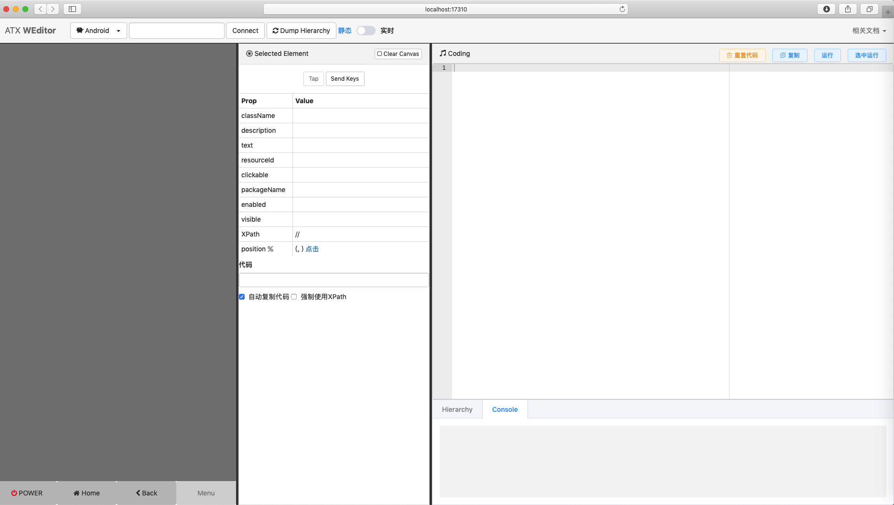

输入`安卓设备的id`后，点击`Connect`连接设备：

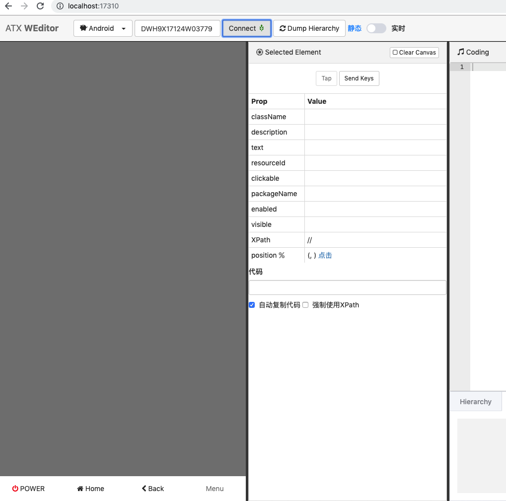

然后 多次在 静态 实时 直接切换几次，最后一次点击 静态，稍等片刻，就能看到页面内容了：

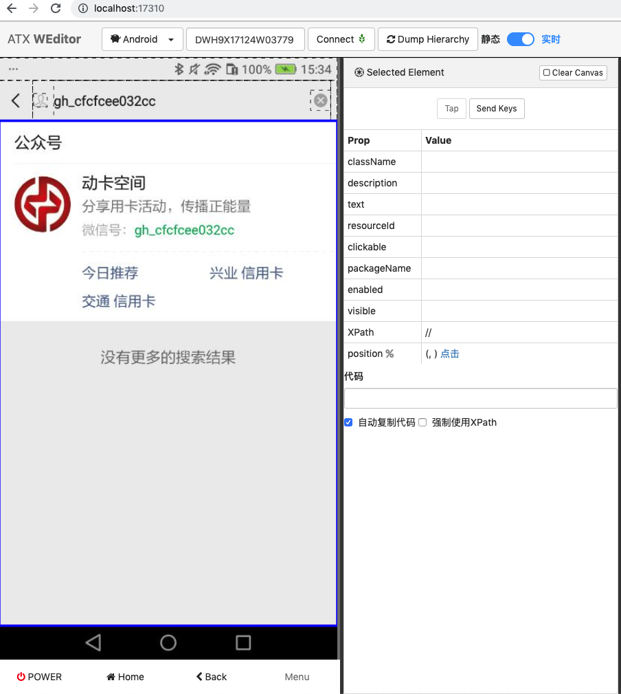

和：

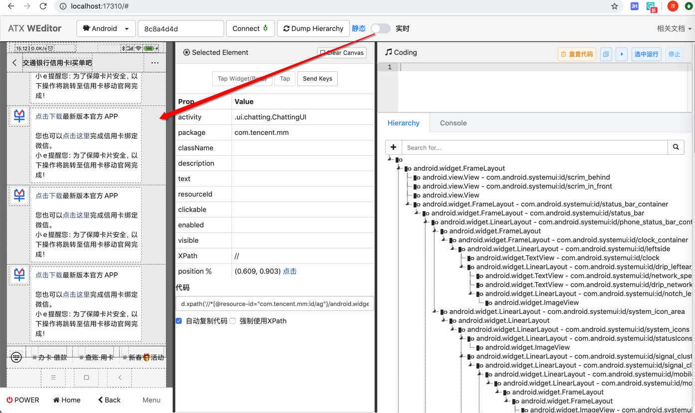

> #### warning:: 报错可忽略
> 
> 注意，切换期间偶然会报错：
> 
> 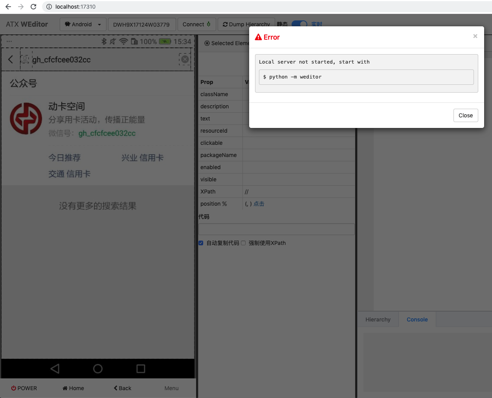
>
> 不用理会，关闭弹框，多试几次即可。

点击`Dump Hierarchy`后，能查看到页面的结构：

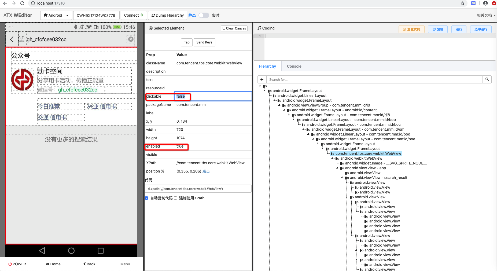

## Coding中可以调试代码

之前有用过输入并运行代码，用于调试，效果不错：

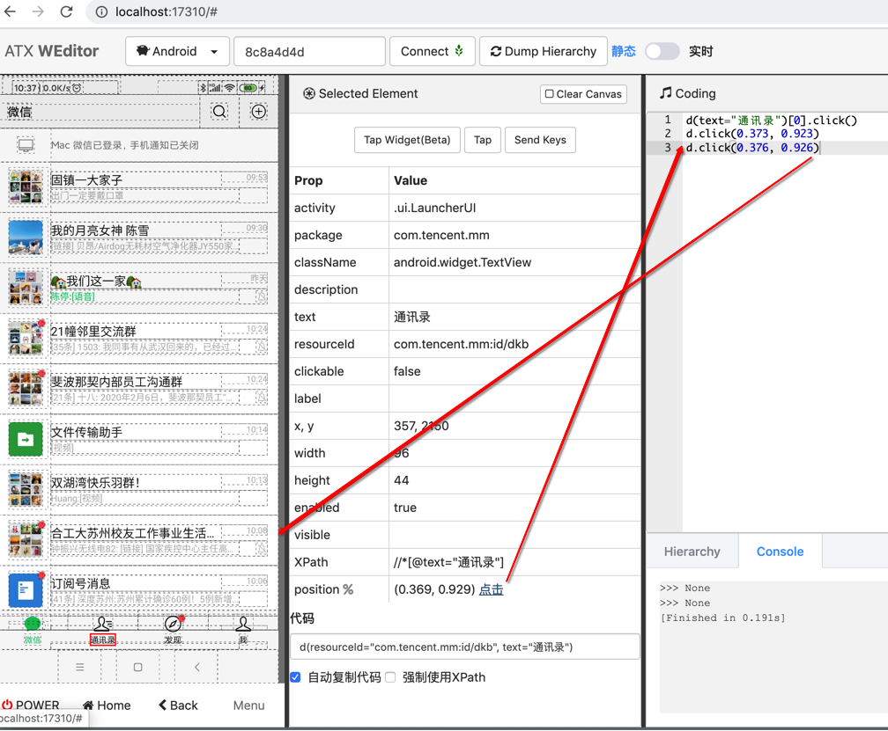

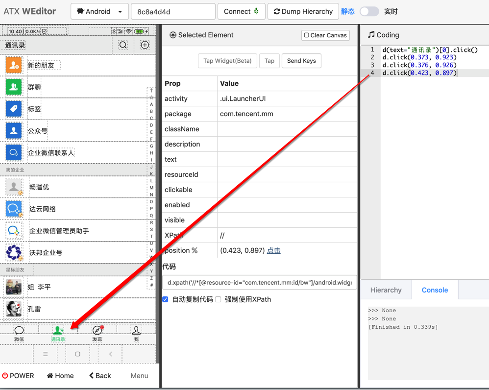

再比如：

```python
d(className="android.view.View")
d(className="android.view.View").count
```

选中第一行后，点击 选中运行：

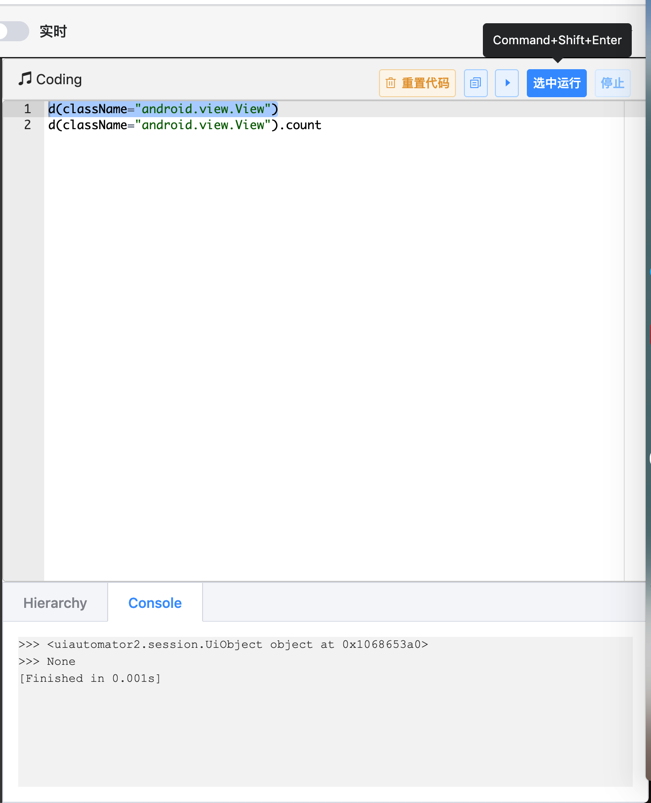

加上print后

```python
print(d(className="android.view.View"))
print(d(className="android.view.View").count)
```

不选中，点击 运行按钮，表示全部运行：

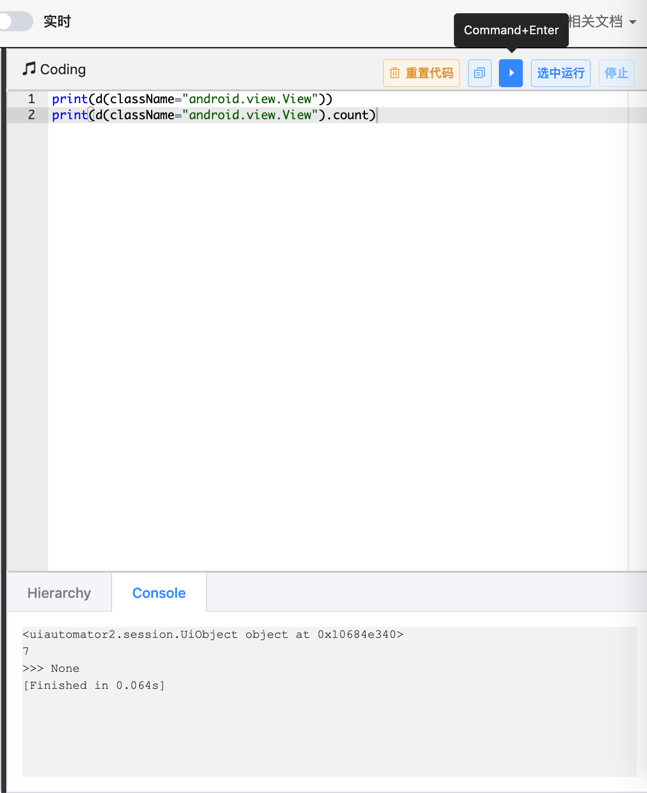

可以实时调试，很方便。

详见：

【未解决】自动抓包工具抓包公众号买单吧某个元素通过class+instance定位不到

【已解决】uiautomator2用click点击微信中的通讯录不起作用

## Hierarchy支持有限的搜索

对于xml中的节点：

```xml
<node NAF="true" index="0" text="" resource-id="com.tencent.mm:id/pq" class="android.view.View" package="com.tencent.mm" content-desc="" checkable="false" checked="false" clickable="true" enabled="true" focusable="true" focused="false" scrollable="false" long-clickable="true" password="false" selected="false" visible-to-user="true" bounds="[156,1522][912,2027]" />
```

想要去WEditor中

搜id值，即搜`com.tencent.mm:id/pq`，结果找不到

搜pq，也搜不到

后来发现，只能搜：当前显示出来的内容，即节点的class的类型

比如：`android.view.View`

是可以搜出并深红色高亮显示的对应节点的

然后才找到此处对应节点：

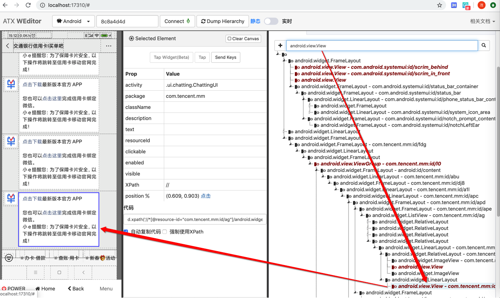

详见：

【已解决】用weditor实时查看安卓当前页面中的xml源码

【已解决】Mac中安装uiautomator2的UI界面工具：weditor
