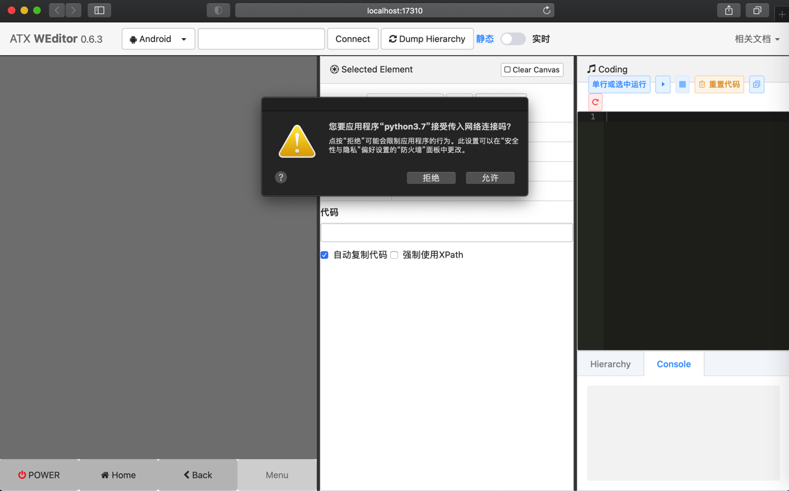
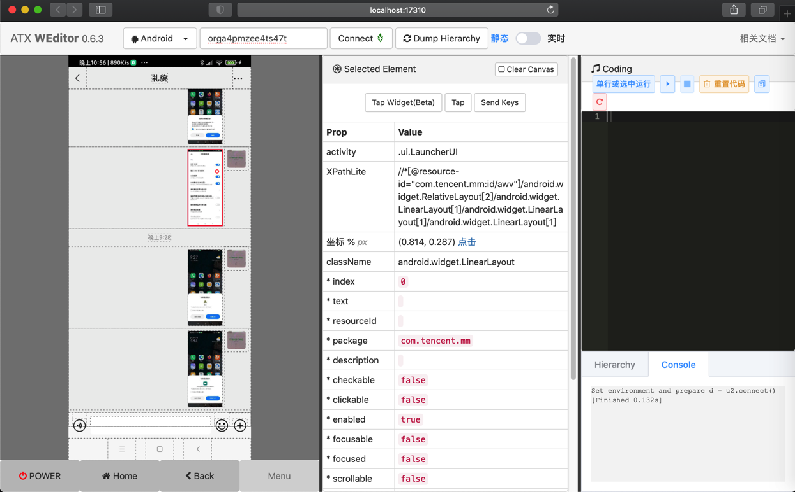
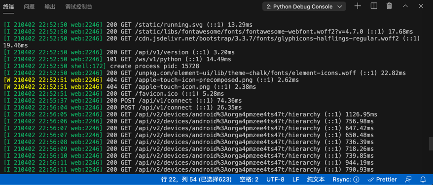
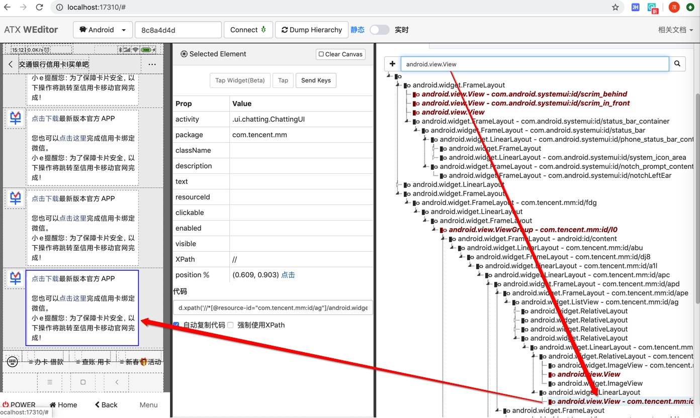
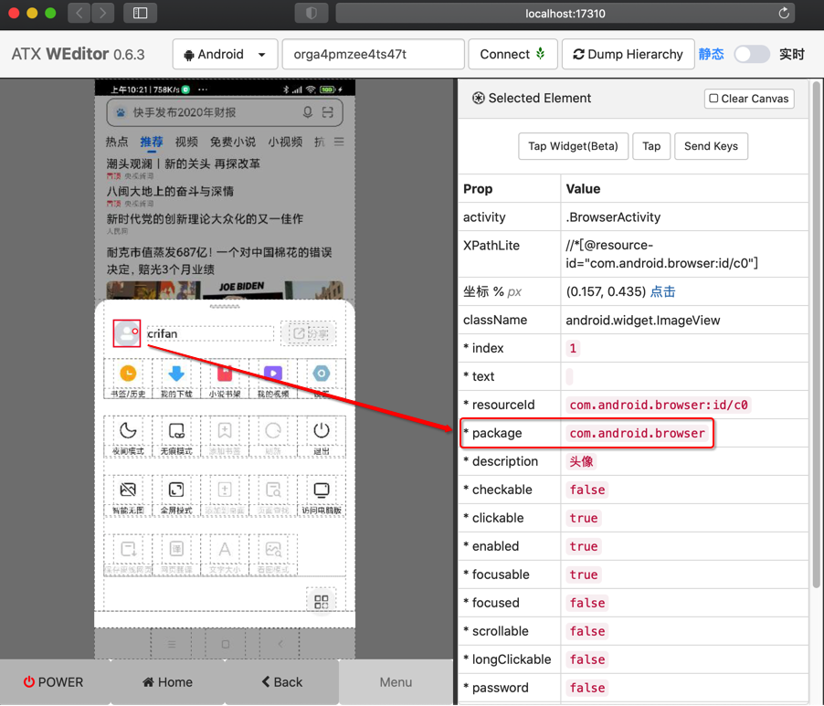
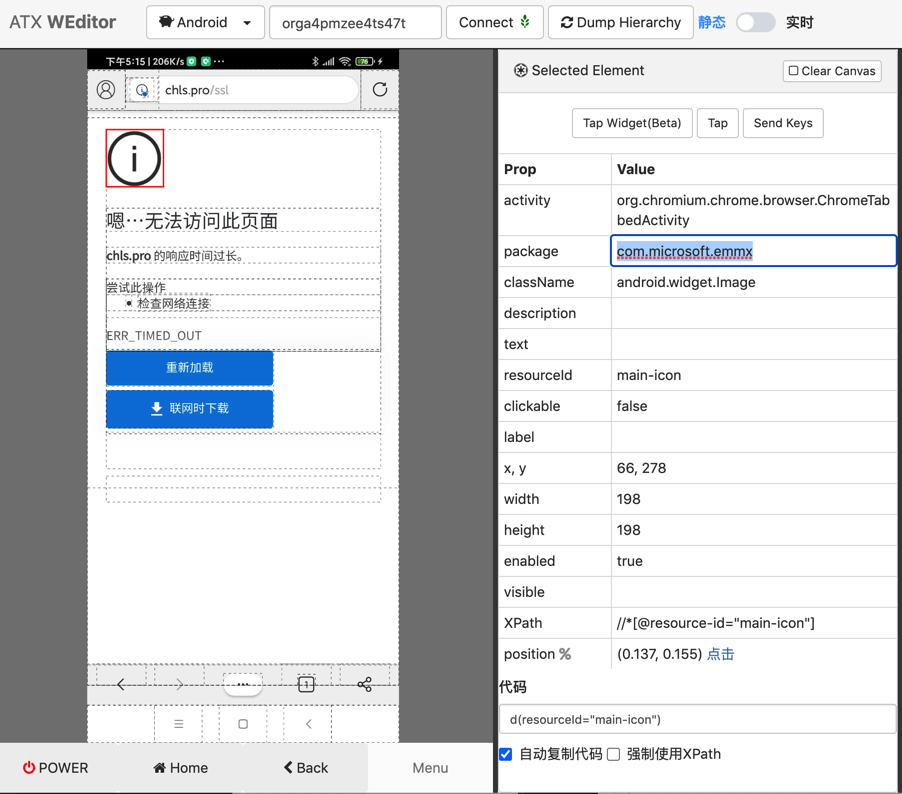
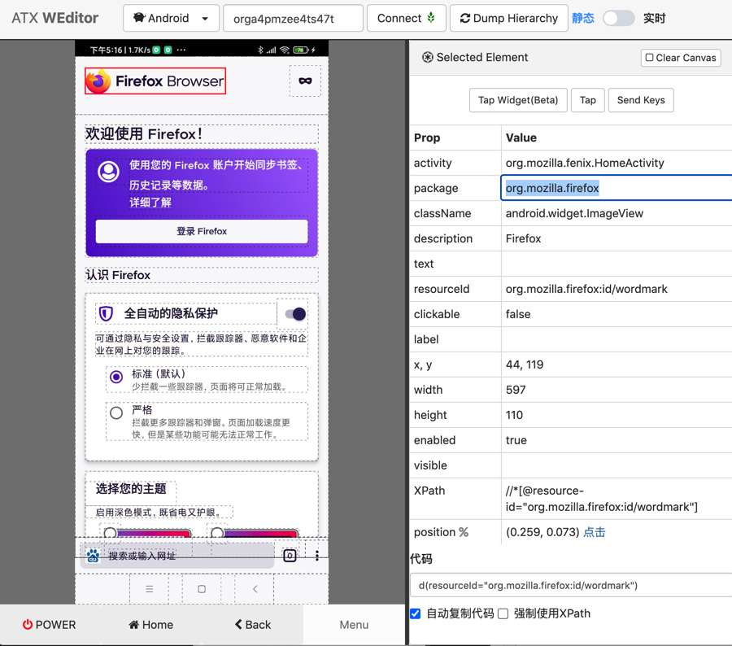
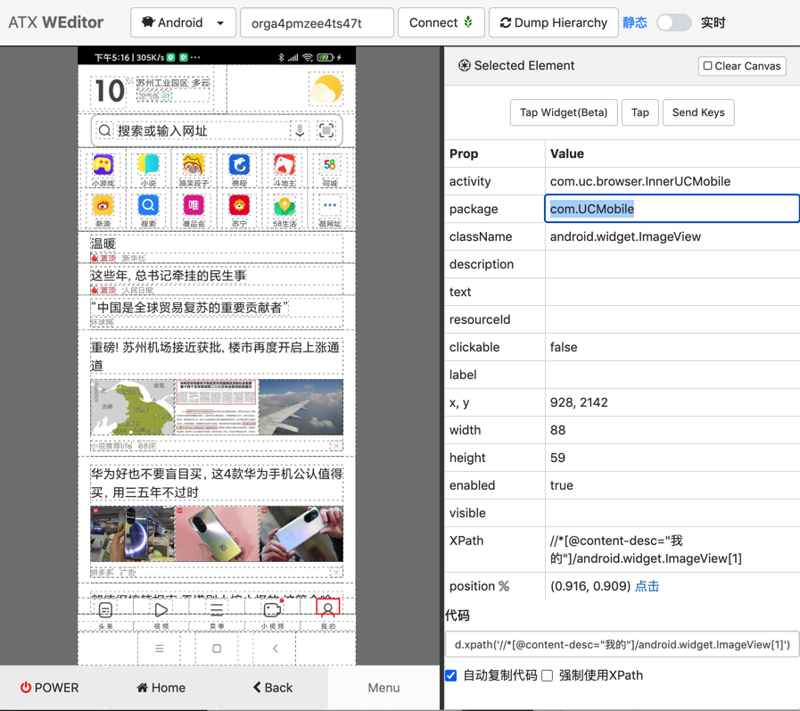
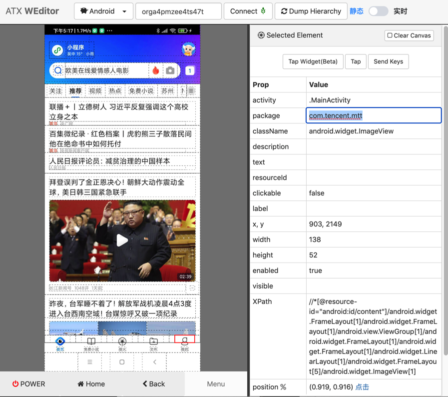

# weditor

折腾u2期间，少不了要调试设备当前的页面，以及希望了解其中的元素和细节。

这时候，同一个作者开发的，用于辅助u2的`weditor`，就可以派上用场了。

* 主页
  * Github
    * [openatx/weditor: web editor for atx](https://github.com/openatx/weditor)

## 安装

```bash
pip install -U weditor
```

* 如果是用`pipenv`，则是：`pipenv install weditor`
* 如果是已安装过，要升级到最新版，则是：`pip install -U weditor`

## 启动

```bash
weditor
```

* 注
  * 旧启动方式是：`python -m weditor`
  * Mac中第一次启动`Python`时，可能会遇到申请使用网络的权限提示，注意要点击`允许`
    * 

会自动调用浏览器并打开网址：

http://localhost:17310

效果：


## 使用

概述：

* 连接设备
  * 输入 （从adb devices中得到的）安卓设备id
  * 点击Connect，看到绿色🚦红绿灯标识，标识连接上了。
* 看安卓设备画面
  * 点击 实时，即可看到安卓手机的实时画面。
  * 如果只是想要调试页面元素，则可以切换会 静态
* 查看属性
  * 点击画面中元素，即可看到属性
* 查看元素结构
  * 点击顶部的 Dump Hierarchy，点击右边切换到 Hierarchy，可以看到最新页面的结构

详解：


输入`安卓设备的id`后，点击`Connect`连接设备：


> #### info::用adb devices查看安卓设备的id
> 
> 注：关于安卓手机的ID=UDID=序列号，可以用`adb devices`获取到
>
> 举例：
  ```bash
  ~  adb devices
  List of devices attached
  orga4pmzee4ts47t    device
  ```
>
> 其中的`orga4pmzee4ts47t`就是安卓设备的id，也成为`序列号`或`UDID`

然后 多次在 静态 实时 直接切换几次，最后一次点击 静态，稍等片刻，就能看到页面内容了：


和：


> #### warning:: 报错可忽略
> 
> 注意，切换期间偶然会报错：
> 
> 
>
> 不用理会，关闭弹框，多试几次即可。

点击`Dump Hierarchy`后，能查看到页面的结构：


### 查看元素属性

以及最常用的，点击查看元素属性：



可以拷贝出属性：

```bash
Selected Element  Clear Canvas
Tap Widget(Beta) Tap Send Keys
Prop    Value
activity    .ui.LauncherUI
XPathLite    //*[@resource-id="com.tencent.mm:id/awv"]/android.widget.RelativeLayout[2]/android.widget.LinearLayout[1]/android.widget.LinearLayout[1]/android.widget.LinearLayout[1]
坐标 % px    (0.814, 0.287) 点击
className    android.widget.LinearLayout
* index    0
* text    
* resourceId    
* package    com.tencent.mm
* description    
* checkable    false
* clickable    false
* enabled    true
* focusable    false
* focused    false
* scrollable    false
* longClickable    false
* password    false
* selected    false
# rect    {"x":707,"y":558,"width":203,"height":452} 代码
```

其中最常用的，可以去定位到元素的一些属性是：

* `text`
* `resourceId`
* `description`
* `clickable`
* 等等

### weditor的log：对应内部各种api请求调用

此处对应weditor内部会显示对应的请求的log：



```bash
 python -m weditor
listening on http://192.168.31.12:17310
[I 210402 22:52:49 web:2246] 200 GET / (::1) 18.51ms
[I 210402 22:52:49 web:2246] 200 GET /cdn.jsdelivr.net/bootstrap/3.3.7/css/bootstrap.min.css (::1) 19.03ms
[I 210402 22:52:49 web:2246] 200 GET /cdn.jsdelivr.net/npm/jstree@3.3.8/dist/themes/default/style.min.css (::1) 33.71ms
[I 210402 22:52:49 web:2246] 200 GET /static/libs/fontawesome/css/font-awesome.min.css (::1) 37.99ms
[I 210402 22:52:49 web:2246] 200 GET /cdn.jsdelivr.net/bootstrap.select/1.12.2/css/bootstrap-select.min.css (::1) 42.20ms
[I 210402 22:52:49 web:2246] 200 GET /unpkg.com/element-ui/lib/theme-chalk/index.css (::1) 52.95ms
[I 210402 22:52:49 web:2246] 200 GET /static/libs/css/buttons.css (::1) 59.13ms
[I 210402 22:52:49 web:2246] 200 GET /static/style.css?v=36c1d231ca96af637a1b43fdeec15aec (::1) 64.98ms
[I 210402 22:52:49 web:2246] 200 GET /cdn.jsdelivr.net/npm/jquery@3.3.1/dist/jquery.min.js (::1) 20.32ms
[I 210402 22:52:50 web:2246] 200 GET /cdn.jsdelivr.net/bootstrap/3.3.7/js/bootstrap.min.js (::1) 81.69ms
[I 210402 22:52:50 web:2246] 200 GET /cdn.jsdelivr.net/bootstrap.select/1.12.2/js/bootstrap-select.min.js (::1) 100.70ms
[I 210402 22:52:50 web:2246] 200 GET /cdn.jsdelivr.net/npm/ace-builds@1.4.12/src-noconflict/ace.min.js (::1) 110.94ms
[I 210402 22:52:50 web:2246] 200 GET /cdn.jsdelivr.net/npm/ace-builds@1.4.12/src-noconflict/mode-python.min.js (::1) 124.62ms
[I 210402 22:52:50 web:2246] 200 GET /cdn.jsdelivr.net/npm/ace-builds@1.4.12/src-noconflict/ext-language_tools.min.js (::1) 135.78ms
[I 210402 22:52:50 web:2246] 200 GET /cdn.jsdelivr.net/npm/ace-builds@1.4.12/src-noconflict/ext-searchbox.min.js (::1) 8.32ms
[I 210402 22:52:50 web:2246] 200 GET /cdn.jsdelivr.net/npm/ace-builds@1.4.12/src-noconflict/theme-monokai.js (::1) 16.38ms
[I 210402 22:52:50 web:2246] 200 GET /cdn.jsdelivr.net/npm/jstree@3.3.8/dist/jstree.min.js (::1) 23.69ms
[I 210402 22:52:50 web:2246] 200 GET /static/libs/vue-2.5.16/vue.js?v=cbe2b9b2fb6955decf033515d079e44b (::1) 31.83ms
[I 210402 22:52:50 web:2246] 200 GET /unpkg.com/element-ui/lib/index.js (::1) 50.16ms
[I 210402 22:52:50 web:2246] 200 GET /static/js/common.js?v=f1c2d6b24d012c4fc2e22595bd549793 (::1) 53.17ms
[I 210402 22:52:50 web:2246] 200 GET /static/js/index.js?v=1e93d9fb27bafdd173d79477b015322e (::1) 5.14ms
[I 210402 22:52:50 web:2246] 200 GET /static/loading.svg (::1) 7.07ms
[I 210402 22:52:50 web:2246] 200 GET /static/running.svg (::1) 13.29ms
[I 210402 22:52:50 web:2246] 200 GET /static/libs/fontawesome/fonts/fontawesome-webfont.woff2?v=4.7.0 (::1) 17.68ms
[I 210402 22:52:50 web:2246] 200 GET /cdn.jsdelivr.net/bootstrap/3.3.7/fonts/glyphicons-halflings-regular.woff2 (::1) 19.46ms
[I 210402 22:52:50 web:2246] 200 GET /api/v1/version (::1) 3.20ms
[I 210402 22:52:50 web:2246] 101 GET /ws/v1/python (::1) 14.49ms
[I 210402 22:52:50 shell:172] create process pid: 15728
[I 210402 22:52:50 web:2246] 200 GET /unpkg.com/element-ui/lib/theme-chalk/fonts/element-icons.woff (::1) 22.82ms
[W 210402 22:52:51 web:2246] 404 GET /apple-touch-icon-precomposed.png (::1) 2.62ms
[W 210402 22:52:51 web:2246] 404 GET /apple-touch-icon.png (::1) 2.38ms
[I 210402 22:52:51 web:2246] 200 GET /favicon.ico (::1) 5.28ms
[I 210402 22:55:37 web:2246] 200 POST /api/v1/connect (::1) 74.36ms
[I 210402 22:56:04 web:2246] 200 POST /api/v1/connect (::1) 26.35ms
[I 210402 22:56:05 web:2246] 200 GET /api/v2/devices/android%3Aorga4pmzee4ts47t/hierarchy (::1) 1126.95ms
[I 210402 22:56:06 web:2246] 200 GET /api/v2/devices/android%3Aorga4pmzee4ts47t/hierarchy (::1) 756.98ms
。。。
[I 210402 22:56:39 web:2246] 200 GET /api/v2/devices/android%3Aorga4pmzee4ts47t/hierarchy (::1) 743.71ms
[I 210402 22:56:39 page:204] Serial: android:orga4pmzee4ts47t
[I 210402 22:56:40 web:2246] 200 GET /api/v1/devices/android%3Aorga4pmzee4ts47t/screenshot (::1) 475.57ms
[I 210402 22:56:41 web:2246] 200 GET /api/v2/devices/android%3Aorga4pmzee4ts47t/hierarchy (::1) 946.91ms
```


### Coding中可以调试代码

之前有用过输入并运行代码，用于调试，效果不错：


再比如：

```python
d(className="android.view.View")
d(className="android.view.View").count
```

选中第一行后，点击 选中运行：


加上print后

```python
print(d(className="android.view.View"))
print(d(className="android.view.View").count)
```

不选中，点击 运行按钮，表示全部运行：


可以实时调试，很方便。

详见：

【未解决】自动抓包工具抓包公众号买单吧某个元素通过class+instance定位不到

【已解决】uiautomator2用click点击微信中的通讯录不起作用

### Hierarchy支持有限的搜索

对于xml中的节点：

```xml
<node NAF="true" index="0" text="" resource-id="com.tencent.mm:id/pq" class="android.view.View" package="com.tencent.mm" content-desc="" checkable="false" checked="false" clickable="true" enabled="true" focusable="true" focused="false" scrollable="false" long-clickable="true" password="false" selected="false" visible-to-user="true" bounds="[156,1522][912,2027]" />
```

想要去WEditor中

搜id值，即搜`com.tencent.mm:id/pq`，结果找不到

搜pq，也搜不到

后来发现，只能搜：当前显示出来的内容，即节点的class的类型

比如：`android.view.View`

是可以搜出并深红色高亮显示的对应节点的

然后才找到此处对应节点：



详见：

【已解决】用weditor实时查看安卓当前页面中的xml源码

【已解决】Mac中安装uiautomator2的UI界面工具：weditor

### 查看当前的app的包名

举例：

用weditor可以查看到当前的app的包名：

* 小米的 内置浏览器 包名：`com.android.browser`
  * 
* Edge包名：`com.microsoft.emmx`
  * 
* Firefox包名：`org.mozilla.firefox`
  * 
* UC浏览器包名：`com.UCMobile`
  * 
* QQ浏览器包名：`com.tencent.mtt`
  * 
